# Arquitectura evolutiva de abastecimiento, bodega e inventario

**Estado:** propuesta técnica previa a implementación  
**Principio rector:** extender el sistema sin reescribir la lógica vigente de Producción, Recepción de leche, Liberación, Maestros ni Planificación.

## 1. Diagnóstico del sistema actual

El sistema ya contiene cinco núcleos que deben conservarse:

| Contexto actual | Responsabilidad válida | Regla que no debe moverse |
|---|---|---|
| `recepcion` | Recepción de leche, controles del camión, descarga y saldo de silos | Una recepción retenida o sin análisis no puede descargarse |
| `produccion` | Lotes, análisis, asignación de leche y controles de proceso | La producción declara el consumo real; la receta es una estimación |
| `calidad` | Expediente documental y liberación de producto terminado | Solo se libera con expediente completo y calidad conforme, o concesión firmada |
| `maestros` | Productos, recetas versionadas, especificaciones, equipos y catálogos | Los datos configurables no deben convertirse en constantes de código |
| `planificacion` | Programa semanal, bloques por equipo y balance de leche | El plan no reemplaza los hechos reales de producción |

Fortalezas existentes:

- permisos cerrados por defecto;
- auditoría transversal;
- estados y transiciones explícitas;
- recetas multinivel versionadas;
- separación entre cálculo y persistencia;
- transacciones y bloqueo de filas en firmas críticas;
- API y frontend separados.

Brechas relevantes:

- `recepcion` representa leche recibida, no recepciones de órdenes de compra;
- `calidad` evalúa producto elaborado, no lotes de materiales comprados;
- el modelo preliminar `inventario.Insumo.stock_actual` es útil como prototipo, pero no ofrece trazabilidad ni separación por lote/estado/ubicación;
- no existen Compras, proveedores, órdenes de compra, MRQ, reservas ni entregas de Bodega;
- no existe una fuente única e inmutable de movimientos de inventario;
- MRP y EOQ actuales son aproximaciones aisladas y todavía no consideran cuarentena, reservas, tránsito ni vencimientos.

## 2. Decisión de arquitectura

Se agregan contextos nuevos, sin reutilizar tablas transaccionales existentes para significados diferentes:

```text
Maestros existentes ───────────────┐
Planificación existente ───────────┼──> Abastecimiento / MRP
Producción existente ──────────────┤             │
                                   │             v
Compras (nuevo) ──> Recepción de compras (nueva) ──> Calidad de materiales (nueva)
                                                        │
                                                        v
                                                 Inventario / Bodega
                                                        │
                                      MRQ ──────────────┤
                                                        v
                                                Entrega a Producción
```

Límites obligatorios:

1. `recepcion.Recepcion` continúa siendo exclusivamente leche y silos.
2. `calidad.Liberacion` continúa siendo exclusivamente liberación de lotes producidos.
3. La inspección de un material comprado usa entidades nuevas y no crea una `Liberacion` ficticia.
4. `produccion.Lote` no se convierte en lote de inventario; ambos conceptos tienen ciclos de vida diferentes.
5. `planificacion` publica demanda; MRP la consume sin modificar sus bloques.
6. `maestros.Producto` puede ser referenciado, pero sus reglas actuales de SKU y receta no se reescriben.

La integración se hará mediante servicios de aplicación y eventos internos transaccionales, no mediante señales con efectos ocultos.

## 3. Flujo futuro desde compra hasta consumo

```mermaid
flowchart LR
    PLAN[Plan de producción] --> MRP[Cálculo MRP]
    STOCK[Existencias utilizables] --> MRP
    BOM[Recetas / BOM vigentes] --> MRP
    MRP --> SC[Solicitud de compra]
    MRQ[Solicitud interna MRQ] -->|faltante| SC
    SC --> AP[Flujo de aprobación]
    AP --> OC[Orden de compra]
    OC --> RC[Recepción de compra]
    RC --> DEC{¿Requiere Calidad?}
    DEC -->|No| DISP[Lote disponible]
    DEC -->|Sí| QUA[Lote en cuarentena]
    QUA --> INS[Inspección de material]
    INS -->|Aprobado| DISP
    INS -->|Rechazado| BLOQ[Bloqueado / disposición]
    DISP --> RES[Reserva FEFO/FIFO]
    RES --> PREP[Preparación MRQ]
    PREP --> ENT[Entrega a Producción]
    ENT --> CONS[Consumo real]
    CONS --> TRAZA[Trazabilidad lote material ↔ lote producido]
```



## 4. Modelo de datos propuesto

### 4.1 Organización y acceso

- `Empresa`
- `Sucursal(empresa)`
- `Area(sucursal, codigo, nombre)`
- `Cargo(area)`
- `PerfilUsuario(usuario, empresa, sucursal, area, cargo, turno, nivel)`
- `AsignacionBodega(usuario, bodega)`
- `Rol`, `Permiso`, `UsuarioRol` solo si la matriz deja de poder expresarse con permisos Django.

Los catálogos de área dejan de ser texto libre. Un administrador de área solo puede administrar perfiles de su misma empresa, sucursal y área. El administrador general es el único que puede crear administradores de área.

### 4.2 Catálogo de abastecimiento

No se agregan decenas de campos sin cohesión a `maestros.Producto`. Se crea una extensión uno-a-uno:

- `ArticuloAbastecimiento(producto, categoria, codigo_barras, descripcion, unidad_compra, unidad_consumo, factor_conversion, requiere_lote, requiere_vencimiento, requiere_calidad, requiere_certificado, requiere_temperatura, requiere_fotografia, vida_util_dias, activo)`
- `CategoriaArticulo(nombre, padre, configurable)`
- `Proveedor`
- `ArticuloProveedor(articulo, proveedor, principal, codigo_proveedor, costo, compra_minima, multiplo_compra, lead_time_dias)`

Categorías iniciales: materia prima, empaque, insumo productivo, químico, repuesto, limpieza, seguridad, terminado y otro.

`requiere_calidad` es dato por artículo, nunca una condición escrita en código.

### 4.3 Compras

- `SolicitudCompra(numero, solicitante, area, motivo, estado, total_estimado)`
- `DetalleSolicitudCompra(solicitud, articulo, cantidad, fecha_requerida, origen_mrp)`
- `Aprobacion(documento_tipo, documento_id, etapa, aprobador, decision, fecha, comentario)`
- `OrdenCompra(numero, proveedor, sucursal_entrega, estado, moneda, condiciones_pago)`
- `DetalleOrdenCompra(orden, articulo, cantidad, costo_unitario, fecha_comprometida, cantidad_recibida)`

La aprobación se configura por empresa, monto, categoría y área. Quien solicita no aprueba su propia solicitud cuando la segregación esté activa.

### 4.4 Bodega, lotes y existencias

- `Bodega(sucursal, codigo, nombre)`
- `Ubicacion(bodega, zona, pasillo, estanteria, nivel, posicion, tipo)`
- `LoteInventario(articulo, lote_proveedor, elaboracion, vencimiento, estado_calidad, proveedor)`
- `Existencia(lote, ubicacion, cantidad_fisica, cantidad_reservada)` como proyección reconstruible
- `MovimientoInventario(tipo, lote, cantidad, origen, destino, documento_tipo, documento_id, usuario, fecha, motivo, saldo_anterior, saldo_posterior)`
- `ReservaInventario(lote, ubicacion, documento, cantidad, estado)`

La fuente de verdad es `MovimientoInventario`. `Existencia` es una proyección optimizada y solo cambia dentro de la misma transacción que crea el movimiento.

Disponibilidad:

```text
disponible = cantidad física aprobada y vigente
             - reservada
             - comprometida
             - bloqueada
```

No se almacena un único `stock_actual` editable. No se permite borrar movimientos ni lotes usados; se inactivan catálogos y se compensan errores con movimientos inversos autorizados.

### 4.5 Recepción de compras y Calidad de materiales

- `RecepcionCompra(orden, guia, factura, proveedor, fecha_hora, receptor, estado)`
- `DetalleRecepcionCompra(detalle_orden, cantidad_esperada, recibida, faltante, sobrante, dañada, lote, vencimiento, temperatura, embalaje, ubicacion_temporal)`
- `Adjunto(documento_tipo, documento_id, tipo, archivo, hash, autor)`
- `SolicitudInspeccion(detalle_recepcion, prioridad, estado, responsable, creada_en)`
- `PlantillaInspeccion(categoria/articulo, version, vigente_desde)`
- `ParametroInspeccion(plantilla, nombre, tipo, limites, obligatorio)`
- `InspeccionMaterial(solicitud, resultado, inspector, decision_en, observaciones, firma)`
- `ResultadoInspeccion(inspeccion, parametro, valor, conforme)`
- `NoConformidad(inspeccion, destino, estado)`
- `LiberacionExcepcionalMaterial(lote, cantidad, uso, justificacion, solicitante, calidad, jefatura, vence_en)`

El checklist es configurable y versionado, siguiendo la misma idea correcta que ya existe para documentos de liberación, pero sin compartir las tablas transaccionales.

### 4.6 MRQ y entrega

- `SolicitudMaterial(numero, area, centro_costo, lote_produccion, fecha_requerida, prioridad, estado, solicitante)`
- `DetalleSolicitudMaterial(solicitud, articulo, cantidad_solicitada, cantidad_aprobada, cantidad_entregada)`
- `PreparacionMaterial(solicitud, preparador, estado)`
- `DetallePreparacion(detalle_solicitud, lote, ubicacion, cantidad)`
- `EntregaProduccion(preparacion, entrega_por, recibe_por, fecha)`
- `DevolucionProduccion(entrega, lote, cantidad, motivo, estado_material)`

Cada detalle puede entregarse parcialmente. La trazabilidad se completa vinculando la entrega con `produccion.Lote` cuando exista.

### 4.7 MRP y EOQ

- `EjecucionMRP(fecha_corte, horizonte, parametros, ejecutada_por, estado)`
- `ResultadoMRP(ejecucion, articulo, fecha_requerida, necesidad_bruta, disponible_proyectado, recepciones_programadas, necesidad_neta, compra_sugerida, ordenar_en, criticidad, explicacion)`
- `ParametroEOQ(articulo_proveedor, demanda_anual, costo_pedido, costo_unitario, tasa_mantencion, stock_seguridad, capacidad, estacionalidad)`

Los resultados son una fotografía auditable de cada corrida. No reemplazan recetas ni planes.

## 5. Estados y transiciones

### Recepción de compra

```text
borrador → registrada → recibida_parcial → completada
                    └→ cancelada
```

### Calidad de material

```text
pendiente → muestra_tomada → en_analisis → aprobado
                                      ├→ aprobado_observaciones
                                      ├→ rechazado → devolución/destrucción/reinspección
                                      └→ bloqueado
rechazado/bloqueado → liberación_excepcional (solo flujo firmado)
```

### MRQ

```text
borrador → enviada → pendiente_aprobacion → aprobada → preparando → preparada
                  └→ rechazada                         └→ entrega_parcial → entregada
cualquier estado no ejecutado → cancelada
```

### Orden de compra

```text
borrador → pendiente_aprobacion → aprobada → enviada → parcial → recibida → cerrada
                              └→ rechazada/cancelada
```

Las transiciones son métodos/servicios explícitos. Los serializers no aceptan escribir directamente estados críticos.

## 6. Reglas técnicas obligatorias

1. Un lote en cuarentena, bloqueado, rechazado o vencido nunca participa del stock disponible.
2. Toda entrega bloquea con `select_for_update()` la existencia, reserva y lote seleccionado.
3. Validación y movimiento ocurren en una sola `transaction.atomic()`.
4. No se permite stock negativo.
5. Solo Calidad decide estados de inspección sujetos a aprobación.
6. Bodega puede trasladar cuarentena únicamente entre ubicaciones de cuarentena.
7. Todo movimiento exige documento, usuario y motivo cuando corresponda.
8. FEFO se usa con vencimiento; FIFO por fecha de recepción cuando no existe vencimiento.
9. Las liberaciones excepcionales son temporales, por cantidad y uso específico.
10. Los movimientos, aprobaciones y firmas son inmutables.
11. Los administradores de área no elevan su propio nivel ni administran otras áreas.
12. El MRP usa disponibilidad proyectada, nunca stock físico bruto.

Servicio central recomendado:

```python
entregar_material(mrq, selecciones, actor):
    with transaction.atomic():
        bloquear_existencias_y_lotes()
        validar_estado_calidad_y_vencimiento()
        validar_reservas_y_cantidad()
        crear_movimientos_inmutables()
        actualizar_proyeccion_existencias()
        registrar_auditoria()
```

## 7. Matriz resumida de permisos

| Acción | Adm. general | Adm. área | Compras | Recepción compra | Calidad | Bodega | Producción | Auditor |
|---|---:|---:|---:|---:|---:|---:|---:|---:|
| Administrar usuarios globales | Sí | No | No | No | No | No | No | Ver |
| Administrar usuarios de su área | Sí | Sí | No | No | No | No | No | Ver |
| Crear solicitud de compra | Sí | Su área | Sí | No | No | No | Su área | Ver |
| Aprobar compra | Config. | Config. | Config. | No | No | No | No | Ver |
| Registrar recepción comprada | Sí | Recepción | Ver | Sí | Ver | Ver | No | Ver |
| Aprobar/rechazar material | No* | No | No | No | Sí | No | No | Ver |
| Trasladar cuarentena | No | Bodega | No | No | Ver | Sí | No | Ver |
| Liberar material | No* | No | No | No | Sí | No | No | Ver |
| Crear MRQ | Sí | Su área | No | No | Su área | No | Sí | Ver |
| Preparar/entregar MRQ | Sí | Bodega | No | No | No | Sí | Recibir | Ver |
| Ajustar inventario | Config. | Bodega con límite | No | No | Bloquear | Sí con motivo | No | Ver |
| Ver costos/proveedores | Sí | Config. | Sí | Limitado | No | Limitado | No | Ver |

\* El administrador general administra el sistema, pero no sustituye la firma técnica de Calidad salvo que posea además una autorización de Calidad explícita. Esto preserva separación de funciones.

## 8. Diseño de MRP

Por artículo y período:

```text
necesidad bruta = explosión de recetas vigentes × producción planificada × (1 + merma)
disponible proyectado = disponible inicial + recepciones programadas - reservas previas
necesidad neta = max(0, necesidad bruta + stock seguridad - disponible proyectado)
```

La compra sugerida ajusta la necesidad neta por mínimo y múltiplo del proveedor:

```text
base = max(necesidad_neta, compra_minima)
compra_sugerida = ceil(base / multiplo_compra) × multiplo_compra
fecha_orden = fecha_requerida - lead_time - días_seguridad
```

Entradas: plan publicado, recetas vigentes a la fecha, reservas, lotes aprobados y vigentes, compras confirmadas en tránsito y parámetros del proveedor.

Salidas: materiales críticos, faltantes, orden planificada, fecha requerida y explicación reproducible. Convertir una propuesta crea una solicitud de compra; nunca una orden automática.

## 9. EOQ, punto de reposición y seguridad

```text
H = costo_unitario × tasa_anual_mantención
EOQ matemático = sqrt((2 × demanda_anual × costo_por_pedido) / H)
punto_reposición = demanda_promedio_durante_lead_time + stock_seguridad
```

El EOQ ajustado respeta:

- mínimo y múltiplo del proveedor;
- capacidad de almacenamiento;
- vida útil y consumo antes del vencimiento;
- presupuesto disponible;
- estacionalidad;
- presentación de compra.

La pantalla debe explicar EOQ matemático, ajuste aplicado, cobertura en días, costo de compra y fecha probable del próximo pedido. Si falta un parámetro, debe decir cuál; no devolver cero como si fuera una recomendación válida.

## 10. Pantallas por área

### Administración general

- usuarios activos/inactivos y por área;
- administradores de área;
- últimos accesos y cambios de permisos;
- empresas, sucursales, áreas y bodegas.

### Compras

- solicitudes pendientes;
- propuestas MRP/EOQ explicadas;
- órdenes atrasadas y en tránsito;
- desempeño de proveedores.

### Recepción de compras

- entregas esperadas;
- formulario guiado contra orden de compra;
- recepción parcial y diferencias;
- documentos, fotos, lotes y vencimientos;
- materiales enviados a cuarentena.

### Calidad de materiales

- bandeja priorizada de inspecciones;
- tiempo en cuarentena;
- checklist dinámico y evidencia;
- decisión firmada, no conformidad y disposición.

### Bodega

- disponibilidad separada por estado;
- ubicaciones y vencimientos;
- MRQ pendientes y preparación FEFO/FIFO;
- escaneo y entrega validada;
- alertas de mínimo, reposición y diferencias.

### Producción

Se conserva el panel actual y se añaden tarjetas no invasivas: MRQ del lote, materiales completos/faltantes, entregados, devueltos y diferencia plan/real.

## 11. Automatizaciones y notificaciones

Se implementan con una tabla `Notificacion` y una cola transaccional/outbox; no se envían correos dentro de la transacción principal.

Eventos iniciales:

- `recepcion_compra_registrada`
- `inspeccion_material_solicitada`
- `material_aprobado/rechazado`
- `mrq_enviada/aprobada/preparada/entregada`
- `faltante_mrp_detectado`
- `punto_reposicion_alcanzado`
- `lote_proximo_vencer`
- `movimiento_bloqueado`

La notificación no ejecuta la regla: informa el resultado de una operación ya validada y confirmada.

## 12. Indicadores

- días promedio de cuarentena;
- porcentaje de recepciones aprobadas/rechazadas por proveedor;
- exactitud de inventario;
- quiebres de stock y días de cobertura;
- cumplimiento FEFO;
- MRQ completas, parciales y tiempo de preparación;
- consumo real versus receta/plan;
- ahorro estimado y desviación respecto de EOQ;
- órdenes atrasadas;
- materiales próximos a vencer.

## 13. Casos de prueba críticos

1. Recepción de artículo sin Calidad crea entrada disponible.
2. Recepción sujeta a Calidad crea cuarentena e inspección automáticamente.
3. Cuarentena cuenta como físico, no como disponible.
4. Bodega no entrega cuarentena, rechazado, bloqueado ni vencido.
5. Calidad aprobada mueve cantidad de cuarentena a disponible mediante movimiento.
6. Una decisión de Calidad no se cambia escribiendo el estado por API.
7. Dos entregas concurrentes no pueden consumir la misma existencia.
8. Entrega parcial conserva saldo de MRQ.
9. FEFO selecciona primero el vencimiento más cercano utilizable.
10. FIFO funciona sin vencimiento.
11. MRP excluye reservas de otra orden y stock bloqueado.
12. MRP usa la receta vigente en la fecha planificada.
13. EOQ sin costos suficientes devuelve explicación de datos faltantes.
14. Administrador de Secado solo lista y administra usuarios de Secado.
15. Administrador de área no puede crearse permisos globales.
16. Solicitante no aprueba su propia compra.
17. Ajuste exige motivo y, sobre el límite, segunda aprobación.
18. Auditoría conserva valores anterior/nuevo y actor.
19. Ningún movimiento deja stock negativo.
20. Las pruebas actuales de Producción, Recepción, Calidad, Maestros y Planificación siguen pasando sin cambios.

## 14. Riesgos y controles

| Riesgo | Control |
|---|---|
| Duplicar productos entre Maestros e Inventario | Extensión uno-a-uno `ArticuloAbastecimiento` |
| Mezclar recepción de leche y compras | Contextos y URLs separados |
| Stock desincronizado | Libro inmutable + proyección transaccional |
| Carrera en entrega/liberación | PostgreSQL, `atomic` y `select_for_update` |
| Usar stock no liberado en MRP | Consulta única de disponibilidad reutilizada por MRP/MRQ/Bodega |
| Permisos crecientes sin control | Matriz explícita y pruebas negativas por rol |
| Señales Django con efectos invisibles | Servicios de aplicación y outbox explícita |
| Migración del prototipo `stock_actual` | Congelar escrituras, generar movimiento inicial y reconciliar saldo |
| Alcance demasiado grande | Entregas verticales por etapa, cada una operable y probada |

## 15. Plan de implementación incremental

### Etapa 0 — Protección de lo existente

- congelar contratos de API críticos con pruebas;
- ejecutar suite completa como línea base;
- documentar que no se renombrarán modelos/estados actuales;
- usar PostgreSQL para pruebas de concurrencia.

### Etapa 1 — Organización y permisos

- empresas, sucursales, áreas y bodegas;
- nivel global versus administración de área;
- aislamiento por ámbito y pruebas de escalamiento.

### Etapa 2 — Catálogo y ubicaciones

- extensión de abastecimiento de Producto;
- categorías, proveedores, unidades y conversiones;
- bodegas/ubicaciones y lotes de inventario.

### Etapa 3 — Libro de inventario

- movimientos inmutables y proyección de existencias;
- carga de saldo inicial desde `inventario.Insumo`;
- conciliación y alertas, sin MRQ todavía.

### Etapa 4 — Compras y recepción

- solicitud, aprobación, orden y recepción parcial;
- adjuntos y diferencias;
- entrada disponible o cuarentena según configuración.

### Etapa 5 — Calidad de materiales

- bandeja, plantillas, inspección, firma y no conformidad;
- liberación excepcional;
- bloqueo técnico en Bodega.

### Etapa 6 — MRQ y entregas

- solicitud, reserva, preparación y entrega parcial;
- FEFO/FIFO, escaneo, devoluciones y trazabilidad con lote productivo.

### Etapa 7 — MRP

- consumir plan y recetas existentes;
- corrida auditable y conversión a solicitud de compra;
- comparación necesidad versus consumo real.

### Etapa 8 — EOQ y alertas

- parámetros por proveedor;
- recomendación explicada y ajustada;
- alertas de reposición, vencimiento y atraso.

### Etapa 9 — Automatización y endurecimiento

- outbox/notificaciones;
- MFA/Entra ID;
- pruebas de carga, concurrencia, recuperación y auditoría;
- métricas y tableros finales.

## 16. Criterio de aceptación global

La evolución se considera correcta cuando puede demostrarse, mediante una prueba de integración y una restricción transaccional, que una MRQ intenta entregar un lote sujeto a Calidad en estado pendiente, bloqueado, rechazado o vencido y el servidor rechaza la operación sin crear movimiento ni modificar saldos.

Este criterio se suma —no sustituye— a la regla actual de liberación de producto terminado.
