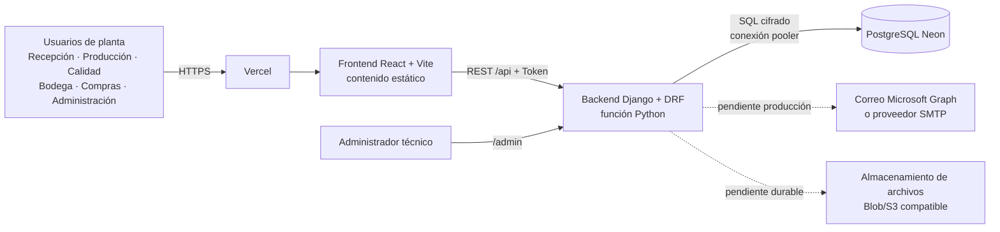
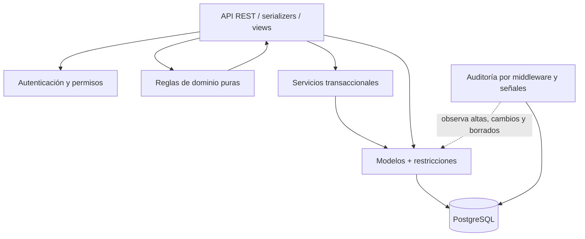
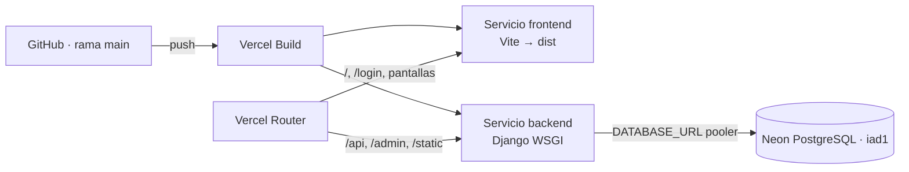
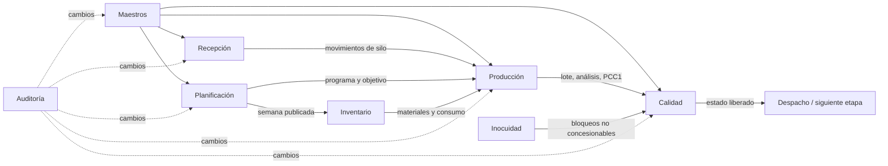
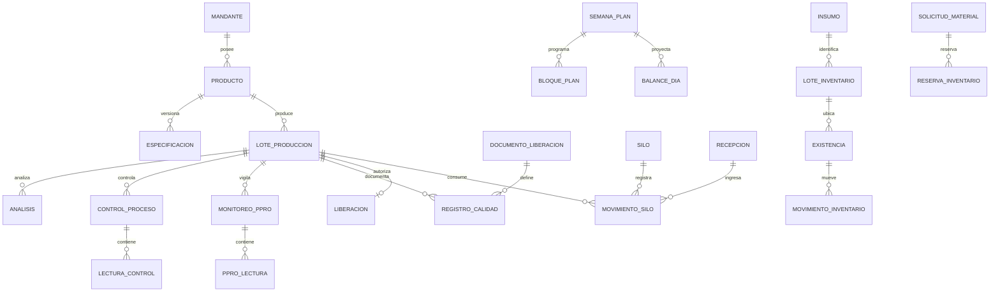

# Arquitectura, procesos BPMN y escalabilidad del sistema CCAA

**Fecha del levantamiento técnico:** 2026-08-04  
**Alcance:** código vigente de `main`, documentación funcional y configuración de despliegue.  
**Objetivo:** explicar cómo funciona el sistema, preparar su representación en Bizagi Modeler y establecer qué falta para operarlo con más usuarios y datos sin depender de suposiciones.

---

## 1. Resumen ejecutivo

CCAA es una aplicación web para gestionar el ciclo productivo de una planta láctea: recepción de leche, planificación, producción, controles de proceso e inocuidad, liberación de calidad, inventario y abastecimiento. Su regla central es:

> Un lote solo puede liberarse si la producción está cerrada, el dossier exigible está completo, la calidad es conforme y los controles de inocuidad no presentan bloqueos. Un producto no conforme puede seguir únicamente por concesión documentada; una falla de inocuidad no admite concesión.

La arquitectura actual es un **monolito modular**: una sola aplicación Django contiene módulos de negocio separados y expone una API REST; React consume esa API; PostgreSQL conserva los datos. En producción temporal, Vercel entrega el frontend estático y ejecuta Django como función Python; Neon presta PostgreSQL con conexión agrupada.

### Dictamen de escalabilidad

| Pregunta | Respuesta |
|---|---|
| ¿Sirve para demostraciones, pruebas con colegas y un piloto controlado? | **Sí.** |
| ¿La arquitectura permite crecer sin reescribir todo? | **Sí.** El monolito modular y PostgreSQL son una base razonable. |
| ¿Está probado cuánto tráfico simultáneo soporta? | **No.** Hay muchas pruebas funcionales, pero no una medición de carga documentada. |
| ¿Puede prometerse hoy operación crítica con alta concurrencia? | **No todavía.** Deben cerrarse los P0 y medirse los escenarios reales. |
| ¿Hay que migrar inmediatamente a microservicios? | **No.** Añadir microservicios hoy aumentaría complejidad sin resolver los riesgos actuales. |

La prioridad correcta no es “dividir por dividir”, sino endurecer el monolito: idempotencia, bloqueos consistentes, índices, paginación, trabajos asíncronos, archivos durables, observabilidad, respaldo y pruebas de carga.

---

## 2. Evidencia revisada

- 9 módulos de backend: `usuarios`, `maestros`, `recepcion`, `planificacion`, `produccion`, `calidad`, `inocuidad`, `inventario` y `auditoria`.
- 61 clases de modelo Django.
- 95 registros declarativos de rutas/API contabilizados en los archivos `urls.py`.
- 41 funciones de dominio puras en archivos `dominio.py`.
- 566 métodos de prueba detectados en 32 archivos de pruebas.
- 53 archivos TypeScript/TSX en el frontend y 164 archivos Python en el backend.
- La suite completa se inició localmente con SQLite, pero no terminó dentro de la ventana de verificación. SQLite además emite correctamente la advertencia `calidad.W001`: no garantiza `select_for_update`. La verificación real de concurrencia debe ejecutarse en PostgreSQL.
- El intento de build local alcanzó TypeScript y falló al cargar un binario nativo de Tailwind/Vite del entorno Windows (`oxide`/`EPERM`); no constituye un error de código demostrado y debe repetirse en un entorno limpio o CI.

Estas cifras muestran amplitud funcional, no capacidad. La capacidad simultánea solo puede afirmarse después de una prueba de carga contra una configuración equivalente a producción.

---

## 3. Arquitectura actual

### 3.1 Vista de contexto

### 3.2 Vista de contenedores

| Contenedor | Tecnología | Responsabilidad | Estado actual |
|---|---|---|---|
| Navegador | React 19, TypeScript, Vite | Pantallas, navegación, validación de cortesía y consumo de API | Implementado |
| API | Django 6, Django REST Framework | Autenticación, permisos, reglas, transacciones y serialización | Implementado |
| Dominio | Funciones Python puras | Decidir estados, bloqueos, calidad, balances y trazabilidad | Implementado por módulo |
| Persistencia | Django ORM + PostgreSQL | Datos, restricciones, transacciones y bloqueos de fila | Implementado; PostgreSQL es obligatorio en operación |
| Hosting | Vercel Services | Rewrites, frontend y ejecución Python serverless | Temporal / piloto |
| Base administrada | Neon PostgreSQL | Persistencia compartida y pool de conexiones | Implementado |
| Archivos | `FileField` local | Adjuntos de abastecimiento | **No apto todavía para serverless** |
| Correo | Backend configurable | Recuperación de contraseña | En Vercel se configuró consola; no entrega correos reales |

### 3.3 Diagrama de componentes del backend

La separación más sólida está en Inventario: las vistas delegan operaciones sensibles a servicios con `transaction.atomic`, `select_for_update` y expresiones `F`. Calidad protege la firma bloqueando filas del dossier, análisis y controles. Otros módulos tienen reglas de dominio claras, pero algunas escrituras críticas aún necesitan el mismo patrón.

### 3.4 Despliegue vigente

`vercel.json` define dos servicios dentro del mismo proyecto y enruta `/api`, `/admin` y `/static` al backend. El resto va al frontend. La aplicación usa `VITE_API_URL=/api/`, por lo que navegador y API comparten dominio y se evita CORS en el flujo normal.

---

## 4. Mapa funcional por módulo

| Módulo | Hechos que guarda | Cálculos o decisiones | Usuarios principales |
|---|---|---|---|
| Usuarios | Empresa, sucursal, perfil, rol | Rol efectivo y permisos | Administración, todos para iniciar sesión |
| Maestros | Mandantes, productos/SKU, equipos, silos, vehículos, especificaciones, documentos, recetas | Generación/validación de SKU y explosión de recetas | Administración y Calidad |
| Recepción | Camiones, controles, estado y movimientos de silo | Veredicto de recepción, ocupación y trazabilidad candidata | Recepción |
| Planificación | Semana, bloques, códigos, entradas del balance | Consumo, arrastre de stock, publicación y contraste plan/real | Producción / planificación |
| Producción | Lote, análisis, control de proceso y lecturas | Código sugerido, calidad, cierre y PCC1 | Producción |
| Inocuidad | Monitoreos PPRO y lecturas | Cumplimiento y acciones correctivas | Producción / Calidad |
| Calidad | Dossier dinámico, registros y firma de liberación | Avance, discrepancias, bloqueos, liberación o concesión | Calidad |
| Inventario | Insumos, lotes, existencias, movimientos, compras, MRQ, reservas, MRP, alertas | FEFO, stock disponible, decisiones y necesidades | Bodega, Compras, Calidad, Producción |
| Auditoría | Actor, fecha, IP, acción y diferencias | Historial legible de cambios | Todos en lectura / auditoría |

### Dependencias de negocio

---

## 5. Flujo integral del negocio

1. Administración mantiene productos, mandantes, SKU, equipos, silos, vehículos, especificaciones, documentos y recetas.
2. Planificación arma una semana, evita solapamientos, calcula consumo esperado y valida saldos antes de publicar.
3. Recepción registra el camión y sus controles. Si cumple, lo libera y descarga al silo mediante un movimiento de ingreso.
4. Producción abre un lote, asigna leche desde uno o más silos y registra el movimiento de salida.
5. Durante la corrida se registran análisis, controles de proceso, lecturas PCC1 y monitoreos PPRO.
6. Al terminar, Producción informa kilos y declara el lote producido/cerrado.
7. Calidad completa el dossier, coteja formularios con análisis y revisa los bloqueos.
8. Si todo cumple, firma liberación. Si solo falla calidad y se documenta la excepción, puede firmar concesión. Si falla inocuidad, queda bloqueado.
9. Inventario soporta compras, recepción de materiales, cuarentena, inspección, reserva FEFO, entrega a producción, devoluciones, ajustes y MRP.
10. Auditoría registra los cambios de los módulos incluidos, independientemente de si se originan en API, admin o scripts.

---

## 6. Estructura recomendada en Bizagi Modeler

### 6.1 Jerarquía de diagramas

No conviene dibujar todo en un solo lienzo. Usar tres niveles:

| Nivel | Diagrama | Objetivo |
|---|---|---|
| 0 | Macroproceso “Gestionar producción y liberación CCAA” | Explicar de inicio a fin en una sola lámina |
| 1 | Ocho procesos principales | Mostrar responsables, decisiones y entregables |
| 2 | Procesos críticos detallados | Representar excepciones, firmas, mensajes y datos |

### 6.2 Pools y lanes

**Pool principal:** CCAA.  
**Lanes recomendadas:** Planificación, Recepción, Producción, Calidad/Inocuidad, Bodega/Compras, Administración y Sistema CCAA.

Usar pools separados solo para entidades externas con proceso propio, por ejemplo Proveedor, Mandante o Servicio de correo. Dentro de un mismo pool se conectan tareas con flujo de secuencia. Entre pools se usan flujos de mensaje. No usar una lane “Sistema” para gateways; usarla únicamente cuando el sistema ejecuta una tarea automática concreta.

### 6.3 Convenciones

- Tareas humanas: verbo + objeto, por ejemplo “Registrar controles del camión”.
- Tareas automáticas: “Calcular ocupación de silos” o “Evaluar dossier”.
- Gateway exclusivo (XOR): pregunta que permite una sola salida, por ejemplo “¿Recepción conforme?”.
- Gateway paralelo (AND): actividades que pueden ejecutarse a la vez, por ejemplo análisis, dossier y controles de inocuidad.
- Evento de mensaje: interacción entre pools, por ejemplo envío de orden a proveedor.
- Objeto de datos: lote, guía, especificación vigente, dossier, análisis, movimiento de inventario.
- Estado final debe ser explícito: liberado, concesionado, retenido, rechazado, cerrado o cancelado.

---

## 7. Diagramas BPMN para construir en Bizagi

## 7.1 Nivel 0 — Gestionar producción y liberación

**Inicio:** necesidad de producir una semana o una orden.  
**Fin exitoso:** lote liberado y disponible para despacho.  
**Fin alternativo:** lote anulado, retenido o no liberado.

| Nº | Lane | Elemento BPMN | Nombre | Salida / condición |
|---:|---|---|---|---|
| 1 | Planificación | Evento de inicio | Necesidad de producción | Inicia planificación |
| 2 | Planificación | Subproceso | Planificar semana | Programa validado |
| 3 | Recepción | Subproceso | Recibir y liberar leche | Leche descargada a silo |
| 4 | Producción | Subproceso | Ejecutar producción | Lote producido |
| 5 | Calidad/Inocuidad | Gateway paralelo | Ejecutar controles | Abre tres ramas |
| 6 | Calidad/Inocuidad | Subproceso | Completar dossier | Documentos completos |
| 7 | Calidad/Inocuidad | Subproceso | Evaluar análisis | Resultado calculado |
| 8 | Calidad/Inocuidad | Subproceso | Verificar inocuidad | Sin bloqueos o bloqueado |
| 9 | Sistema CCAA | Gateway exclusivo | ¿Cumple liberación? | Sí / No |
| 10 | Calidad | Tarea de usuario | Firmar liberación | Lote liberado |
| 11 | Calidad | Gateway exclusivo | ¿Admite concesión? | Solo no conformidad de calidad |
| 12 | Calidad | Tarea de usuario | Documentar y firmar concesión | Lote concesionado |
| 13 | Calidad | Evento final | Lote no liberado | Bloqueo vigente |
| 14 | Calidad | Evento final | Lote disponible para despacho | Liberado o concesionado |

## 7.2 Recepción de leche y descarga a silo

**Lanes:** Recepción, Calidad/Análisis, Sistema CCAA.  
**Datos:** guía, vehículo, procedencia, litros, controles, silo y movimiento.

| Nº | Lane | Tipo | Actividad o decisión |
|---:|---|---|---|
| 1 | Recepción | Inicio | Camión llega a planta |
| 2 | Recepción | Tarea | Registrar recepción y guía |
| 3 | Recepción | Tarea | Tomar muestra |
| 4 | Calidad/Análisis | Tarea | Registrar controles de recepción |
| 5 | Sistema | Tarea automática | Evaluar límites y controles decisivos |
| 6 | Sistema | XOR | ¿Información suficiente? |
| 7A | Recepción | Tarea | Completar controles faltantes; vuelve a 4 |
| 7B | Sistema | XOR | ¿Recepción liberable? |
| 8A | Calidad/Análisis | Tarea | Retener y registrar motivo |
| 9A | Calidad/Análisis | XOR | ¿Reanálisis autoriza? |
| 10A | Recepción | Fin | Recepción cerrada/rechazada |
| 8B | Recepción | Tarea | Seleccionar silo y confirmar descarga |
| 9B | Sistema | Tarea automática | Crear movimiento de ingreso y cambiar a descargada |
| 10B | Sistema | Tarea automática | Recalcular ocupación y alertas |
| 11B | Recepción | Fin | Leche disponible en silo |

**Riesgo que debe figurar como anotación:** la descarga debe ser idempotente y bloquear la recepción antes de crear el movimiento, para impedir una doble descarga simultánea.

## 7.3 Planificación semanal

**Lanes:** Planificación/Producción y Sistema CCAA.  
**Datos:** semana, equipos, bloques, códigos, rendimientos, recepciones previstas y stocks.

1. Crear o clonar semana en borrador.
2. Cargar stock inicial y recepciones previstas.
3. Programar bloques de producción, aseo, mantenimiento o preparación.
4. El sistema valida horarios, coherencia y solapamientos.
5. El sistema calcula consumo solo en equipos que consumen leche.
6. El sistema arrastra el stock diario y calcula saldos por origen.
7. Gateway: “¿Hay bloqueos o saldos negativos sin justificar?”.
8. Si hay bloqueos, corregir programa o balance.
9. Si no hay bloqueos, publicar semana y registrar autor/fecha.
10. Durante/tras la ejecución, contrastar plan con recepciones, salidas de silo y kilos reales.
11. Cerrar la semana y documentar desviaciones.

## 7.4 Apertura y ejecución del lote

**Lanes:** Producción, Sistema CCAA, Calidad/Inocuidad.

1. Seleccionar producto y fecha.
2. El sistema propone el código de lote desde el SKU y correlativo; el operador puede corregirlo.
3. Seleccionar silos y litros asignados.
4. En una transacción, crear lote y movimientos de salida; si una parte falla, no guardar ninguna.
5. Ejecutar corrida.
6. En paralelo registrar análisis, lecturas de control, PCC1 y PPRO.
7. Registrar kilos producidos y hora de término.
8. El sistema evalúa si puede declararse producido.
9. Si faltan kilos o son inválidos, corregir.
10. Si falta trazabilidad de leche, mostrar aviso sin bloquear según la regla vigente.
11. Pasar a producido/cerrado.

**Riesgos a modelar:** colisión del correlativo cuando dos usuarios abren lotes simultáneamente; stock de silo insuficiente o asignación concurrente; corrección posterior mediante ajuste y no borrado histórico.

## 7.5 Control de calidad, inocuidad y liberación

**Lanes:** Producción, Laboratorio/Calidad, Inocuidad, Sistema CCAA, Autorizador.

1. Evento inicial: lote producido/cerrado.
2. Gateway paralelo: completar dossier, análisis y controles de inocuidad.
3. Sistema selecciona documentos aplicables a la familia del producto.
4. Calidad completa y firma cada registro.
5. Sistema calcula la especificación vigente a la fecha y evalúa parámetros.
6. Sistema coteja valores repetidos entre formularios y laboratorio.
7. Sistema evalúa PCC1 y PPRO; un No-OK requiere acción correctiva.
8. Gateway de unión: esperar todas las ramas.
9. Sistema bloquea las filas relevantes y recalcula la decisión dentro de una transacción.
10. XOR “¿Checklist completo y calidad conforme y sin bloqueo de inocuidad?”.
11. Sí: autorizador firma liberación.
12. No: XOR “¿La única desviación permite concesión?”.
13. Sí: registrar motivo y autorizador; firmar concesión.
14. No: mantener en revisión/bloqueado y mostrar motivos.
15. Evento final: liberado, concesionado o no liberado.

## 7.6 Compra y recepción de materiales

**Pools:** CCAA y Proveedor.  
**Lanes CCAA:** Solicitante, Compras/Aprobador, Recepción de compras, Calidad, Bodega, Sistema.

1. Detectar necesidad manual o desde MRP.
2. Crear solicitud de compra con detalles.
3. Enviar a aprobación.
4. XOR “¿Aprobada?”; el solicitante no puede autoaprobarse.
5. Compras emite orden y la envía al proveedor mediante mensaje.
6. Proveedor entrega material y documentos.
7. Recepción controla cantidad, daño, temperatura, embalaje y certificado.
8. Material sujeto a Calidad ingresa en cuarentena; el resto, a ubicación disponible.
9. Calidad inspecciona con plantilla versionada.
10. XOR “¿Aprobado, observado, rechazado o bloqueado?”.
11. El sistema mueve el lote a una ubicación compatible y conserva el movimiento.
12. Si existe no conformidad, decidir devolución, destrucción, reinspección, reproceso o liberación excepcional.

## 7.7 Solicitud, reserva FEFO y entrega a Producción

1. Producción crea MRQ asociada opcionalmente a un lote.
2. Envía MRQ.
3. Bodega aprueba/prepara.
4. El sistema bloquea existencias elegibles y reserva por FEFO.
5. XOR “¿Stock suficiente?”.
6. No: dejar faltante y generar alerta/compra.
7. Sí: preparar entrega.
8. Entregador y receptor identificados confirman cantidades.
9. El sistema descuenta/mueve existencias dentro de una transacción.
10. Si sobra material, registrar devolución como utilizable, dañado o merma.
11. Ajustes requieren motivo y separación entre solicitante y aprobador.

## 7.8 Auditoría y recuperación de contraseña

**Auditoría:** petición autenticada → middleware identifica actor/IP → señales capturan antes/después desde base → registro inmutable → consulta de solo lectura.  
**Recuperación:** usuario solicita enlace → throttle → backend genera token temporal → proveedor envía correo → usuario abre frontend → backend valida token y bloquea usuario al cambiar contraseña → fin.

---

## 8. Modelo de datos conceptual

Principios del modelo:

- Los saldos se derivan de movimientos; no se corrigen escribiendo un total.
- El veredicto de calidad y el avance del checklist se recalculan; no se persisten.
- Las especificaciones, documentos y plantillas están versionados.
- Las restricciones de base protegen unicidad y cantidades imposibles.
- Las operaciones de inventario se registran junto con su movimiento en la misma transacción.
- La trazabilidad de leche desde un silo es un conjunto de recepciones candidatas, porque el contenido se mezcla; no se promete una relación falsa uno-a-uno.

---

## 9. Evaluación de escalabilidad y resiliencia

### 9.1 Fortalezas actuales

| Fortaleza | Por qué importa al crecer |
|---|---|
| Backend sin estado de sesión obligatorio | Varias instancias pueden atender peticiones; el token viaja con cada llamada. |
| PostgreSQL | Restricciones, transacciones y bloqueos reales bajo concurrencia. |
| Neon con URL `-pooler` | PgBouncer amortigua muchas conexiones serverless breves. |
| Paginación REST por defecto (50) | Evita devolver tablas completas en ViewSets estándar. |
| `select_related`/`prefetch_related` en rutas importantes | Reduce consultas N+1 en lotes y expedientes. |
| Dominio puro | Las reglas se prueban y se pueden reutilizar sin acoplarlas al ORM o UI. |
| Firma de calidad protegida | Bloquea los datos evaluados hasta guardar la decisión. |
| Inventario transaccional | Bloqueos, `F()` y movimientos reducen sobreventa y saldos inconsistentes. |
| Restricciones de base | Impiden duplicados y cantidades físicamente imposibles aun si falla la UI. |
| Permisos cerrados por defecto | Un endpoint nuevo queda autenticado si olvida declarar permisos. |

### 9.2 Cuellos de botella y fallas posibles

| Hallazgo | Impacto | Prioridad |
|---|---|---:|
| `ocupacion` carga todos los movimientos de silo y suma en Python | Tiempo y memoria crecen linealmente con todo el histórico | P0 antes de gran histórico |
| Descarga de recepción no bloquea la fila ni tiene clave idempotente | Dos peticiones simultáneas pueden intentar crear dos ingresos | P0 |
| Código sugerido usa `count()+1` | Dos aperturas simultáneas pueden recibir el mismo correlativo; la restricción rechaza una, pero la UX falla | P0/P1 |
| Asignación de leche a lote no demuestra bloqueo del saldo de silo | Dos lotes pueden consumir simultáneamente sobre un saldo que solo se calcula después | P0 si el stock debe bloquear |
| Expedientes de Calidad recorren lotes y calculan en Python sin paginación propia | Respuesta lenta al crecer el histórico | P1 |
| Auditoría excluye actualmente la app `inventario` | Operaciones sensibles de abastecimiento quedan fuera del registro transversal | P0 de cumplimiento |
| `FileField` usa almacenamiento local | En ejecución serverless el archivo no es una persistencia durable compartida | P0 antes de usar adjuntos |
| Alertas de inventario recorren insumos/existencias en Python | N+1 y costo alto al crecer catálogo/lotes | P1 |
| MRP, alertas y correo son síncronos | Solicitudes largas, reintentos inseguros y riesgo de timeout | P1 |
| Solo recuperación de contraseña tiene throttle explícito | Login y endpoints costosos pueden abusarse o saturarse | P1 |
| Sin configuración visible de observabilidad estructurada/APM | Un 500 o degradación puede detectarse tarde | P0 operativo |
| Migraciones y creación de usuario se ejecutaron manualmente | Riesgo de desplegar código antes del esquema | P0 operativo |
| Correo de producción configurado a consola | La recuperación no llega al usuario | P0 para operación real |
| Ruta directa `/login` presentó 404 en una prueba de despliegue | Enlaces y recargas profundas pueden fallar según rewrite vigente | P0 de experiencia/despliegue |
| Runtime Python de Vercel está documentado como Beta | Adecuado para piloto; evaluar plataforma más convencional para operación crítica | Decisión de plataforma |

### 9.3 Concurrencia: qué está protegido y qué no

| Operación simultánea | Protección actual | Evaluación |
|---|---|---|
| Dos usuarios editan un formulario antes de liberar | La firma vuelve a leer y bloquea filas | Buena para la decisión final |
| Firma mientras otro cambia análisis/PCC/PPRO | `select_for_update` dentro de `atomic` | Buena en PostgreSQL |
| Dos salidas/reservas sobre la misma existencia | Bloqueo de `Existencia`, transacción y `F()` | Buena |
| Dos decisiones sobre una solicitud/ajuste | Bloqueo de fila y validación de estado | Buena |
| Dos descargas de la misma recepción | Transacción, pero sin bloqueo/idempotencia visible | Insuficiente |
| Dos lotes toman leche del mismo silo | Libro de movimientos; no se observa bloqueo serializado del saldo | Requiere diseño explícito |
| Dos lotes nuevos del mismo producto/fecha | Restricción natural detiene el duplicado, pero el correlativo se calcula con carrera | Consistencia aceptable, experiencia no |
| Dos publicaciones/cambios de una misma semana | Transacción de publicación; revisar bloqueo de semana y bloqueo de edición posterior | Parcial |

### 9.4 Escala por volumen

No existe un número responsable de “usuarios máximos” sin medición. La capacidad depende de mezcla de operaciones, tamaño de la base, latencia regional, índices y plan contratado. Se proponen tres escalones de validación:

| Escenario | Carga a simular | Objetivo |
|---|---|---|
| Piloto | 10 usuarios concurrentes; 20 peticiones/s en ráfaga | Sin errores de consistencia; p95 de lectura < 1 s y escritura < 2 s |
| Planta | 50 usuarios; 75 peticiones/s; 10 escrituras/s | Error < 1%; sin doble movimiento; p95 < 2 s |
| Crecimiento | 200 usuarios; 250 peticiones/s; histórico x10 | Error < 1%; cola controlada; consultas críticas < 3 s |

Estos son **criterios de prueba propuestos**, no resultados obtenidos.

### 9.5 Plan de prueba de carga

1. Crear una base de prueba PostgreSQL con volumen representativo: productos, 10 años de recepciones/movimientos, lotes, análisis, dossier e inventario.
2. Usar k6 o Locust con usuarios y roles separados.
3. Mezcla sugerida: 45% lecturas de panel/listados, 20% ocupación/stock, 10% planificación, 10% apertura/cierre de lote, 10% formularios de Calidad y 5% firma/ajustes.
4. Inyectar carreras dirigidas: doble descarga, doble reserva, firma frente a edición y doble correlativo.
5. Medir p50/p95/p99, tasa de error, consultas lentas, conexiones, CPU, memoria, locks y tamaño de respuesta.
6. Definir presupuesto de error y detener el aumento cuando p95 o errores superen el criterio.
7. Repetir después de cada optimización y guardar los resultados como evidencia de capacidad.

---

## 10. Hoja de ruta de endurecimiento

### P0 — antes de operación real o demostración con datos sensibles

1. **Rotar credenciales expuestas:** regenerar contraseña/URL de Neon y confirmar que la clave Django compartida previamente ya no está vigente.
2. **Persistencia de archivos:** conectar `FileField` a Blob/S3 compatible y guardar hash/tamaño/tipo.
3. **Idempotencia y locks:** bloquear recepción al descargar; usar una restricción que permita un solo ingreso por recepción; serializar consumo de silo o definir si el saldo negativo solo alerta.
4. **Auditoría:** incluir Inventario y probar que movimientos/decisiones críticos se registren sin recursión ni ruido.
5. **Consultas históricas:** convertir ocupación a agregación SQL y paginar expedientes.
6. **Operación:** automatizar `migrate` como paso controlado, respaldo, restauración probada y rollback de despliegue.
7. **Observabilidad:** logs JSON con request ID, errores, latencia, consultas lentas y alertas; integrar APM/Sentry o equivalente.
8. **Correo real:** configurar Microsoft Graph/SMTP y verificar recuperación extremo a extremo.
9. **SPA/rewrite:** probar `/login`, `/dashboard` y rutas profundas en una ventana anónima y al recargar.
10. **Prueba de carga base:** ejecutar escenario piloto y conservar el informe.

### P1 — antes de ampliar áreas, usuarios o datos

1. Añadir índices compuestos según filtros reales y revisar planes con `EXPLAIN ANALYZE`.
2. Optimizar alertas y MRP con agregaciones/bulk; ejecutar fuera de la petición.
3. Añadir una cola de trabajos para correo, MRP, alertas y reportes; diseñar reintentos idempotentes.
4. Cachear catálogos y maestros de lectura frecuente con invalidación explícita.
5. Incorporar rate limiting para login y endpoints costosos.
6. Limitar tamaños de JSON, archivos y respuestas.
7. Crear pruebas de contrato frontend/API y CI obligatorio en pull request.
8. Validar permisos por empresa/sucursal; hoy el modelo existe, pero debe revisarse el aislamiento de datos en todos los querysets.

### P2 — crecimiento sostenido

1. Particionar o archivar tablas históricas solo si las métricas lo justifican.
2. Réplicas de lectura para reportes pesados.
3. Materialized views o tablas de resumen para indicadores, sin reemplazar el libro original.
4. Separar un servicio únicamente cuando tenga un motivo medido: carga independiente, equipo propietario o ciclo de despliegue distinto.
5. Evaluar migrar Django desde runtime beta a contenedores administrados si se requieren procesos largos, workers permanentes, WebSockets o controles operativos más finos.

---

## 11. Seguridad, continuidad y cumplimiento

### Controles existentes

- Autenticación por token y sesión para navegación administrativa.
- API autenticada y cerrada por defecto.
- Permisos de escritura por rol/área; lectura transversal para operación de planta.
- Cookies seguras, redirección HTTPS, `X-Frame-Options: DENY` y `nosniff` en producción.
- Validadores de contraseña y throttle de recuperación.
- Auditoría con actor, IP, origen y diferencias antes/después.
- Restricciones y transacciones de base.

### Riesgos por cerrar

- El token se guarda en `localStorage` o `sessionStorage`; un XSS podría extraerlo. Para exposición pública, preferir cookie HttpOnly y una estrategia CSRF completa.
- Falta una política visible de expiración/rotación de tokens.
- Falta documentar recuperación ante desastre, RPO y RTO.
- Falta verificar respaldo y restauración, no solo que el proveedor declare respaldo.
- Falta clasificación/retención de datos y adjuntos.
- Falta auditoría transversal de Inventario.
- Falta invalidación global de sesiones ante incidente.

### Objetivos operativos sugeridos

| Indicador | Meta inicial de piloto |
|---|---|
| Disponibilidad mensual | 99,5% |
| RPO | 24 h como máximo; reducir según criticidad |
| RTO | 4 h para piloto |
| Error de API | < 1% excluyendo validaciones 4xx esperadas |
| p95 lectura/escritura | < 1 s / < 2 s en piloto |
| Restauración | Simulada y documentada cada trimestre |
| Incidentes de doble movimiento | 0 |

Las metas deben ser aprobadas por negocio; no son una garantía del proveedor ni una medición actual.

---

## 12. Indicadores para la presentación y la operación

### Producción y Calidad

- Lotes producidos, liberados, concesionados y bloqueados.
- Tiempo desde cierre de producción hasta liberación.
- Porcentaje de dossier completo al primer intento.
- Desviaciones por parámetro, equipo, producto y mandante.
- Incumplimientos PCC/PPRO y tiempo hasta acción correctiva.
- Diferencia plan versus real en litros, horas y kilos.

### Recepción e Inventario

- Recepciones liberadas/retenidas y motivos.
- Ocupación y días de cobertura por silo.
- Exactitud de inventario y número de ajustes.
- Rotación, vencimientos, mermas y uso FEFO.
- Tiempo solicitud–aprobación–orden–recepción.
- Nivel de servicio de MRQ y quiebres de stock.

### Plataforma

- Usuarios activos y concurrencia máxima.
- p95/p99 por endpoint.
- Errores 5xx y reintentos.
- Conexiones y locks de PostgreSQL.
- Consultas lentas y cache hit ratio.
- Duración de cold starts y funciones.
- Crecimiento mensual por tabla y almacenamiento de archivos.

---

## 13. Guion ejecutivo de la presentación

1. **Problema:** la operación en papel/Excel no garantiza una sola versión del dato ni bloqueos automáticos.
2. **Solución:** una cadena digital desde recepción hasta liberación, con reglas explicables.
3. **Arquitectura:** React + API Django modular + PostgreSQL, desplegado temporalmente en Vercel/Neon.
4. **Flujo:** planificar → recibir → producir → controlar → liberar → abastecer/auditar.
5. **Control central:** no se firma una liberación contra datos que puedan cambiar simultáneamente.
6. **Fortalezas:** dominio probado, trazabilidad, transacciones, permisos y restricciones.
7. **Límite honesto:** no existe aún una cifra de capacidad porque no se ha ejecutado una prueba de carga representativa.
8. **Riesgos:** doble descarga, consultas históricas, adjuntos serverless, auditoría de Inventario y operación manual.
9. **Plan:** cerrar P0, medir piloto, optimizar P1 y recién después ampliar.
10. **Decisión solicitada:** aprobar piloto controlado y un sprint de endurecimiento, no una promesa de escala sin evidencia.

---

## 14. Checklist antes de presentar o levantar el piloto

- [ ] Credenciales rotadas y secretos fuera de capturas/repositorio.
- [ ] `DEBUG=false`, host y HTTPS correctos.
- [ ] Base Neon conectada mediante URL pooler y misma región que backend.
- [ ] Migraciones aplicadas y verificadas.
- [ ] Usuario de prueba por cada rol.
- [ ] `/api/salud/`, login, logout y recuperación verificados.
- [ ] Rutas profundas del frontend verificadas al recargar.
- [ ] Flujo de recepción, descarga y ocupación probado.
- [ ] Flujo de apertura, asignación y cierre de lote probado.
- [ ] Expediente conforme, concesión y bloqueo por inocuidad probados.
- [ ] Respaldo/exportación de datos antes de borrar Neon.
- [ ] Monitoreo y canal de reporte de errores activos.
- [ ] Datos de demostración sin información sensible.
- [ ] Resultado de prueba de carga piloto adjunto a la decisión de salida.

---

## 15. Fuentes

### Repositorio

- `README.md`, `CLAUDE.md`, `DECISIONES.md`.
- `vercel.json`, `frontend/vercel.json`, `backend/config/settings.py` y `backend/config/urls.py`.
- Modelos, vistas, serializadores, servicios, dominios y pruebas de todas las apps bajo `backend/`.
- `docs/ARQUITECTURA_EVOLUTIVA_ABASTECIMIENTO.md`.
- `docs/levantamiento-2026-07/LEVANTAMIENTO_PLANTA.md` y backlog asociado.
- `prototipo/MODELO_DATOS.md` y `prototipo/PLANIFICADOR.md` como antecedentes de diseño.

### Documentación externa oficial

- Bizagi, interacción entre procesos y uso de pools/mensajes: <https://help.bizagi.com/platform/en/multiple_pools.htm>
- Bizagi, buenas prácticas BPMN: <https://help.bizagi.com/platform/en/best_practices_in_modeling.htm>
- Django 6.0, transacciones: <https://docs.djangoproject.com/en/6.0/topics/db/transactions/>
- Django, `select_for_update`: <https://docs.djangoproject.com/en/6.1/ref/models/querysets/#select-for-update>
- Vercel, escalado de concurrencia: <https://vercel.com/docs/functions/concurrency-scaling>
- Vercel, runtime Python: <https://vercel.com/docs/functions/runtimes/python>
- Vercel, almacenamiento: <https://vercel.com/docs/storage>
- Neon, connection pooling: <https://neon.com/docs/connect/connection-pooling>

