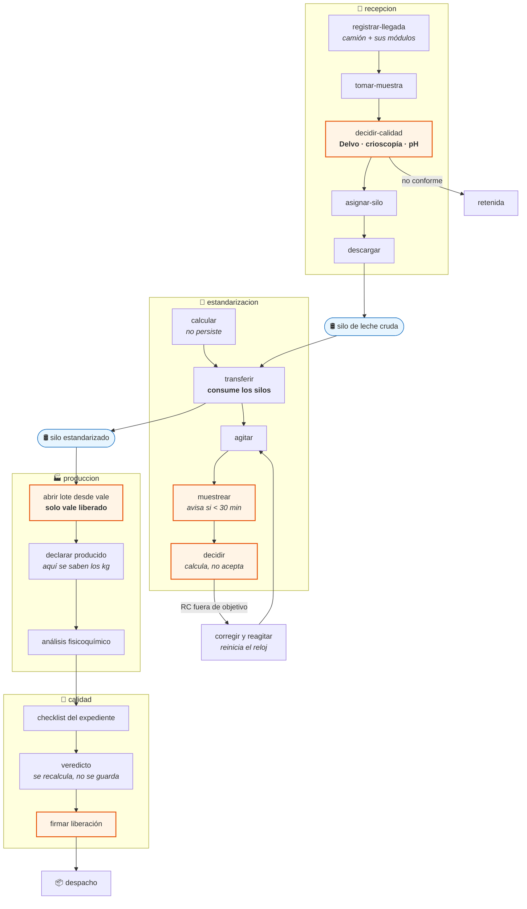
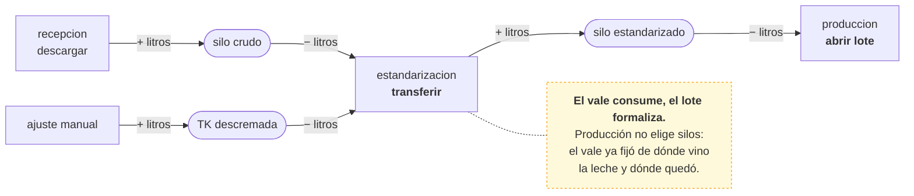
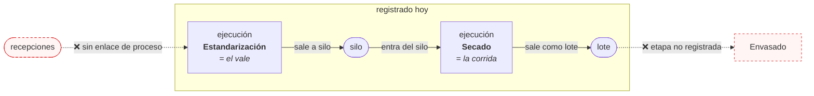
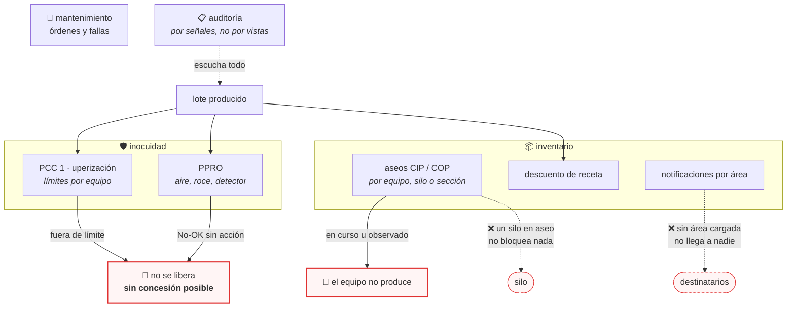
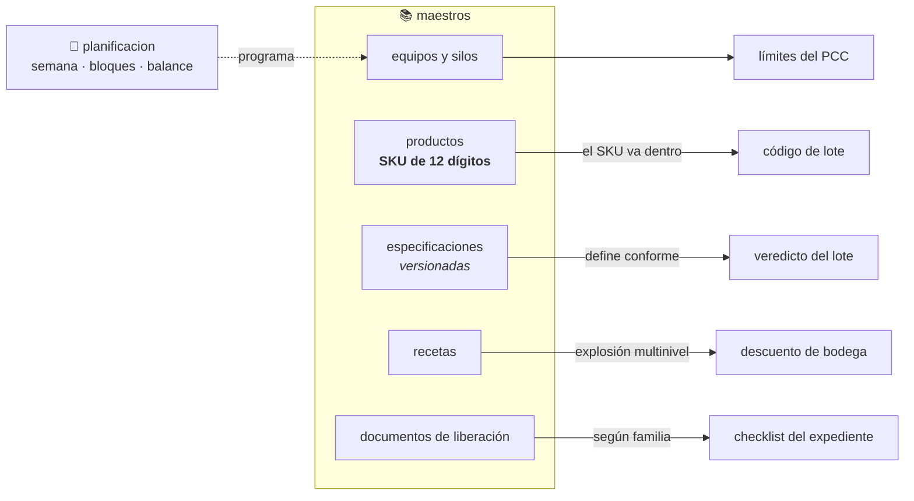

# Flujo del sistema — procesos y módulos

Mapa de **cómo circula el trabajo** por CCAA: qué módulo recibe cada hecho de
planta, qué regla decide si puede pasar al siguiente, y dónde el sistema todavía
no se parece a lo que ocurre en la fábrica.

No es un diagrama de tablas. Las flechas son **transiciones reales del
proceso** —una acción que alguien ejecuta y que el backend acepta o rechaza—, no
claves foráneas.

**Cómo leerlo como ruta de trabajo:** lo dibujado en línea continua está
implementado y cubierto por pruebas; lo punteado en rojo es **hueco conocido**,
y cada uno tiene su ficha en la sección [Huecos](#huecos-conocidos). Ese es el
material de las próximas mejoras.

> Verificado contra el código el 2026-08-14, rama `feature-inocuidadJS`.
> Cuando una regla cambie, este documento tiene que cambiar con ella: un mapa
> que ya no describe el terreno es peor que no tener mapa, porque se sigue.

---

## 1. La cadena principal: de la leche cruda al saco liberado

**Las cinco compuertas** (en naranja) son las decisiones que el sistema **no
delega en el cliente**: las calcula siempre, y las impone — salvo `muestrear`,
que desde 2026-08-17 solo avisa y deja seguir.

| Compuerta | Qué exige | Dónde vive |
|---|---|---|
| `decidir-calidad` | Los controles completos; el veredicto lo calcula el dominio | `recepcion/dominio.py` |
| `muestrear` | Hora de agitación la fija el servidor; muestrear antes de los 30 minutos avisa, no bloquea (desde 2026-08-17) | `estandarizacion/servicios.py` |
| `decidir` | El RC medido contra el objetivo — **no recibe la decisión** | `estandarizacion/servicios.py` |
| abrir lote | Vale **liberado**, producto que coincide, y no más litros de los preparados | `produccion/dominio.py` |
| firmar liberación | Checklist, análisis, PCC y PPRO — con bloqueo de fila | `calidad/dominio.py` |

---

## 2. Quién consume qué: el balance de los silos

El error más fácil de cometer aquí es que dos módulos descuenten la misma leche.
La regla que lo evita es **quién consume el silo**.

Cada movimiento queda en `MovimientoSilo` con su `origen_tipo` —`recepcion`,
`estandarizacion`, `lote`, `ajuste`— y la ocupación **se calcula sumando el
libro**, nunca se guarda. Un saldo almacenado se desincroniza; uno calculado no
puede mentir.

---

## 3. La cadena de trazabilidad

`procesos` es la capa que responde **de qué salió un saco**. Un vale de
estandarización **es** una ejecución de su etapa; no algo que la acompaña.

De las **siete etapas declaradas** —recepción, estandarización, descremación,
evaporación, condensación, secado, envasado— solo **dos** registran ejecución
automáticamente. Las otras cinco existen en el maestro y nadie las alimenta.

Consecuencia medible: la genealogía de un lote devuelve **un nodo y ningún
enlace**. Para llegar desde un saco hasta los camiones que trajeron esa leche
hay que cruzar a mano el libro de movimientos de silo.

---

## 4. Los módulos que vigilan, no producen

**Un fallo de inocuidad no admite concesión.** Una concesión asume un riesgo
medido sobre la calidad; aquí lo que falló es la barrera que hace seguro el
producto. Sus motivos entran en la lista de bloqueos, y eso anula las dos vías.

---

## 5. Los maestros: lo que hay que cargar antes de operar

**Quién escribe cada maestro importa:** las especificaciones, las recetas y el
catálogo de documentos los escribe **Calidad**, no Administración. Los rangos
deciden qué producto sale conforme; que otro pudiera moverlos le dejaría cambiar
el veredicto de un lote sin volver a medirlo.

---

## Huecos conocidos

Ordenados por lo que costaría que se materializaran, no por esfuerzo.

### 🔴 1. Un silo en aseo puede recibir leche

`CicloCIP` ya admite `tipo_objetivo = silo`, pero **ninguna regla lo consulta**.
`motivo_equipo_no_habilitado` filtra por equipo, así que una recepción puede
descargar en un silo con soda circulando, y un vale puede tomarlo como destino.

Es el reverso exacto de la regla que sí existe para máquinas. El modelo promete
algo que no cumple.

**Dónde:** `inventario/servicios.py` · `recepcion/views.py` (descargar) ·
`estandarizacion/servicios.py` (transferir).

### 🟠 2. Cinco de siete etapas no registran ejecución

Solo estandarización y secado crean su `EjecucionProceso`. Recepción,
descremación, evaporación, condensación y envasado están declaradas y vacías.

Mientras siga así, la trazabilidad hacia adelante —«este lote salió malo, ¿a qué
lotes afectó?»— no puede responder, que es la pregunta que se hace en un retiro
de producto.

**Dónde:** `procesos/servicios.py` · los servicios de cada módulo.

### 🟠 3. La descremación no está modelada

El TK de leche descremada se carga con un **ajuste manual**. En planta esa leche
sale de descremar leche entera, con su propio rendimiento y su crema como
coproducto. Hoy aparece de la nada, así que el balance de grasa de la planta no
cuadra por ningún lado.

**Dónde:** módulo nuevo, o una etapa de `procesos` con su servicio.

### 🟡 4. Las notificaciones no llegan a nadie

El flujo avisa a Recepción cuando llega leche y a Condensación cuando hay leche
disponible en el silo. Los destinatarios se buscan **por área**, y hoy ningún
perfil tiene un área válida cargada — el check `usuarios.W001` lo dice en cada
arranque.

No falla: no hace nada, que es peor porque no hay error que ver.

**Dónde:** dato, no código. Asignar áreas reales a las personas.

### 🟡 5. De un saco a sus camiones hay que cruzar a mano

La cadena de lotes termina donde empieza el silo. El vínculo hacia las
recepciones existe en `MovimientoSilo` (`origen_tipo` + `origen_id`) pero no
está expuesto como trazabilidad.

**Dónde:** `procesos/servicios.py::genealogia_lote`.

### 🟡 6. La sesión caducada no manda al login

El interceptor del frontend redirige con `window.location.assign("/login")`, y
la aplicación usa `HashRouter`: sus rutas son `/#/login`. El usuario se queda
mirando «no se pudo cargar» en vez de que le pidan la contraseña.

**Dónde:** `frontend/src/services/api.ts`.

---

## Lo que ya está resuelto, y conviene no deshacer

Estas decisiones costaron encontrarlas. Están en `CLAUDE.md` con su detalle.

- **El veredicto y el avance del checklist se recalculan**, no se guardan.
  Corregir una especificación reevalúa todo el histórico sin migrar nada.
- **Las decisiones devuelven motivos**, no un booleano. Un `False` no le dice al
  operador qué le falta.
- **El vale calcula su decisión**; no la acepta del cliente. Dejar que el cliente
  diga «liberado» convierte la regla en una sugerencia.
- **La ocupación del silo es un saldo del libro**, nunca un campo.
- **Una sola planta y no se nota**: se resuelve sola cuando hay una activa, y
  vuelve a pedirse cuando hay dos.
- **La firma usa `select_for_update`** — y por eso el motor tiene que ser
  PostgreSQL. En SQLite ese bloqueo no hace nada, en silencio.
