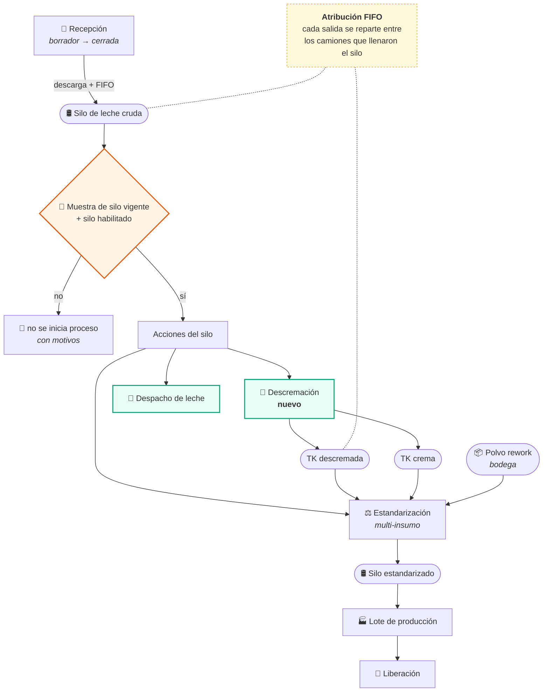

# Plan de implementación — cambios levantados con planta

**Fecha:** 2026-08-24
**Origen:** reunión con planta sobre el comportamiento real de los procesos
**Para:** Analista TI (ejecución) · **Solicita:** José Sepúlveda
**Estado del sistema:** en desarrollo. Implementación en planta posterior a la semana del 2026-09-18.
**Verificado contra:** rama `feature-AcopleArchivosFabricación`, último commit del 2026-08-21.

---

## 0. Cómo usar este plan

El documento tiene **dos partes**:

- **Parte I (§1–§8)** — los nueve cambios levantados con planta, con su diseño técnico.
- **Parte II (§9–§16)** — el estado del proyecto según la prueba de verificación corrida sobre el repo el 2026-08-24: errores abiertos, trabajo ya planificado, deuda técnica, brechas y las trampas que hay que conocer antes de tocar nada.

**Las dos partes se cruzan y hay que leerlas juntas.** El §15 trae el orden único
de ejecución que las combina, y el §16 la tabla consolidada de decisiones. En
particular: **el error 1.4 hay que resolverlo antes de construir C-04**, y el
doble consumo de leche (1.3) antes de C-05.

Nueve cambios, agrupados en cuatro fases por dependencia. Cada ficha trae **qué
pide planta**, **qué existe hoy en el código** (con archivo y nombre real, no
suposiciones), **el diseño propuesto**, **qué tocar**, **qué probar** y **el
criterio de aceptación**.

Las **decisiones marcadas 🔷 son de planta, no de TI**: están propuestas con el
criterio más seguro para que el trabajo no se detenga, pero hay que confirmarlas
antes de dar por cerrada la ficha. Van consolidadas en la sección 6.

Convenciones del repo que este plan respeta y que hay que mantener:

- Las reglas puras viven en `dominio.py`, sin ORM, y se cubren en `tests_dominio*.py`.
- **Las decisiones devuelven motivos, no booleanos.** Un `False` no le dice al operador qué le falta.
- Lo que se puede recalcular no se guarda (veredictos, avances de checklist, saldos de silo).
- Español en UI, datos, nombres de campo y comentarios. Fechas ISO `YYYY-MM-DD`.
- **El sistema parte en blanco:** no hay datos productivos, así que ningún cambio de este plan necesita migración de datos ni compatibilidad hacia atrás. No escribir código de compatibilidad.
- PostgreSQL obligatorio (`DECISIONES.md` §001).
- Backend desde `backend/`: `.venv\Scripts\python.exe manage.py ...` · Frontend: `npx tsc -b`.

---

## 1. Los nueve cambios y su orden

| # | Cambio | Fase | Depende de |
|---|---|---|---|
| **C-01** | Borrador en todos los documentos que se abren | A | — |
| **C-02** | Recorrer el documento hacia atrás y editar antes del cierre (incluida la crioscopía) | A | C-01 |
| **C-03** | Reporte diario de camiones en Recepción | A (rápido, en paralelo) | — |
| **C-04** | Descremación como proceso propio, separado de Estandarización | C | C-01, C-06 |
| **C-05** | Atribución FIFO de la leche consumida a los camiones que la trajeron | B | — |
| **C-06** | Muestreo del silo obligatorio antes de iniciar un proceso | B | — |
| **C-07** | Estandarización multi-insumo (crema y polvo rework) con mezcla sugerida | C | C-04, C-06 |
| **C-08** | Sugerencia de uso de leche por FIFO | B | C-05 |
| **C-09** | Acciones desde el silo: muestrear, estandarizar, descremar, despachar | D | C-04, C-06, C-08 |

**Por qué este orden.** C-01 y C-02 son transversales: tocan todos los
formularios. Hacerlos primero evita que los módulos nuevos (C-04, C-07) nazcan
sin borrador y haya que reabrirlos. C-05 y C-06 son motor de dominio sin
pantalla, y son lo que C-08 y C-09 consumen. C-03 no depende de nada y el
backend ya está hecho: sirve de entrega temprana.

### El flujo objetivo



---

## FASE A — El documento se comporta como un documento

### C-01 · Borrador en todos los documentos que se abren

**Qué pide planta.** Si un documento se cierra por accidente —el navegador, la
sesión, el turno— el operador hoy pierde todo y vuelve a tipear. Todo documento
que se abre debe existir como borrador desde el primer campo.

**Qué hay hoy.** Ningún documento operativo nace en borrador:

| Documento | Estado inicial actual | Archivo |
|---|---|---|
| `Recepcion` | `REGISTRADA` (se crea completa en `registrar-llegada`) | `backend/recepcion/models.py:224` |
| `ValeEstandarizacion` | `CALCULADO` | `backend/estandarizacion/models.py:134` |
| `Lote` | `EN_PROCESO` | `backend/produccion/models.py:127` |
| `AnalisisSilo` | sin estado | `backend/recepcion/models.py:711` |
| `ControlProceso`, `RegistroEnvase` | sin estado | `backend/produccion/models.py` |

Sí lo tienen `OrdenProduccion`, `EjecucionProceso`, `CorridaCondensacion` y
`CorridaMantequilla` (`BORRADOR` como `default`). Ese es el patrón a extender,
no uno nuevo.

**Diseño.**

1. Mixin `DocumentoBorradorMixin` (nuevo, en `backend/usuarios/documentos.py` o
   app `documentos/`; decidir dónde, pero **uno solo** para toda la app) que aporta:
   - `es_borrador` (propiedad), `abierto_por`, `abierto_en`, `actualizado_en`.
   - `CAMPOS_OBLIGATORIOS_AL_CONFIRMAR`: tupla declarada por cada modelo.
   - `confirmar(usuario)` → valida los obligatorios y transiciona al primer estado real. Devuelve **motivos** de lo que falta, no un booleano.
2. Cada modelo agrega `BORRADOR` a su `Estado` como `default`, y a `TRANSICIONES`
   la arista `BORRADOR → <primer estado real>` más `BORRADOR → ANULADO`.
3. **Un borrador no toca el mundo.** Invariante a probar explícitamente: en
   borrador no se escribe `MovimientoSilo`, no se consume inventario, no se
   descuenta saldo, no dispara notificaciones y **no aparece** en las consultas
   operativas (solo en "Mis borradores" y en el panel de su área).
4. **Un borrador no quema un código definitivo.** Trampa real: `ValeEstandarizacion.codigo`
   y `Lote.codigo_lote` son `unique`, y el correlativo del lote se cuenta por
   `(fecha, equipo)` desde el cambio del 2026-08-21. Un borrador debe llevar código
   provisorio (`BORRADOR-<uuid8>`) y recibir el definitivo **al confirmar**.
5. **Autoguardado**: el formulario hace `POST` en el primer cambio de campo y
   `PATCH` parcial después (debounce ~2 s y al perder el foco). El serializer
   omite `required` cuando el objeto está en borrador — la validación completa
   corre en `confirmar`, no en `clean()`.
6. Al entrar a un formulario, si el usuario tiene un borrador abierto de ese tipo,
   la pantalla ofrece **reanudar o descartar**; nunca lo abre en silencio.
7. Comando `manage.py purgar_borradores --dias N` que anula (no borra) borradores
   sin actividad. 🔷 N por confirmar; propuesta: 7 días.

**Archivos.**
- Crear: `backend/usuarios/documentos.py` (mixin) + `tests_borrador.py` en cada app tocada.
- Modificar: `models.py`, `serializers.py`, `views.py` de `recepcion`, `estandarizacion`, `produccion` (`Lote`, `ControlProceso`, `RegistroEnvase`), `recepcion` (`AnalisisSilo`).
- Migraciones: una por app (campo `estado` con nuevo `default` + campos del mixin).
- Frontend: `src/hooks/useBorrador.ts` (nuevo, autoguardado + reanudar) consumido por `pages/Leche/FormularioRecepcion.tsx`, `pages/Estandarizacion/FormularioVale.tsx`, `pages/Produccion/FormularioLote.tsx`, `pages/Leche/AnalisisSilo.tsx`.

**Pruebas.**
- Un borrador de recepción no genera ningún `MovimientoSilo`.
- `confirmar` con campos faltantes devuelve la lista de motivos y no transiciona.
- Dos borradores simultáneos del mismo operador no chocan por código único.
- Confirmar asigna el correlativo del día correcto aunque el borrador se haya abierto ayer. 🔷 Ver decisión D-1.

**Criterio de aceptación.** Cerrar el navegador a la mitad de cualquier
formulario y volver a entrar recupera todo lo escrito, sin haber movido ningún
saldo ni haber consumido un código definitivo.

---

### C-02 · Recorrer el documento hacia atrás y editar antes del cierre

**Qué pide planta.** Poder volver a un paso anterior y corregirlo mientras el
documento no esté cerrado. El caso citado es la **crioscopía**, que hoy queda
atrás cuando el flujo avanza.

**Qué hay hoy.** `Recepcion.TRANSICIONES` (`backend/recepcion/models.py:126`) es
unidireccional: `registrada → muestreada → analizada → liberada → descargada →
cerrada`. Cada paso estampa su `*_por` / `*_en`. La crioscopía vive por módulo en
`ModuloRecepcion.crioscopia` (`recepcion/models.py:453`) y se captura en
`registrar-llegada`. El veredicto ya se recalcula desde los controles
(`recepcion/dominio.py::evaluar_recepcion`), así que corregir un dato **ya**
reevalúa: lo que falta es dejar corregirlo.

**Diseño.** No romper la máquina de estados: acotar qué se puede editar y hasta
cuándo.

1. Declarar `CAMPOS_POR_PASO` en cada modelo (qué campos pertenecen a qué paso).
2. Regla general: **mientras el documento no esté cerrado/firmado, los campos de
   cualquier paso ya recorrido son editables**, con estas tres excepciones:
   - **Campos que ya movieron el libro** (litros, silo asignado, kg): no se editan.
     Se corrigen con un **ajuste con motivo**, que es el patrón que ya existe
     (`MovimientoSilo.Tipo.AJUSTE` + `motivo`).
   - **Lo firmado por Calidad** (liberación firmada): no se edita. Se anula con motivo.
   - **Documento cerrado**: no se edita. Reabrir es anular y rehacer.
3. Toda edición de un paso ya recorrido **exige motivo** y queda en auditoría (la
   app `auditoria` ya escucha por señales; verificar que capture el `PATCH` parcial).
4. **Regla dura nueva, y es la importante:** si al corregir un dato el veredicto
   cambia de conforme a no conforme y la leche **ya se descargó**, el sistema no
   puede "deshacer" el silo. Debe: marcar la recepción como no conforme, levantar
   una alerta al área de Calidad, y marcar el silo receptor como afectado.
   🔷 Ver decisión D-2 (¿bloquea el silo o solo avisa?).
5. Frontend: el formulario pasa a **stepper con pasos anteriores navegables**
   ("Editar este paso"), con el paso actual resaltado y un aviso visible cuando
   la edición requiere motivo.

**Archivos.**
- `backend/recepcion/models.py`, `views.py` (`perform_update`, hoy restringido), `serializers.py`, `dominio.py`.
- Mismo tratamiento en `estandarizacion` (vale) y `produccion` (lote).
- Frontend: `pages/Leche/FormularioRecepcion.tsx`, `pages/Leche/AccionRecepcion.tsx`, `pages/Estandarizacion/FormularioVale.tsx`.

**Pruebas.**
- Editar la crioscopía de un módulo con la recepción en `analizada` recalcula el veredicto.
- Editar la crioscopía con la recepción `descargada` exige motivo y deja alerta.
- Editar litros con la leche ya descargada devuelve 409 con el motivo y la instrucción de usar ajuste.
- Un documento cerrado rechaza cualquier `PATCH` (405/409, no 500).

**Criterio de aceptación.** El operador corrige la crioscopía de cualquier módulo
en cualquier momento antes del cierre; el sistema recalcula solo, y si la
corrección cambia el veredicto de leche ya descargada, alguien se entera.

---

### C-03 · Reporte diario de camiones en Recepción

**Qué pide planta.** Un reporte de los camiones que llegan por día.

**Qué hay hoy.** **El backend ya está construido y probado**:
`GET /recepcion/recepciones/resumen-diario/?fecha=YYYY-MM-DD`
(`backend/recepcion/views.py:625`) devuelve camiones, litros, kg guía, kg romana,
diferencia, reparto por silo y por procedencia, promedios de grasa y SNG, horas a
pagar, y los dos contadores que evitan totales engañosos
(`camiones_sin_romana`, `camiones_sin_marcas_horarias`). El servicio del frontend
existe (`src/services/recepcion.service.ts:456`) y **ninguna pantalla lo usa**.

Este cambio es, casi todo, pantalla.

**Diseño.**
1. Añadir al endpoint el **detalle** de camiones en la misma respuesta
   (`?detalle=1`): hora de ingreso, guía, patente, procedencia, tipo de leche,
   litros, kg guía/romana, silo, estado, crioscopía por módulo, permanencia y
   sobreestadía. Una llamada, no dos.
2. Aceptar `desde`/`hasta` además de `fecha` (mismo endpoint) para el corte
   semanal y mensual.
3. Página `pages/Leche/ReporteDiario.tsx`: cabecera con el día y navegación
   ±1 día, tabla del detalle, totales al pie, y las tres tarjetas de reparto
   (por silo, por procedencia, promedios).
4. **Exportar** a XLSX y CSV desde la propia pantalla. 🔷 Ver decisión D-3
   (¿basta la tabla o debe replicar el formato impreso de la planilla?).
5. Mostrar siempre los contadores de "sin romana" y "sin marcas horarias": un
   total que parece completo cuando le falta la mitad de los datos es el defecto
   que este endpoint fue escrito para no repetir.

**Pruebas.** Totales con camiones sin romana; rango de fechas; que el filtro por
sucursal (tenancy) no deje ver camiones de otra; fecha inválida → 400 con mensaje.

**Criterio de aceptación.** Recepción abre la pantalla, elige un día y ve —y
exporta— la misma información que hoy arma a mano en la planilla.

---

## FASE B — Trazabilidad y disponibilidad del silo

### C-05 · Atribución FIFO de la leche consumida a los camiones

**Qué pide planta.** Cuando la leche se consume, además de registrar de qué silo
salió hay que cuadrarla con los camiones que entraron a ese silo. En el silo la
leche está mezclada y la pertenencia real no se puede saber; la convención
acordada es repartir **por volumen y FIFO, en el orden de llegada de los camiones**.

**Qué hay hoy.** `MovimientoSilo` (`backend/recepcion/models.py:500`) guarda
`origen_tipo` + `origen_id`, así que el ingreso sabe de qué recepción vino. Lo
que no existe es el vínculo en la **salida**: el consumo no dice de qué camiones
se llevó litros. Es el hueco 🟡5 del brief ("de un saco a sus camiones hay que
cruzar a mano").

**Diseño.**

1. Modelo nuevo `AtribucionRecepcion` en `recepcion`:
   `movimiento` (FK a la salida) · `recepcion` (FK, nulable) · `litros` · `orden`
   · `origen_no_atribuible` (texto: ajuste, transferencia sin trazar, saldo inicial).
   Índice por `recepcion` y por `movimiento`.
2. Dominio puro en `recepcion/dominio.py`:
   ```python
   def saldo_por_recepcion(movimientos, atribuciones) -> list[CapaSilo]:
       """Cuántos litros de cada camión siguen en el silo, en orden de llegada."""

   def atribuir_fifo(capas, litros) -> Atribucion:
       """Reparte `litros` entre las capas más antiguas. Devuelve el reparto y
       el remanente no atribuible, nunca una excepción: que el silo tenga saldo
       previo sin camión es normal, no un error."""
   ```
3. Enganche: **toda** salida llama a `atribuir` dentro de la misma transacción —
   `estandarizacion/servicios.py::transferir`, el consumo del lote, la
   descremación (C-04) y el despacho (C-09).
4. **Propagación entre silos.** Una transferencia o una descremación mueve leche
   que ya tenía camiones: la atribución debe **heredarse** al silo destino, o la
   cadena se corta en el primer traslado. La descremada hereda los camiones de la
   entera que la originó. 🔷 Ver decisión D-4.
5. Orden del FIFO: por **hora de descarga al silo** (`MovimientoSilo.fecha_hora`
   del ingreso), con la hora de ingreso a planta como desempate. 🔷 Ver decisión D-5.
6. Consultas que esto habilita, y que hay que exponer:
   - **Hacia atrás**: "de qué camiones salió este lote" — extender
     `procesos/servicios.py::genealogia_lote` con el nivel de recepción.
   - **Hacia adelante**: "a qué lotes fue la leche de este camión" — la pregunta
     de un retiro de producto. Endpoint nuevo `recepcion/recepciones/{id}/destino/`.

**Pruebas (dominio, sin ORM).** Consumo menor que la capa más antigua; consumo que
cruza tres camiones; consumo mayor que todo el saldo atribuible (devuelve
remanente, no falla); silo con saldo inicial por ajuste; dos consumos seguidos no
atribuyen dos veces los mismos litros; suma de atribuciones = litros del movimiento.

**Criterio de aceptación.** Para cualquier lote, el sistema lista los camiones que
aportaron su leche con litros y porcentaje, y declara explícitamente qué parte no
es atribuible. Nadie vuelve a cruzar el libro de movimientos a mano.

---

### C-06 · Muestreo del silo antes de iniciar un proceso

**Qué pide planta.** Antes de iniciar un proceso con la leche de un silo, esa
leche se muestrea para validar **inocuidad** y **composición (grasa y SNG)**.

**Qué hay hoy.** `AnalisisSilo` existe desde el 2026-08-19
(`backend/recepcion/models.py:711`, formato `CCAA.REC.FORM.005.01`) con pH,
acidez, grasa, SNG, proteína, temperatura y densidad, y su vigencia se calcula
leyendo el libro: un camión que entra después de la muestra la invalida
(`recepcion/dominio.py::analisis_vigente`). El vale ya declara de qué análisis
salieron su grasa y su SNG. **Lo que falta es la compuerta**: nadie exige el
análisis para arrancar. Y el análisis no cubre inocuidad.

**Diseño.**

1. Ampliar `AnalisisSilo` con la parte de inocuidad: `inhibidores_resultado`
   (reutilizar `ControlInhibidores.Resultado`), `metodo`, `hora_lectura`,
   `apto_inocuidad` calculado, y **doble firma** (quien realiza / quien
   visualiza), que es como está el Delvo Test por silo del Instructivo
   (`docs/LEVANTAMIENTO_REGISTROS_FABRICACION_2026.md` §C).
2. Compuerta única y reutilizable, en `recepcion/dominio.py`:
   ```python
   def motivos_silo_no_disponible(silo, analisis, ciclo_cip, ahora, *, para) -> list[str]:
       """`para` ∈ {'proceso', 'descarga'}. Devuelve motivos; lista vacía = habilitado."""
   ```
   La consumen estandarización, descremación, despacho y la descarga de recepción.
3. Motivos que debe cubrir: sin análisis vigente · análisis vencido por camión
   posterior · inhibidores no conformes · silo en CIP o bloqueado por Calidad ·
   silo fuera de servicio · **leche con más de 48 h de permanencia sin el control
   de revalidación** (prueba de alcohol 75°, hervor, organoléptico — hoy no
   existe; ver §C del levantamiento).
4. **Cerrar de paso el hueco rojo del brief**: `CicloCIP` admite
   `tipo_objetivo = silo` pero no sincroniza `Silo.estado`. `estandarizacion/servicios.py`
   ya bloquea por `Silo.estado in ESTADOS_SIN_CONSUMO` — o sea, **la regla existe y
   el dato no llega**. Al abrir un ciclo CIP sobre un silo hay que poner
   `Silo.estado = EN_CIP` y devolverlo al cerrarlo. Es barato y elimina el riesgo
   de descargar sobre soda circulando.
5. 🔷 Ver decisión D-6: para **iniciar un proceso** se propone **bloquear**
   (tomar otra muestra cuesta minutos); para **descargar un camión** se propone
   **avisar** (no se puede dejar el camión esperando).

**Pruebas.** Iniciar estandarización sin análisis → 409 con motivos; análisis
invalidado por un camión posterior → 409; silo en CIP → 409 tanto para descargar
como para estandarizar; análisis vigente con inhibidores positivos → 409;
`motivos_silo_no_disponible` cubierto en `tests_dominio.py` sin base de datos.

**Criterio de aceptación.** Ningún proceso arranca desde un silo cuya leche no
tenga una muestra vigente y apta, y cuando no arranca el operador ve **por qué**.

---

### C-08 · Sugerencia de uso de leche por FIFO

**Qué pide planta.** El sistema debe sugerir usar la leche por FIFO, según el
orden de llegada a planta.

**Diseño.** Sobre el motor de C-05:

1. `recepcion/dominio.py::sugerir_origenes(silos, volumen) -> list[Sugerencia]`,
   ordenando por la **capa más antigua con saldo** de cada silo, con: litros
   disponibles, antigüedad de la leche más vieja, composición del último análisis
   y su vigencia, y motivos de no disponibilidad (C-06).
2. Endpoint `GET /recepcion/silos/sugerencia/?volumen=&tipo=` consumido por los
   formularios de estandarización, descremación y despacho: el silo sugerido
   aparece preseleccionado y marcado como *"sugerido por FIFO — leche del
   2026-08-22, 31 h"*.
3. **Sugerencia, no imposición.** Elegir otro silo es válido; el sistema pide un
   motivo breve y lo guarda. Coherente con el reverso ya adoptado en agitación
   ("avisa, no bloquea"). 🔷 Ver decisión D-7 (¿motivo obligatorio u opcional?).
4. En el panel de silos, indicador de **antigüedad** por silo, con umbral visual a
   las 48 h (que es el que dispara el control de revalidación de C-06).

**Criterio de aceptación.** Al abrir cualquier formulario que consuma leche, el
silo propuesto es el que tiene la leche más antigua utilizable, y desviarse queda
registrado.

---

## FASE C — Los procesos que faltan

### C-04 · Descremación como proceso propio

**Qué pide planta.** La descremación es un proceso aparte de la estandarización.

**Qué hay hoy.** `EtapaProceso.Tipo.DESCREMACION` existe **como etiqueta y nada
más** (`backend/procesos/models.py:31`). El TK de leche descremada se carga hoy
con un **ajuste manual**, o sea la leche descremada aparece de la nada: sin
rendimiento, sin crema como coproducto y con el balance de grasa de la planta sin
cerrar (hueco 🟠3 del brief; §A y §B de
`docs/LEVANTAMIENTO_REGISTROS_FABRICACION_2026.md`). La captura real de planta es
la hoja `Control Descr.` del Instructivo.

**Diseño.** Igual que condensación y mantequilla, que ya tienen su forma:

1. Modelo `CorridaDescremacion` en `procesos/models.py`, hermano de
   `CorridaCondensacion`:
   - `ejecucion` (OneToOne con `EjecucionProceso`, etapa `descremacion`), `equipo` (descremadora), `orden` (opcional).
   - Entrada: `silo_entera`, `litros_entrada`, `grasa_entrada`, `sng_entrada`, `analisis_entrada` (FK `AnalisisSilo`).
   - Salidas: `silo_descremada` + `litros_descremada` + `grasa_descremada`; `estanque_crema` + `litros_crema` (o kg) + `grasa_crema`.
   - Control de proceso de la hoja real: MG por muestra (dos o tres lecturas) más promedio, acidez, pH, temperatura, **test IN/OUT**, **aseo de filtros**, operario y destino → `controles` JSONField, que es como ya se resuelven los formularios variables.
   - `estado`: `BORRADOR → EN_CURSO → CERRADA / ANULADA` (C-01), `operacion_id`, `iniciada_por/en`, `finalizada_por/en`, `motivo_anulacion`.
2. Servicios `iniciar_descremacion` / `cerrar_descremacion` en `procesos/servicios.py`,
   siguiendo `iniciar_condensacion` / `cerrar_condensacion`. Al cerrar, en una
   sola transacción:
   - `EntradaProceso` (silo entera) y `SalidaProceso` ×2: descremada `PRINCIPAL`, crema `COPRODUCTO`.
   - `MovimientoSilo`: salida del silo de entera, ingreso al silo de descremada, ingreso al TK de crema. Agregar `MovimientoSilo.OrigenTipo.DESCREMACION`.
   - Atribución FIFO de la salida y **herencia** de las capas a los dos destinos (C-05, decisión D-4).
3. Balance en `procesos/dominio.py` (nuevo o ampliado), puro:
   ```python
   def balance_descremacion(litros_entrada, grasa_entrada, sng_entrada,
                            grasa_descremada, grasa_crema) -> Balance:
       """Litros esperados de descremada y de crema por balance de grasa, más
       la merma. Avisa si lo declarado se aleja de lo esperado; no bloquea."""
   ```
   🔷 Ver decisión D-8: grasa objetivo de la descremada y grasa nominal de la crema, y la tolerancia con la que el cierre avisa.
4. **El ajuste manual del TK descremada deja de ser la vía normal.** Sigue
   existiendo para corregir, con motivo y auditado, pero la carga del TK viene de
   una descremación.
5. La crema queda disponible como insumo de estandarización (C-07) y de
   `CorridaMantequilla`, que ya consume un `lote_crema`.
   🔷 Ver decisión D-9: ¿el cierre de la descremación genera un **lote de crema**
   (para que mantequilla y despacho lo consuman y Calidad lo libere), o solo saldo
   en el estanque? Está pendiente de respuesta la consulta a Calidad del
   2026-08-19 (`docs/CONSULTA_CALIDAD_CREMA_2026-08-19.md`): destino único o
   repartido, reestandarización, y a quién pertenecen los paros. **Ese documento
   es requisito de esta ficha** — sin él, construir solo la parte de leche
   descremada y dejar la crema como saldo de estanque.
6. Frontend: `pages/Procesos/` o `pages/Leche/` — formulario de corrida con los
   dos destinos, cronómetro de corrida y cierre con balance a la vista.

**Pruebas.** Balance de grasa cierra con datos reales de planta; cerrar con
litros declarados fuera de tolerancia avisa y deja cerrar; la descremada hereda
los camiones de la entera; el TK de crema recibe su movimiento; anular una
corrida cerrada exige motivo y revierte con asientos, no borrando.

**Criterio de aceptación.** Una corrida de descremadora entra al sistema con su
entrada y sus dos salidas, el balance de grasa de la planta cuadra, y el TK de
descremada deja de cargarse a mano.

---

### C-07 · Estandarización multi-insumo con mezcla sugerida

**Qué pide planta.** En la estandarización también se admite agregar **crema
disponible** y **leche en polvo, principalmente polvo Rework** resultante como
producto residual de los procesos. Al calcular el RC, el sistema debe **sugerir
una mezcla óptima**, pero el operador define finalmente cómo la ejecuta.

**Qué hay hoy.** El vale tiene exactamente dos insumos, cableados como campos:
`silo_entera` / `litros_entera` y `silo_descremada` / `litros_descremada`
(`backend/estandarizacion/models.py:82-133`). El dominio resuelve la ecuación de
dos leches en forma cerrada (`estandarizacion/dominio.py::calcular_mezcla`,
`x = V·(RC·sd − gd) / [(ge − gd) − RC·(se − sd)]`). Con dos insumos hay una única
solución; **con tres o más el sistema queda indeterminado y aparece la palabra
"óptima"**: hay infinitas mezclas que dan el mismo RC y hay que decir cuál se
prefiere.

**Diseño.**

1. **Las líneas reemplazan a los campos.** Modelo `InsumoVale` en
   `estandarizacion/models.py`: `vale` (FK) · `tipo`
   (`leche_entera`, `leche_descremada`, `crema`, `polvo_rework`) · `origen_silo`
   (FK, nulable) · `origen_lote_inventario` (FK, nulable — el polvo sale de
   bodega, no del libro de silos) · `cantidad` · `unidad` (`l` / `kg`) ·
   `grasa` · `sng` · `analisis` (FK) · `sugerido` (lo propuso el sistema) ·
   `orden`. Los cuatro campos actuales del vale se eliminan: **el sistema parte
   en blanco, no hay nada que migrar**.
2. **Política de sugerencia** (esto es el corazón de la ficha, y es una decisión
   de negocio antes que de código). Propuesta, sin dependencias nuevas ni
   solucionadores:
   - El operador marca qué residuales quiere consumir primero (crema, rework) y
     su tope, en litros/kg o en % de la mezcla. Por omisión, el tope es **todo lo
     disponible** de rework y crema, porque el objetivo declarado es darles salida.
   - El dominio fija esos residuales en el tope, descuenta su aporte de grasa y de
     SNG del objetivo, y resuelve el par de leches restante con la fórmula que ya
     existe y está probada.
   - Si el resultado es infactible (litros negativos), baja el tope de residuales
     por pasos hasta que sea factible y **lo informa como aviso**: *"con 500 kg de
     rework el RC 0,38 no se alcanza; la mezcla sugerida usa 320 kg"*.
   - Devuelve además **una alternativa sin residuales**, para comparar.
   ```python
   def sugerir_mezcla(*, insumos, rc_objetivo, volumen, topes) -> MezclaSugerida:
       """Líneas propuestas, RC/grasa/SNG esperados, avisos y alternativas.
       `posible=False` con motivo cuando ninguna combinación alcanza el objetivo."""
   ```
3. **El polvo rework no es un líquido.** Aporta SNG (y algo de grasa) en kg, sin
   volumen equivalente propio. Hay que modelar su **reconstitución**: cuántos
   litros equivalentes aporta un kg y con qué composición.
   🔷 Ver decisión D-10 — es el dato que hoy falta para que la fórmula sea correcta,
   y sin él la sugerencia con rework no se puede escribir.
4. **La sugerencia no decide.** El endpoint `calcular` devuelve la propuesta; el
   vale se crea con **las líneas que el operador confirme o edite**, y el sistema
   recalcula el RC esperado de lo que el operador eligió y **avisa** si se aparta
   del objetivo. La compuerta dura sigue donde está: `decidir`, contra el RC
   **medido**. Esto respeta el patrón "el vale calcula su decisión, no la acepta
   del cliente" sin quitarle al operador la ejecución.
5. **El libro correcto para cada insumo**: leche y crema mueven `MovimientoSilo`;
   el polvo rework mueve `inventario` (`MovimientoInventario` / consumo de
   `LoteInventario`). No mezclar los dos libros.
6. Trazabilidad: cada línea alimenta una `EntradaProceso` de la ejecución de
   estandarización, que `procesos/servicios.py::registrar_estandarizacion` ya crea.
   Con eso, un lote sabe que lleva rework de otro lote — que es justo lo que un
   retiro necesita saber.
7. Frontend `pages/Estandarizacion/FormularioVale.tsx`: tabla de líneas editable,
   panel lateral con la mezcla sugerida y su alternativa, y el RC esperado
   recalculándose mientras el operador edita.

**Pruebas.** La sugerencia con solo dos leches devuelve exactamente lo que
devolvía `calcular_mezcla` (no romper lo probado); con crema; con rework; tope
infactible que se degrada con aviso; el vale del operador distinto del sugerido
se acepta y avisa; el consumo de rework descuenta de bodega y no del silo; la
suma de las líneas iguala el volumen del vale.

**Criterio de aceptación.** El operador pide el RC objetivo, ve una mezcla
sugerida que aprovecha crema y rework disponibles, la ajusta a lo que realmente
va a hacer, y el sistema registra —y traza— lo que efectivamente se mezcló.

---

## FASE D — La pantalla del silo

### C-09 · Acciones desde el silo

**Qué pide planta.** Igual que al apretar el silo se puede tomar la muestra, que
dé la opción de iniciar una **estandarización**, una **descremación** o un
**despacho** desde ese silo.

**Qué hay hoy.** `frontend/src/pages/Leche/Silos.tsx` ya selecciona un silo y
abre `AnalisisSilo.tsx` (el panel de muestra). Falta todo lo demás.

**Diseño.**
1. Al seleccionar un silo, el panel muestra: saldo, capacidad, composición del
   último análisis y **su vigencia**, antigüedad FIFO de la leche, estado de aseo,
   y los motivos de no disponibilidad si los hay (C-06).
2. Botonera: **Tomar muestra** (ya existe) · **Estandarizar** · **Descremar** ·
   **Despachar**. Cada botón abre el formulario correspondiente con el silo
   precargado. Si el silo no está habilitado, el botón se deshabilita y **muestra
   el motivo** — no desaparece en silencio.
3. **Despacho de leche desde silo: es un flujo nuevo.** `inventario.Despacho`
   existe pero es de **producto terminado** (sacos, pallets, cliente); no sirve
   para leche a granel. Propuesta mínima: `EjecucionProceso` de etapa
   `transferencia` + registro `DespachoLeche` (silo, litros, destino/cliente,
   guía, patente, hora, responsable) → `MovimientoSilo` de salida con
   `OrigenTipo.DESPACHO` (nuevo) + atribución FIFO. `Recepcion.Uso.DESPACHO` ya
   existe del lado de entrada, así que el vocabulario calza.
   🔷 Ver decisión D-11: a quién se despacha leche, qué documento la acompaña y si
   requiere liberación de Calidad antes de salir.

**Criterio de aceptación.** Desde el panel de silos, el operador ve el estado real
de cada silo y arranca cualquiera de los cuatro caminos sin buscar el formulario
en otro menú.

---

## 6. Decisiones que necesitan a planta (🔷)

Cada una está propuesta con el criterio más seguro para no detener el trabajo.
Confirmar antes de cerrar la ficha correspondiente.

| # | Decisión | Propuesta | Ficha |
|---|---|---|---|
| **D-1** | ¿Cuántos días vive un borrador sin actividad, y qué correlativo recibe si se confirma otro día? | Anular a los 7 días; el correlativo se asigna **al confirmar**, con la fecha de confirmación | C-01 |
| **D-2** | Si una corrección cambia el veredicto de leche **ya descargada**, ¿se bloquea el silo o solo se avisa? | Avisar + no conformidad + marcar el silo como afectado; **no** bloquear automáticamente (bloquearlo detendría producción por un dato que puede ser un tipeo) | C-02 |
| **D-3** | El reporte diario, ¿basta como tabla exportable o debe replicar el formato impreso de la planilla? | Tabla + XLSX/CSV | C-03 |
| **D-4** | ¿La atribución de camiones se **hereda** al transferir entre silos y al descremar? | Sí: sin herencia la trazabilidad se corta en el primer traslado | C-05 |
| **D-5** | El FIFO, ¿por hora de **llegada a planta** o por hora de **descarga al silo**? | Por hora de descarga (es cuando la leche entra físicamente), con la llegada como desempate | C-05 |
| **D-6** | Análisis de silo vencido: ¿bloquea o avisa? | **Bloquea** para iniciar un proceso; **avisa** para descargar un camión | C-06 |
| **D-7** | Desviarse del silo sugerido por FIFO, ¿exige motivo? | Sí, motivo breve obligatorio | C-08 |
| **D-8** | Grasa objetivo de la leche descremada, grasa nominal de la crema y tolerancia del balance | **Falta el dato de planta** | C-04 |
| **D-9** | ¿La descremación genera un **lote de crema** o solo saldo en el estanque? | Depende de la respuesta de Calidad del 2026-08-19 (destino único o repartido, reestandarización, paros). Sin ella: solo saldo de estanque | C-04 |
| **D-10** | Reconstitución del polvo rework: litros equivalentes por kg y su aporte de grasa/SNG | **Falta el dato de planta** — bloquea la sugerencia con rework | C-07 |
| **D-11** | Despacho de leche: destinatarios, documento que acompaña, ¿requiere liberación de Calidad? | Guía de despacho + liberación de Calidad antes de salir | C-09 |

**Las tres que bloquean código, no diseño:** D-8, D-10 y la respuesta de Calidad
sobre crema (D-9). Sin ellas, C-04 se construye solo para leche descremada y C-07
solo con crema.

---

## 7. Lo que no hay que romper

Estas decisiones costaron encontrarlas y varias de estas fichas las rozan:

- **El veredicto y el avance del checklist se recalculan, no se guardan.** C-02 se apoya justamente en eso.
- **Las decisiones devuelven motivos.** C-06 y C-09 dependen de que los motivos lleguen a la pantalla, no de un botón gris sin explicación.
- **La ocupación del silo es un saldo del libro, nunca un campo.** C-05 agrega atribución **encima** del libro; no reemplaza el cálculo del saldo.
- **El vale calcula su decisión.** C-07 le da al operador la ejecución de la mezcla, no la decisión del RC medido.
- **La firma usa `select_for_update`** y el motor es PostgreSQL.
- **Los lotes no se borran: se anulan con motivo.** Lo mismo para corridas de descremación y despachos.

---

## 8. Pendientes de operación que la Parte I no cubre

Siguen abiertos y son previos a la implementación de septiembre: observabilidad
(instrumentada el 2026-08-20, apagada por omisión), prueba de carga con volumen
real, `MEDIA_ROOT` y adjuntos durables, respaldo con restauración ensayada, carga
de maestros definitivos, capacitación en planta, y el build de Vite bloqueado por
`@tailwindcss/oxide-win32-x64-msvc`.

El detalle de lo que está abierto en el código va en la Parte II, que sigue.

---
---

# PARTE II — Estado del proyecto al 2026-08-24

**Origen:** prueba de verificación corrida sobre el repo desde VS Code el
2026-08-24. Listado conservado tal como salió, con su marca de esfuerzo
(**S** = horas · **M** = un par de días · **L** = una semana o más).

Donde el repo dice algo distinto de lo que reportó la prueba, va una nota
**⚠️ Contraste** con lo verificado. Son tres, y una de ellas evita rehacer
trabajo ya hecho.

---

## 9. Errores detectados en pruebas (arreglar primero)

| # | Problema | Dónde | Qué hacer | Esf. |
|---|---|---|---|---|
| **1.1** | HTTP 500 al asignar silo si la recepción no tiene vehículo. `recepcion.vehiculo.sucursal_id` se usa sin comprobar que exista, y el vehículo es opcional | `backend/recepcion/views.py:436` | Devolver 400 con motivo en vez de reventar. Prueba que registre una recepción sin vehículo y confirme el mensaje | S |
| **1.2** | `cargar_productos` revienta en base nueva. Solo informa las colisiones de SKU, no se niega a aplicar; desde el commit `9da7b65` hay restricción, así que fallará a mitad de carga con los cuatro pares del Excel | `backend/maestros/management/commands/cargar_productos.py:308` | Que se niegue de entrada listando las colisiones y diciendo que se desempatan con variante. Es lo primero que va a golpear a quien monte el entorno desde cero | S |
| **1.3** | Doble consumo de leche. El lote descuenta el silo con `litros_estandarizados` y `CorridaCondensacion.litros_entrada` quiere descontar lo mismo otra vez | `produccion` / `procesos` | Es el mismo problema que 1.4 | — |
| **1.4** | `Lote` y `CorridaCondensacion` se bloquean. Crear un lote con evaporador abre y avanza su `EjecucionProceso`; después la corrida no puede iniciarse en esa ejecución («no se puede pasar de En ejecución a ejecucion») ni en una nueva («el equipo está ocupado»). La corrida es **inalcanzable en el caso normal** | `procesos/views.py`, `produccion/models.py` | Decidir primero cuál manda: si la corrida de condensación **es** la ejecución del lote, o un registro aparte. No es un parche: es elegir un modelo y retirar el otro | M |

**1.4 es el más importante de esta sección.** Los tres anteriores son arreglos;
este es una decisión de diseño con dos modelos cubriendo el mismo hecho.

> **⚠️ Contraste — 1.1 arréglese completo.** El guard evita el 500, pero la
> comparación en sí está mirando al lugar equivocado: `Recepcion` tiene su
> **propia** `sucursal` (`recepcion/models.py:65`). Comparar el silo contra la
> sucursal del *vehículo* es un rodeo que además falla cuando no hay vehículo.
> Cambiar la línea a `recepcion.sucursal_id` resuelve el error y la causa.

> **🔗 Cruce con la Parte I — 1.4 antes que C-04.** La ficha C-04 diseña
> `CorridaDescremacion` **como hermana de `CorridaCondensacion`**, siguiendo el
> patrón que ya existe. Si ese patrón está mal —dos modelos para el mismo
> hecho—, C-04 lo replica y el problema se duplica en vez de resolverse.
> Igual 1.3 con C-05: si un silo se descuenta dos veces, la atribución FIFO
> reparte esos litros dos veces entre los mismos camiones.

---

## 10. Trabajo ya planificado, listo para ejecutar

Los planes están escritos con ciclo TDD paso a paso. No hay que diseñar nada.

| # | Qué | Plan | Estado | Esf. |
|---|---|---|---|---|
| **2.1** | Código de lote por corrida — saca el SKU del código y lo reemplaza por la sigla del equipo (`CCAA6232E1-01`) | `docs/superpowers/plans/2026-08-20-codigo-de-lote-por-corrida.md` | 7 tareas, ninguna marcada | M |
| **2.2** | Instrumentación de rendimiento | `docs/superpowers/plans/2026-08-20-instrumentacion-y-medicion.md` | Tareas 1–4 hechas; faltan 5, 6, 7 | S |
| **2.3** | Capturar la línea base navegando la app dos minutos con `METRICAS_ACTIVAS=1` y correr `manage.py resumen_metricas` | Tarea 4 del mismo plan | Cableado listo, falta la sesión de navegación | S |

> **⚠️ Contraste — 2.1 ya está ejecutado. No rehacerlo.** El archivo del plan
> tiene sus 39 casillas sin marcar, y la prueba leyó el archivo, no el código.
> En el repo están: `Equipo.sigla` (`maestros/models.py:384`) con su restricción
> `equipo_sigla_unica_sucursal`, `generar_codigo_lote(fecha, sigla, correlativo)`
> y `codigo_lote_valido` (`produccion/dominio.py:283`), las migraciones
> `maestros/0030_equipo_sigla`, `0031_sembrar_siglas`, `produccion/0010_lote_codigo_unico`
> y `0011_lote_corte`, y las pruebas `maestros/tests_sigla.py`,
> `produccion/tests_codigo_lote.py` y `tests_unicidad_lote.py`. Los commits son
> del 2026-08-21.
>
> **Qué hacer:** correr `manage.py test maestros.tests_sigla produccion.tests_codigo_lote produccion.tests_unicidad_lote`. Si pasan, **marcar las casillas y cerrar el plan** — eso es todo lo que falta. Esfuerzo real: S, no M.

**Ojo con el resto de 2.1 si algo falla:** la tarea 3 cambia una restricción
única y puede poner en rojo pruebas que reutilizaban códigos. Está previsto en el
plan y explica cómo corregirlas.

**Prioridad de 2.3:** la línea base de rendimiento es la que desbloquea la prueba
de carga con volumen real, que a su vez es el pendiente de operación que
desbloquea a los demás antes de septiembre. Es media hora de navegación.

---

## 11. Deuda técnica acotada

| # | Problema | Dónde | Esf. |
|---|---|---|---|
| **3.1** | Paginación sin orden estable — `UnorderedObjectListWarning` en `Existencia`, `InspeccionMaterial`, `AjusteInventario`, `SolicitudMaterial`. No es rendimiento: sin `ORDER BY` una fila puede salir en dos páginas o en ninguna | `inventario/models.py` (tarea 5 del plan 2.2) | S |
| **3.2** | Healthcheck duplicado — Nginx se prueba a sí mismo atravesando Django cada 10 s | `compose.yml:165`, `infra/nginx/*.conf` (tarea 6 del plan 2.2) | S |
| **3.3** | `Lote.linea` es un `TextChoices` heredado (E1/E2) conviviendo con el FK `equipo`, que es la representación única desde el 2026-08-03 | `produccion/models.py` | S |
| **3.4** | `Insumo.stock_actual` — saldo huérfano, visible en el admin, que ya no lee nadie | `inventario/models.py` | S |
| **3.5** | Dos definiciones de «estamos en pruebas» — `_en_pruebas()` mira `sys.argv`; la migración `0008` mira `os.getenv("DJANGO_ENV")`. Hoy no daña porque ambos caminos convergen, pero si alguien apoya una decisión ahí, divergen | `usuarios/tenancy.py`, `usuarios/migrations/0008` | S |
| **3.6** | N+1 conocido — `AnalisisSiloViewSet` con `?vigentes=1` evalúa la vigencia por fila. Con ocho silos es irrelevante; anotado para cuando la medición lo confirme | `recepcion/views.py` | S |

**3.1 va antes de la prueba de carga**, no después: un listado que pierde filas
al paginar produce resultados de carga que no significan nada. **3.3 conviene
resolverlo dentro de C-04/C-09**, que son las fichas que vuelven a tocar la
relación lote–equipo. **3.6 lo toca C-06**, que pasa a consultar la vigencia del
análisis en cada compuerta: ahí deja de ser irrelevante y hay que medirlo.

---

## 12. Brechas funcionales

Del levantamiento `docs/LEVANTAMIENTO_REGISTROS_FABRICACION_2026.md`.

| # | Qué falta | Consecuencia hoy | Esf. | Ficha Parte I |
|---|---|---|---|---|
| **4.1** | Crema — 111 archivos/año, formato `CCAA.REC.FORM.004.01` | El balance de grasa no cierra: la grasa que sale de la entera no tiene dónde registrarse | L | **C-04** |
| **4.2** | Descremación — la hoja `Control Descr.` del Instructivo | `EtapaProceso.Tipo.DESCREMACION` existe como etiqueta y nada más | M | **C-04** |
| **4.3** | Delvo por silo y permanencia > 48 h | El control que revalida leche vieja no existe. La antigüedad es derivable de `MovimientoSilo`: falta el control, no el dato | M | **C-06** |
| **4.4** | Desviaciones + maestro de predios | Sin maestro, no se puede sumar cuánta leche de un predio se rechazó en el año, que es lo que el formato pide | M | — |
| **4.5** | Calibración de instrumentos (Milkoscan) | No hay respuesta a «¿estaba calibrado el equipo el día que se liberó este lote?» | M | — |
| **4.6** | Completar el vale RC — reemplazo de sólidos (MSK), confirmaciones de 1ª y 2ª estandarización, línea destino, Preco N.° | Una receta con reemplazo de sólidos no se puede representar | M | **C-07** |

> **⚠️ Contraste — 4.1, 4.2, 4.3 y 4.6 ya tienen plan.** No son trabajo nuevo:
> son las mismas brechas vistas desde el repo, y la reunión con planta pidió
> exactamente eso. Su plan es la Parte I de este documento. **4.6 hay que
> sumarlo explícitamente al alcance de C-07**: el reemplazo de sólidos (MSK) es
> el mismo mecanismo de insumo no líquido que el polvo rework, así que las
> líneas de `InsumoVale` deben cubrir los dos con el mismo modelo, no con dos.
>
> Quedan sin ficha **4.4** y **4.5**, y ninguna de las dos es opcional para
> septiembre: sin calibración de instrumentos no hay respuesta a una pregunta
> que una auditoría de calidad hace siempre. Necesitan plan propio.

---

## 13. Decisiones que no son de TI (perseguirlas, no resolverlas)

| # | Pregunta | Quién | Bloquea |
|---|---|---|---|
| **5.1** | Las cuatro sobre la forma del proceso de crema: ¿una operación se reparte en varios destinos? ¿la reestandarización es el mismo vale? ¿los paros son del vale o de la máquina? ¿la crema se libera o se despacha? | Calidad | 4.1 · **C-04 (D-9)** |
| **5.2** | ¿La permanencia > 48 h bloquea o avisa? | Calidad | 4.3 · **C-06 (D-6)** — se construye avisando |
| **5.3** | ¿Caduca un análisis de silo en reposo? ¿Cada cuánto re-muestrear? | Calidad | **C-06** — pasa a bloquear, ya no es «nada» |
| **5.4** | ¿Qué instrumentos entran al plan de autocontrol? | Calidad | 4.5 |
| **5.5** | ¿La Entrega de Turnos sigue viva? Solo 3 archivos en 2026 | Planta | 4.x |
| **5.6** | ¿El maestro de predios lo alimenta Recolección o viene de un sistema externo? | TI + planta | 4.4 |

La consulta a Calidad ya está redactada en
`docs/CONSULTA_CALIDAD_CREMA_2026-08-19.md` y cubre 5.1 a 5.4. **Está sin
responder desde hace cinco días y ahora bloquea dos fichas, no una** (C-04 y,
por la crema como insumo, parte de C-07): conviene empujarla esta semana.

> **Cambia de estado 5.3.** La prueba la anotó como que no bloquea nada. Con
> C-06 el análisis de silo pasa a ser **compuerta** de todo proceso, así que
> «cada cuánto se re-muestrea un silo en reposo» decide cuántas veces al día
> Calidad va a tener que subir a muestrear. Sube a bloqueante de C-06.

---

## 14. Lo que el analista tiene que saber antes de tocar nada

Esto no son tareas: son las trampas que hacen perder días.

1. **Leer `CLAUDE.md` completo.** No es opcional: ahí están las decisiones vigentes y las trampas conocidas.
2. **Correr `manage.py test` antes de empezar.** Debe dar OK, ~1.145 pruebas, cero fallos. Si no, no empezar: reportar.
3. **Después de `makemigrations`, correr `migrate`.** El runner migra solo la base de pruebas: una migración sin aplicar deja la suite verde y revienta en el navegador.
4. **Frontend: `npx tsc -b`.** `npx tsc --noEmit` a secas no comprueba nada y sale con 0.
5. **No usar `Get-Content | … | Set-Content` en PowerShell** sobre archivos con acentos: los convierte en mojibake.
6. **Intocables al optimizar:** el veredicto y el checklist no se cachean (se recalculan a propósito); el `select_for_update` de la firma no se toca; las señales de auditoría no se saltan; y no se recortan serializers «que el frontend no usa», porque ahí viajan los motivos de bloqueo.
7. **El sistema parte en blanco.** Los históricos son referencia de arquitectura, no datos a migrar.

---

## 15. Orden único de ejecución

Las dos partes combinadas, en el orden en que conviene tomarlas:

| Paso | Qué | Por qué aquí | Esf. |
|---|---|---|---|
| **0** | Suite verde (`manage.py test`) + arreglar **1.1** y **1.2** | Sin línea de partida limpia no se sabe qué rompió qué. 1.2 golpea a quien monte el entorno de cero | S |
| **1** | Verificar y cerrar **2.1** (correr sus pruebas, marcar casillas) | Media hora que evita rehacer un plan de 7 tareas | S |
| **2** | Decidir **1.4** (lote ↔ corrida) y con eso resolver **1.3** | **Bloquea C-04**: C-04 copia el patrón de `CorridaCondensacion`. Y 1.3 falsea la atribución de C-05 | M |
| **3** | **C-03** reporte diario de camiones | El backend ya está hecho; entrega temprana visible para planta | S |
| **4** | **2.3** línea base de rendimiento + **3.1** paginación estable | Desbloquean la prueba de carga, que es el pendiente que desbloquea a los demás antes de septiembre | S |
| **5** | **Fase A**: C-01 borrador · C-02 edición hacia atrás | Transversales: hacerlos antes de que nazcan los módulos nuevos | L |
| **6** | **Fase B**: C-05 FIFO · C-06 compuerta de muestreo (+ **4.3**) · C-08 sugerencia | Motor de dominio sin pantalla; C-09 lo consume | L |
| **7** | **Fase C**: C-04 descremación (+ **4.1**, **4.2**) · C-07 multi-insumo (+ **4.6**) | Requiere el paso 2 decidido y la respuesta de Calidad (5.1) | L |
| **8** | **Fase D**: C-09 acciones desde el silo | Cierra la experiencia sobre lo construido antes | M |
| **9** | Deuda **3.2–3.6** y brechas **4.4**, **4.5** | En las ventanas entre fases; 3.3 dentro de C-04/C-09, 3.6 dentro de C-06 | M |

**En paralelo y sin esperar a nadie:** perseguir las respuestas de Calidad (5.1
a 5.4) y los dos datos de planta que bloquean código —D-8 y D-10—. Son las
únicas cosas de este documento que TI no puede destrabar sola.

---

## 16. Decisiones consolidadas

Las 🔷 de la Parte I y las de la §13, en una sola tabla, por quién las responde.

| Responde | Decisiones | Bloquea |
|---|---|---|
| **TI (diseño)** | **1.4** lote ↔ corrida de condensación | C-04, y el doble consumo 1.3 |
| **Planta (dato duro)** | **D-8** grasa objetivo de la descremada, grasa nominal de la crema, tolerancia del balance · **D-10** reconstitución del polvo rework (litros equivalentes por kg y su aporte) | C-04 y C-07: **sin estos dos datos no se puede escribir el cálculo** |
| **Calidad** | **5.1/D-9** forma del proceso de crema (4 preguntas) · **5.2/D-6** permanencia > 48 h y análisis vencido · **5.3** caducidad del análisis en reposo · **5.4** instrumentos del plan de autocontrol | C-04, C-06, 4.5 |
| **José (operación)** | **D-1** vida del borrador · **D-2** veredicto que cambia con leche ya descargada · **D-3** formato del reporte diario · **D-4** herencia FIFO entre silos · **D-5** FIFO por descarga o por llegada · **D-7** motivo al desviarse del FIFO · **D-11** documento del despacho de leche | C-01, C-02, C-03, C-05, C-08, C-09 |
| **TI + planta** | **5.5** ¿sigue viva la Entrega de Turnos? · **5.6** de dónde sale el maestro de predios | 4.4 |
