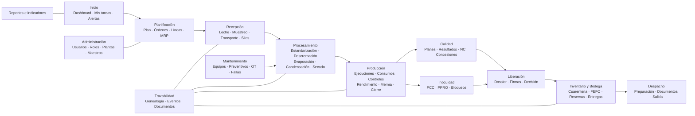
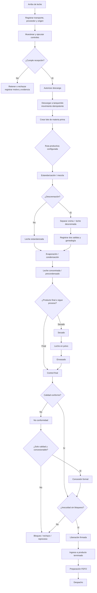
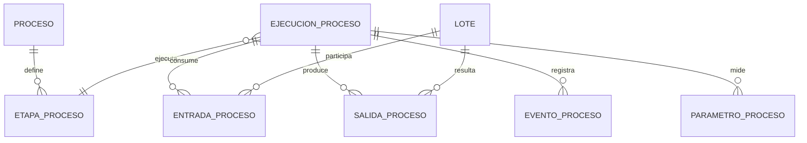
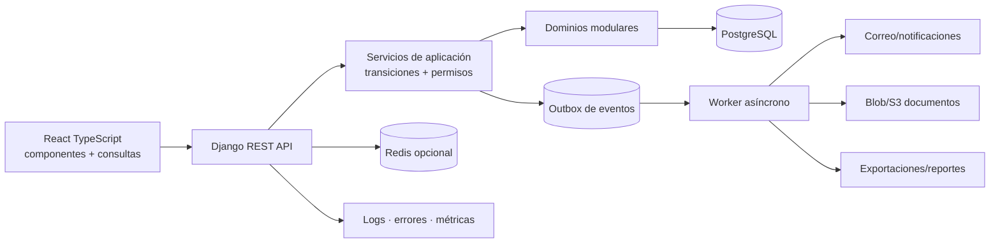

# Plan maestro de rediseño funcional, técnico y operativo de CCAA

**Fecha:** 4 de agosto de 2026  
**Base analizada:** repositorio local CCAA, documentación de levantamiento, configuración Vercel/Neon y pruebas existentes.  
**Propósito:** servir como base común para UX/UI, desarrollo, BPMN, reglas, pruebas, seguridad, rendimiento y evolución a producción.

---

## Supuestos y límites del diagnóstico

1. La planta opera una o más líneas de recepción, condensación, secado y envase; los nombres y capacidades definitivos de cada equipo deben confirmarse con Operaciones.
2. Los límites críticos y especificaciones que aparecen en código o documentos son evidencia del prototipo, no sustituyen la aprobación formal de Calidad/HACCP.
3. El repositorio contiene módulos funcionales de usuarios, maestros, recepción, planificación, producción, calidad, inocuidad, inventario y auditoría. Mantenimiento, trazabilidad transversal y reportería avanzada todavía no existen como módulos completos.
4. Vercel y Neon son adecuados para demostración y piloto controlado. La capacidad máxima no está demostrada porque no existe una prueba de carga representativa registrada.
5. Las recomendaciones marcadas **Obligatoria** son necesarias antes de operación crítica. Las marcadas **Deseable** pueden incorporarse gradualmente.

---

# Entregable 1 — Resumen ejecutivo

## 1.1 Situación actual

CCAA es un monolito modular con React, Django REST Framework y PostgreSQL. Ya representa una parte considerable de la operación: recepción de leche, silos, planificación semanal, lotes, controles de proceso, inocuidad, dossier de calidad, liberación, compras, inspección de materiales, inventario, solicitudes a bodega, FEFO, MRP, alertas y auditoría.

La regla central de liberación está correctamente orientada: la decisión debe depender del cierre productivo, controles, dossier, calidad e inocuidad. El código contiene funciones de dominio, restricciones de base de datos y bloqueos de fila en operaciones críticas. Esto es una base valiosa y evita una reescritura.

El principal problema no es la tecnología: es que el crecimiento funcional ha dejado experiencias y modelos con diferentes niveles de madurez. Algunos procesos tienen servicios transaccionales sólidos —especialmente Inventario y Calidad— mientras otros aún dependen de formularios grandes, cálculos en memoria, estados documentados pero no siempre centralizados y relaciones de trazabilidad insuficientes para procesos con múltiples entradas y salidas.

## 1.2 Diagnóstico priorizado

| ID | Severidad | Área | Problema comprobado o brecha | Causa | Consecuencia | Recomendación | Complejidad |
|---|---|---|---|---|---|---|---|
| D-01 | Crítica | Seguridad | Una credencial de Neon fue compartida durante el despliegue | Gestión manual de secretos | Acceso no autorizado y fuga de datos | Rotar contraseña/URL, secretos Django y tokens; revisar historial | Baja |
| D-02 | Crítica | Liberación | La trazabilidad completa no está modelada como grafo de genealogía | `Lote` y consumos cubren parte del flujo, no mezclas/divisiones universales | Un lote podría cumplir controles sin demostrar toda su genealogía | Crear ejecución de proceso, entradas, salidas y relaciones entre lotes | Alta |
| D-03 | Crítica | Archivos | Los `FileField` locales no son durables en ejecución serverless | Sistema de archivos efímero | Pérdida de evidencias y documentos | Blob/S3 compatible, hash, metadatos y validación | Media |
| D-04 | Crítica | Concurrencia | Descarga a silo y algunas operaciones no muestran idempotencia uniforme | Protección transaccional desigual | Doble descarga, saldos o estados inconsistentes | Clave idempotente, bloqueo de recepción/silo y prueba PostgreSQL | Media |
| D-05 | Crítica | Calidad/Inocuidad | Debe demostrarse con pruebas que toda falla crítica bloquea y nunca admite concesión | Reglas distribuidas entre dominio y vistas | Liberación indebida | Servicio único de decisión, códigos de motivo inmutables y pruebas de regresión | Media |
| D-06 | Alta | Arquitectura | No existe módulo completo de mantenimiento | Alcance incremental | Fallas, preventivos y paradas quedan fuera de CCAA | Implementar equipos, planes, OT, fallas y repuestos en fase 7 | Alta |
| D-07 | Alta | UX | Navegación plana y diferente del flujo real de planta | Menú construido por páginas existentes | Dificultad para encontrar tareas y exceso de contexto | Navegación jerárquica por proceso y permiso | Media |
| D-08 | Alta | Frontend | Páginas grandes concentran formularios, tablas y llamadas | Desarrollo por pantalla | Renders amplios, mantenimiento difícil y errores repetidos | Componentes de dominio, hooks de consulta y formularios por etapas | Media |
| D-09 | Alta | Rendimiento | Algunos listados cargan y filtran en navegador; personal no está paginado | Contratos API orientados al prototipo | Degradación al crecer registros | Paginación real, filtros y ordenamiento del servidor | Media |
| D-10 | Alta | Recepción | Cálculo de ocupación recorre movimientos en Python | Agregación operacional en aplicación | Tiempo y memoria crecen linealmente | Saldo materializado o agregación SQL indexada | Media |
| D-11 | Alta | Calidad | Expedientes agregan y evalúan conjuntos en Python sin paginación uniforme | Endpoint compuesto | Latencia al crecer lotes y documentos | Resumen materializado, filtros, paginación y prefetch específico | Media |
| D-12 | Alta | Auditoría | Inventario no está incluido uniformemente en todos los mecanismos de auditoría | Cobertura por señales/middleware parcial | Cambios críticos sin historial homogéneo | Registro de eventos de dominio y auditoría transaccional | Media |
| D-13 | Alta | Usuarios | Permisos combinan rol, nivel y área; falta política declarativa por acción/estado | Evolución incremental | Reglas difíciles de auditar y mantener | Matriz RBAC contextual y permisos por objeto | Alta |
| D-14 | Alta | Operación | Migraciones no aparecen automatizadas en el despliegue Vercel | Backend serverless sin pipeline operativo | Código nuevo con esquema anterior | Pipeline controlado de migración, backup y rollback | Media |
| D-15 | Alta | Continuidad | No hay evidencia de restauración ensayada, RPO/RTO o runbooks | Piloto inicial | Recuperación incierta | Backups verificados, simulacro y runbooks | Media |
| D-16 | Media | Modelo industrial | Producto y receta existen, pero no hay una abstracción universal de etapa con N entradas/N salidas | Modelo centrado en lote terminado | Reprocesos y coproductos se fuerzan a campos particulares | Modelo configurable de ejecución y genealogía | Alta |
| D-17 | Media | Estados | Cada módulo usa estados propios, pero no existe servicio uniforme de transición | Máquinas distribuidas | Saltos inválidos y botones inconsistentes | Servicios `transicionar()` con precondiciones y auditoría | Media |
| D-18 | Media | Formularios | Varias páginas reúnen altas, edición, filtros y detalles | Falta de patrón de interacción común | Errores de captura y dificultad en tablet | Wizard, autosave de borrador y panel lateral de detalle | Media |
| D-19 | Media | Notificaciones | Alertas/notificaciones existen principalmente en Inventario | Automatización por módulo | Tareas vencidas no llegan al responsable | Centro de tareas/eventos con deduplicación y severidad | Alta |
| D-20 | Media | Reportes | Indicadores y exportaciones no forman una capa coherente | Consultas operativas directas | Reportes lentos e inconsistentes | Diccionario de KPI, snapshots y trabajos asíncronos | Alta |
| D-21 | Media | Observabilidad | No se evidencian trazas, métricas de negocio ni alertas técnicas centralizadas | Hosting de piloto | Fallos detectados por usuarios | Logs JSON, Sentry/OpenTelemetry y métricas | Media |
| D-22 | Media | Correo | El backend de consola usado en pruebas no entrega correos reales | Configuración temporal | Recuperación y avisos no llegan | Configurar Graph/SMTP y monitorear entregas | Baja |
| D-23 | Baja | UI | Estados, errores y cargas no usan componentes universales | Estilos locales por página | Experiencia inconsistente | Sistema de diseño y catálogo de componentes | Media |
| D-24 | Baja | Catálogos | Etiquetas y áreas aparecen en constantes del frontend | Duplicación de catálogos | Desalineación con backend | Endpoint de capacidades/catálogos versionado | Baja |

## 1.3 Propuesta general

La propuesta conserva el monolito modular y lo organiza alrededor de cinco capacidades transversales:

1. **Identidad y autorización contextual:** usuario, planta, área, rol, acción, objeto y estado.
2. **Ejecución industrial configurable:** procesos, etapas, entradas, salidas, coproductos, mermas y genealogía.
3. **Decisión de liberación única:** calidad e inocuidad separadas, con motivos explicables e inmutables.
4. **Libro de inventario y trazabilidad:** movimientos append-only, reservas, cuarentena, FEFO y conciliación.
5. **Eventos, tareas y auditoría:** toda transición crítica produce historial, tarea o notificación cuando corresponde.

## 1.4 Beneficios esperados

- Menos liberaciones y consumos incorrectos.
- Trazabilidad hacia atrás y adelante en minutos, no mediante búsqueda manual.
- Interfaces enfocadas en la tarea del usuario.
- Mejor respuesta con grandes volúmenes gracias a paginación, índices y procesos asíncronos.
- Incorporación gradual de plantas y líneas sin duplicar código por producto.
- Evidencia auditable de cada decisión crítica.
- Capacidad de cambiar infraestructura sin reescribir el dominio.

---

# Entregable 2 — Mapa completo del sistema

## 2.1 Mapa objetivo de módulos



## 2.2 Estado actual frente al objetivo

| Capacidad | Estado | Evidencia actual | Brecha principal |
|---|---|---|---|
| Usuarios y permisos | Implementado/mejorado | Perfil, empresa, sucursal, área, rol, admin de área | Política por acción/objeto/estado |
| Maestros | Implementado | Producto, SKU, receta, equipo, silo, vehículo, especificación, dossier | Versionado/aprobación homogénea |
| Recepción | Implementado | Recepción, controles, movimientos a silo, ocupación | Idempotencia y trazabilidad de origen más profunda |
| Planificación | Implementado | Semana, bloques, equipos, balances, publicación/cierre | Orden de producción formal y capacidad detallada |
| Producción | Implementado parcial | Lote, análisis, controles, lecturas, asignación | Ejecución N:M, paradas, mermas y consumos integrales |
| Calidad | Implementado | Registro, dossier, expediente, liberación/concesión | NC general, instrumentos, firma robusta y escalado de consultas |
| Inocuidad | Implementado parcial | Monitoreos PPRO y lecturas | Gestión explícita de bloqueo, investigación y cierre |
| Inventario/Bodega | Implementado amplio | Compras, lotes, existencias, movimientos, MRQ, reservas, entrega, devolución, MRP | Ledger universal y conciliación avanzada |
| Abastecimiento | Implementado amplio | Solicitudes, OC, recepción, inspección, alertas | Pronóstico, proveedores y aprobación más completa |
| Mantenimiento | No implementado como módulo | Solo estados de mantenimiento y CIP relacionados | Planes, OT, fallas, repuestos y costos |
| Trazabilidad | Parcial/distribuida | FKs, movimientos, auditoría | Grafo unificado hacia atrás/adelante |
| Reportes | Parcial | Resúmenes locales y dashboard | Diccionario KPI, exportaciones y capa analítica |

## 2.3 Límites internos recomendados

| Módulo Django | Responsabilidad exclusiva | No debe decidir |
|---|---|---|
| `usuarios` | Identidad, organización y capacidades del actor | Liberación o stock |
| `maestros` | Productos, procesos, equipos, especificaciones y versiones | Ejecuciones operativas |
| `recepcion` | Ingreso, muestreo, decisión y descarga de leche | Liberación de producto terminado |
| `planificacion` | Demanda, capacidad, programa y orden aprobada | Consumo físico real |
| `produccion` | Ejecución, consumos, salidas, parámetros, merma y cierre | Aprobación final de calidad |
| `calidad` | Planes, muestras, resultados, NC y decisión de calidad | Resolver una falla de inocuidad |
| `inocuidad` | PCC/PPRO, bloqueo, investigación y cierre autorizado | Concesión comercial |
| `inventario` | Lotes, ubicaciones, movimientos, reservas y entrega | Fórmula de producción |
| `mantenimiento` | Activos, preventivos, OT, fallas y repuestos | Calidad de producto |
| `trazabilidad` | Proyección de genealogía y consulta transversal | Duplicar hechos de otros módulos |
| `auditoria` | Evidencia inmutable de acciones | Reglas operativas |

---

# Entregable 3 — Flujo industrial ordenado

## 3.1 Flujo cronológico general



## 3.2 Modelo para entradas y salidas múltiples

Cada operación física debe representarse como una `EjecucionProceso`, no como una simple flecha de un lote a otro.



Una entrada o salida debe incluir cantidad, unidad, lote, momento, ubicación y clasificación: principal, coproducto, subproducto, merma, reproceso o recirculación. Así se soportan:

- Descremación: una entrada y dos salidas.
- Mezcla: varias entradas y una salida.
- División: una entrada y varias salidas.
- Consumo parcial: la entrada registra solo la cantidad utilizada.
- Reproceso: una salida bloqueada vuelve como entrada en una nueva ejecución autorizada.
- Recirculación: salida y reingreso a la misma ejecución, identificando cantidad y motivo.
- Merma: salida no inventariable con causa y autorización.

## 3.3 Automatización frente a intervención humana

| Actividad | Tipo | Control principal |
|---|---|---|
| Proponer código de recepción/lote | Automática | Secuencia segura y unicidad DB |
| Evaluar rangos | Automática | Especificación vigente por producto/etapa |
| Decidir rechazo o repetición | Humana | Rol autorizado, motivo y evidencia |
| Reservar materiales FEFO | Automática confirmada | Stock aprobado y bloqueo de filas |
| Confirmar cantidad física entregada | Humana | Bodega |
| Confirmar cantidad recibida | Humana | Producción |
| Calcular rendimiento/merma | Automática | Entradas y salidas reales |
| Generar bloqueo de inocuidad | Automática | Resultado crítico fuera de límite |
| Cerrar investigación de inocuidad | Humana autorizada | Evidencia y doble control si aplica |
| Liberar lote | Humana asistida | Motor automático de elegibilidad + firma |
| Seleccionar lote para despacho | Automática sugerida | FEFO; excepción motivada |

---

# Entregable 4 — Procesos BPMN sugeridos para Bizagi

## 4.1 Convención general

- Pool principal: **Planta CCAA**.
- Lanes según proceso: Planificación, Recepción, Producción, Bodega, Calidad, Inocuidad, Mantenimiento y Sistema.
- Pools externos: Proveedor/Productor, Transportista, Laboratorio externo, Cliente.
- Las interacciones entre pools usan flujos de mensaje, no flujos de secuencia.
- Cada compuerta debe formular una pregunta verificable.
- Los estados se registran como objetos de datos o anotaciones; no reemplazan actividades.

## 4.2 Catálogo de diagramas

| BPMN | Objetivo | Inicio | Participantes | Actividades principales | Decisiones | Excepciones | Final |
|---|---|---|---|---|---|---|---|
| B-01 Planificar producción | Convertir demanda y capacidad en plan aprobado | Demanda/stock actualizado | Planificación, Producción, Bodega, Mantenimiento | Calcular necesidad, revisar materiales/equipos, programar, aprobar, publicar | ¿Capacidad? ¿Materiales? ¿Equipo disponible? | Reprogramación, falta de material, falla de equipo | Plan publicado |
| B-02 Recibir leche | Aceptar o rechazar leche con evidencia | Arribo del camión | Transportista, Recepción, Calidad, Sistema | Identificar, pesar/medir, muestrear, analizar, decidir, descargar | ¿Datos completos? ¿Controles conformes? | Retención, reanálisis, rechazo, diferencia de volumen | Recepción cerrada |
| B-03 Descargar a silo | Mover leche autorizada una sola vez | Recepción liberada | Recepción, Sistema | Reservar destino, validar capacidad, bloquear, registrar movimiento | ¿Capacidad suficiente? ¿Ya descargada? | Silo lleno, doble solicitud, conexión incorrecta | Leche almacenada |
| B-04 Ejecutar estandarización/descremación | Generar productos con balance de masa | Orden aprobada | Producción, Calidad, Sistema | Preparar equipo, consumir lotes, parametrizar, separar, registrar salidas | ¿Grasa objetivo? ¿Balance aceptable? | Desvío, reproceso, merma anormal | Coproductos identificados |
| B-05 Evaporar y condensar | Producir concentrado/precondensado | Material disponible | Producción, Inocuidad, Mantenimiento | Verificar CIP, iniciar, leer parámetros, controlar PCC, transferir | ¿PCC conforme? ¿Equipo apto? | Pausa, bloqueo PCC, falla | Salida transferida |
| B-06 Secar y envasar | Transformar y envasar polvo | Precondensado autorizado | Producción, Envase, Inocuidad | Secar, controlar, transferir, envasar, detectar metales, identificar unidades | ¿PPRO/PCC conforme? | Rechazo detector, material envase bloqueado | Lote envasado |
| B-07 Cerrar producción | Consolidar consumos, salidas, merma y controles | Producción terminada | Producción, Sistema | Conciliar, completar controles, explicar diferencias, cerrar | ¿Controles completos? ¿Balance aceptable? | Diferencia no resuelta | Producción cerrada |
| B-08 Gestionar no conformidad | Investigar y resolver desviación | Resultado fuera de especificación | Calidad, Producción, Inocuidad | Abrir NC, contener, investigar, decidir, corregir, verificar eficacia | ¿Inocuidad? ¿Concesionable? ¿Reproceso? | Escalamiento, rechazo definitivo | NC cerrada o lote bloqueado |
| B-09 Liberar lote | Emitir decisión auditable | Solicitud de revisión | Calidad, Inocuidad, Producción, Sistema | Construir expediente, verificar dossier, calidad, inocuidad y trazabilidad, firmar | ¿Elegible? ¿Concesión válida? | Documento faltante, firma inválida, bloqueo crítico | Liberado/rechazado |
| B-10 Solicitar materiales | Entregar material correcto a producción | Orden/solicitud | Producción, Bodega, Calidad, Sistema | Calcular, solicitar, aprobar, reservar FEFO, preparar, entregar, recibir, devolver | ¿Stock? ¿Aprobado? ¿Entrega total? | Parcial, vencido, cuarentena, diferencia | Solicitud cerrada |
| B-11 Comprar y recibir | Reponer materiales con inspección | Punto de reposición/MRP | Compras, Proveedor, Bodega, Calidad | Solicitar, aprobar, ordenar, recibir, inspeccionar, ingresar | ¿Coincide OC? ¿Requiere calidad? | Recepción parcial, rechazo, devolución | Material disponible/bloqueado |
| B-12 Mantener equipo | Restaurar o prevenir falla | Calendario/alarma/falla | Mantenimiento, Producción, Bodega | Crear OT, bloquear equipo, diagnosticar, reservar repuesto, ejecutar, probar, liberar | ¿Seguro? ¿Repuesto? ¿Prueba conforme? | Parada extendida, espera de repuesto | Equipo disponible |
| B-13 Despachar producto | Entregar producto liberado con FEFO | Pedido aprobado | Ventas/Despacho, Bodega, Calidad | Reservar, verificar liberación, preparar, documentar, cargar, confirmar | ¿Liberado? ¿FEFO? ¿Documentos? | Excepción FEFO, daño, bloqueo posterior | Despacho confirmado |
| B-14 Retirar producto | Localizar y contener producto afectado | Alerta/reclamo | Calidad, Trazabilidad, Clientes, Bodega | Identificar lote, buscar genealogía, bloquear descendientes, notificar, recuperar, conciliar | ¿Alcance completo? | Datos faltantes, cliente sin respuesta | Retiro cerrado |

---

# Entregable 5 — Matriz de reglas de negocio

| Código | Área | Regla | Condición | Acción automática/humana | Bloqueo | Responsable | Mensaje al usuario |
|---|---|---|---|---|---|---|---|
| REC-001 | Recepción | No cerrar con datos obligatorios faltantes | Falta litros, proveedor, vehículo, conductor, fecha, tanque o control | Rechazar transición | Sí | Recepción | “No se puede cerrar: faltan proveedor y tanque de destino.” |
| REC-002 | Recepción | No descargar leche rechazada o retenida | Estado distinto de liberada | Rechazar descarga | Sí | Sistema | “La leche está retenida. Calidad debe resolver el análisis antes de descargar.” |
| REC-003 | Recepción | Descargar una sola vez | Ya existe movimiento confirmado para la recepción | Devolver resultado previo o rechazar duplicado | Sí | Sistema | “Esta recepción ya fue descargada en el silo S-02.” |
| REC-004 | Recepción | Control fuera de rango genera alerta | Resultado viola especificación vigente | Retener y crear tarea | Sí hasta decisión | Calidad | “Temperatura 9,2 °C fuera del máximo 6,0 °C; recepción retenida.” |
| REC-005 | Recepción | Registrar diferencia de volumen | Diferencia supera tolerancia | Exigir motivo y aprobación | Sí para cierre | Recepción/Jefatura | “La diferencia es 2,4 %, superior al 1 %. Registre causa y aprobación.” |
| PLA-001 | Planificación | Publicar solo plan válido | Bloques incompatibles, capacidad o datos faltantes | Rechazar publicación | Sí | Planificación | “No se puede publicar: Egron 1 tiene bloques superpuestos.” |
| PRO-001 | Producción | Iniciar solo con orden aprobada | Orden ausente/no aprobada | Rechazar inicio | Sí | Producción | “Seleccione una orden aprobada antes de iniciar.” |
| PRO-002 | Producción | No consumir stock no disponible | Bloqueado, vencido, cuarentena o reservado | Excluir y rechazar | Sí | Sistema/Bodega | “El lote MP-204 está en cuarentena y no puede consumirse.” |
| PRO-003 | Producción | Identificar recursos reales | Falta línea, equipo u operador | Rechazar inicio/cierre | Sí | Producción | “Indique equipo y operador responsable.” |
| PRO-004 | Producción | Validar controles críticos | Lectura fuera de límite | Crear desviación y bloqueo | Sí | Sistema/Inocuidad | “PCC1 fuera de límite: lote bloqueado automáticamente.” |
| PRO-005 | Producción | Conciliar balance | Entradas ≠ salidas + merma dentro de tolerancia | Calcular diferencia y exigir explicación | Sí para cierre | Producción | “Faltan justificar 184 kg en el balance de masa.” |
| PRO-006 | Producción | Cierre irreversible sin reapertura autorizada | Producción cerrada | Bloquear edición directa | Sí | Jefatura | “La producción está cerrada; solicite reapertura indicando motivo.” |
| CAL-001 | Calidad | Usar especificación vigente | No existe versión aplicable a fecha/producto | Bloquear evaluación | Sí | Calidad | “No existe especificación vigente para este producto y fecha.” |
| CAL-002 | Calidad | Resultado aprobado es inmutable | Intento de sobrescritura | Crear corrección versionada | Sí edición directa | Calidad | “El resultado aprobado no se reemplaza; registre una corrección.” |
| CAL-003 | Calidad | Fuera de especificación crea NC | Resultado no conforme | Abrir NC y tarea | Sí hasta resolución | Sistema/Calidad | “Se creó NC-0042 por humedad fuera de especificación.” |
| CAL-004 | Calidad | Concesión formal | Desviación de calidad concesionable | Exigir motivo, alcance, evidencia, aprobadores y vencimiento | Sí sin firmas | Calidad/Autorizador | “La concesión requiere dos aprobaciones y documento adjunto.” |
| INO-001 | Inocuidad | Falla crítica bloquea automáticamente | PCC/PPRO no conforme | Crear bloqueo inmutable | Sí | Sistema/Inocuidad | “Bloqueo crítico de inocuidad; no admite concesión.” |
| INO-002 | Inocuidad | No usar concesión para liberar falla crítica | Existe bloqueo crítico abierto | Rechazar acción | Sí | Sistema | “No se puede conceder: existe un bloqueo de inocuidad abierto.” |
| LIB-001 | Liberación | Producción debe estar cerrada | Estado distinto de cerrado | Inhabilitar/rechazar | Sí | Calidad | “Falta cerrar la producción.” |
| LIB-002 | Liberación | Dossier obligatorio completo | Documentos faltantes/observados | Mostrar faltantes por área | Sí | Área responsable | “Faltan 2 documentos: control PCC1 y hermeticidad.” |
| LIB-003 | Liberación | Trazabilidad completa | Entrada o salida sin genealogía | Rechazar firma | Sí | Calidad/Producción | “El lote no identifica el origen de 620 kg de precondensado.” |
| LIB-004 | Liberación | Firma sobre snapshot consistente | Cambio concurrente del expediente | Reintentar revisión | Sí | Sistema | “El expediente cambió durante la revisión; vuelva a confirmar.” |
| INV-001 | Inventario | No permitir stock negativo | Movimiento supera disponible | Rechazar dentro de transacción | Sí | Sistema | “Disponible 80 kg; solicitados 120 kg.” |
| INV-002 | Inventario | Disponible excluye reservado/bloqueado | Consulta o reserva | Calcular físico − reservado y filtrar calidad | Sí | Sistema | “Sin stock utilizable; 200 kg están reservados.” |
| INV-003 | Inventario | FEFO por vencimiento | Material con fecha | Proponer lote más próximo | Advertencia/bloqueo configurable | Bodega | “El lote seleccionado no cumple FEFO; indique motivo de excepción.” |
| INV-004 | Inventario | Movimiento completo e inmutable | Falta origen/destino/motivo/actor/lote | Rechazar asiento | Sí | Bodega | “Todo movimiento requiere origen, destino, lote y motivo.” |
| INV-005 | Inventario | Ajuste requiere aprobación separada | Solicitante = aprobador o falta motivo | Rechazar aprobación | Sí | Jefatura | “El solicitante no puede aprobar su propio ajuste.” |
| MRQ-001 | Bodega/Producción | Entrega debe ser confirmada por ambas áreas | Solo bodega confirmó | Mantener pendiente de recepción | No cierre | Producción | “Confirme la cantidad recibida o registre diferencia.” |
| MAN-001 | Mantenimiento | Equipo vencido/bloqueado no inicia | Preventivo crítico vencido o bloqueo LOTO | Rechazar asignación | Sí | Mantenimiento | “El equipo tiene una OT crítica vencida.” |
| SEG-001 | Usuarios | Admin de área solo administra su ámbito | Planta/área diferente | Ocultar y devolver 404/403 | Sí | Sistema | “No tienes permiso para administrar usuarios de otra área.” |
| AUD-001 | Auditoría | Acción crítica registra antes/después y motivo | Aprobar, liberar, bloquear, anular, ajustar | Escribir en misma transacción | Sí si falla auditoría crítica | Sistema | “No se pudo registrar la auditoría; la operación no fue aplicada.” |

---

# Entregable 6 — Propuesta UX/UI

## 6.1 Principios

1. La pantalla debe responder tres preguntas: **qué ocurre, qué debo hacer y qué impide avanzar**.
2. Los colores expresan estado, no decoran.
3. Las acciones irreversibles nunca comparten jerarquía visual con guardar borrador.
4. El usuario ve tareas de su área; la autorización real siempre se repite en el backend.
5. Computador prioriza densidad; tablet prioriza objetivos táctiles de 44 px; móvil se limita a consulta y acciones seguras.

## 6.2 Sistema visual

| Token | Propuesta | Uso |
|---|---|---|
| Fondo | `#F6F8F7` | Superficie general |
| Superficie | `#FFFFFF` | Paneles y tarjetas |
| Primario | `#176B45` | Navegación y acción principal |
| Primario oscuro | `#0E4C31` | Hover/encabezados |
| Texto | `#17211B` | Texto principal |
| Secundario | `#5E6C64` | Texto auxiliar |
| Borde | `#DDE5E0` | Separación |
| Éxito/liberado | `#16834F` sobre `#EAF7F0` | Conforme/liberado |
| Pendiente | `#8A6418` sobre `#FFF7DF` | Requiere acción |
| Advertencia | `#B45309` sobre `#FFF1E5` | Riesgo operativo |
| Error/no conforme | `#B42318` sobre `#FDEDEC` | Desviación |
| Bloqueo crítico | `#7F1D1D` sobre `#FBE5E5` | Inocuidad/bloqueo |
| Información | `#1D4ED8` sobre `#EAF0FF` | Contexto |

- Tipografía: Inter o fuente sans del sistema; cuerpo 14–16 px.
- Títulos: H1 30/36, H2 22/28, H3 18/24.
- Espaciado base: 4 px; separaciones 8, 12, 16, 24, 32.
- Bordes: 1 px; radio 10–14 px. Sombras muy suaves solo para elevación temporal.
- Iconografía: Lucide ya existente, siempre acompañada de texto en acciones críticas.

## 6.3 Layout objetivo

```text
┌──────────────────────────────────────────────────────────────────┐
│ Logo / planta   Buscar lote, orden…     Alertas  Ayuda  Usuario │
├───────────────┬──────────────────────────────────────────────────┤
│ Inicio        │ Recepción / REC-2026-0041                       │
│ Planificación │ ┌ Estado y acciones permitidas ───────────────┐ │
│ Recepción     │ │ Retenida · Falta decisión de Calidad        │ │
│ Procesamiento │ └──────────────────────────────────────────────┘ │
│ Producción    │ Resumen | Controles | Documentos | Historial    │
│ Calidad       │                                                  │
│ Inventario    │ Panel de contenido                               │
│ Mantenimiento │                                                  │
│ Trazabilidad  │                                                  │
│ Administración│                                                  │
└───────────────┴──────────────────────────────────────────────────┘
```

La barra lateral debe agrupar módulos y recordar secciones abiertas. La barra superior contiene selector de planta, búsqueda global, notificaciones y usuario. Las migas se generan desde las rutas.

## 6.4 Dashboard por rol

| Rol | Indicadores/tareas prioritarias | No mostrar por defecto |
|---|---|---|
| Recepción | Camiones esperando, recepciones retenidas, silos/capacidad, diferencias | MRP financiero, liberaciones históricas |
| Producción | Órdenes de turno, materiales pendientes, controles atrasados, rendimiento/merma | Usuarios, proveedores |
| Calidad | Muestras pendientes, OOS, expedientes incompletos, tiempo de liberación | Plan completo de compras |
| Inocuidad | PCC/PPRO pendientes, bloqueos críticos, acciones correctivas | KPI comerciales |
| Bodega | Solicitudes por preparar, cuarentena, stock bajo, vencimientos | Parámetros de proceso |
| Planificación | Plan vs real, capacidad, materiales y equipos no disponibles | Detalle analítico de laboratorio |
| Mantenimiento | OT vencidas, disponibilidad, fallas, repuestos críticos | Dossier completo de liberación |
| Administración | Usuarios, actividad, catálogos pendientes, salud de integraciones | Operaciones tácticas por defecto |

Cada tarjeta navega a un listado filtrado. “4 lotes bloqueados” abre `/calidad/lotes?estado=bloqueado`, no una cifra estática.

## 6.5 Componentes reutilizables

- `AppShell`, `SidebarGroup`, `Topbar`, `Breadcrumbs`.
- `PageHeader`, `StatusBadge`, `BlockingBanner`, `PermissionGate`.
- `KpiCard`, `TaskCard`, `AlertCenter`, `ActivityTimeline`.
- `ServerDataTable`, `FilterBar`, `SavedView`, `ColumnPicker`, `RowActionsMenu`.
- `DetailDrawer`, `EntityHeader`, `AuditTimeline`, `TraceabilityGraph`.
- `StepForm`, `FormSection`, `FieldError`, `UnsavedChangesGuard`.
- `ConfirmActionDialog` con motivo obligatorio para acciones críticas.
- `EmptyState`, `ErrorState`, `SkeletonTable`, `OfflineBanner`.

## 6.6 Formularios

Los flujos largos usan nueve etapas configurables: información, recursos, materiales, parámetros, controles, resultados, documentos, revisión y confirmación. Se guarda borrador al terminar cada etapa y se muestra progreso.

Ejemplo de cierre de producción:

- Paso 1: horas reales y responsables.
- Paso 2: entradas y salidas.
- Paso 3: balance, rendimiento y merma calculados.
- Paso 4: controles faltantes con enlaces directos.
- Paso 5: resumen y confirmación con motivo si hay desviación.

## 6.7 Tablas

- Consulta al servidor con `page`, `page_size`, `search`, `ordering` y filtros.
- Búsqueda con debounce de 300–500 ms y cancelación mediante `AbortController`.
- Acciones primarias visibles; secundarias en menú contextual.
- Exportación genera un trabajo asíncrono cuando supera el umbral definido.
- Filtros se conservan en URL y pueden guardarse por usuario.
- En tablet, las filas se convierten en tarjetas de resumen; no se fuerza una tabla de 12 columnas.

## 6.8 Pantalla de detalle estándar

Encabezado con código, estado, producto, lote, responsable y fechas. Debajo: resumen, materiales, controles, documentos, trazabilidad, comentarios e historial. El backend devuelve `acciones_permitidas` y `bloqueos` para impedir que el frontend replique todas las reglas.

Ejemplo de respuesta:

```json
{
  "estado": "pendiente_aprobacion",
  "acciones_permitidas": ["revisar", "rechazar"],
  "bloqueos": [
    {"codigo": "LIB-002", "mensaje": "Faltan humedad y temperatura final"}
  ]
}
```

---

# Entregable 7 — Arquitectura técnica propuesta

## 7.1 Vista objetivo



## 7.2 Frontend

- React y TypeScript se mantienen.
- Rutas cargadas con `lazy()` por módulo.
- Capa de consultas centralizada —TanStack Query es justificable cuando haya invalidación/caché repetida; no es obligatoria en fase 0.
- Formularios con componentes compartidos y esquema de validación alineado con errores DRF.
- Permisos de UI basados en capacidades entregadas por API, nunca como único control.
- Tokens actuales deben evolucionar a sesiones rotables o tokens con expiración cuando el piloto sea multiusuario real.

## 7.3 Backend

- Mantener Django/DRF y el monolito modular.
- Vistas delgadas; casos de uso en `servicios.py`; reglas puras en `dominio.py`.
- Toda transición usa un servicio transaccional: carga con bloqueo, valida precondiciones, escribe hecho/auditoría/outbox y confirma.
- Serializadores separados para lista, detalle y escritura cuando el volumen lo justifique.
- `select_related`/`prefetch_related` definidos por endpoint, no globalmente.
- Errores de dominio con código estable y mensaje accionable.

## 7.4 Base de datos

Entidades nuevas recomendadas:

| Entidad | Propósito | Restricción principal |
|---|---|---|
| `Proceso` | Define transformación configurable | código + versión únicos |
| `EtapaProceso` | Orden/ruta dentro del proceso | orden único por versión |
| `OrdenProduccion` | Autoriza cantidades y fechas | número único por planta |
| `EjecucionProceso` | Hecho operativo de una etapa | estado y versión optimista |
| `EntradaProceso` | Lote/cantidad consumida | cantidad > 0 |
| `SalidaProceso` | Lote/cantidad producida y naturaleza | cantidad > 0 |
| `RelacionLote` | Proyección de genealogía | origen ≠ destino; tipo válido |
| `EventoProceso` | Pausa, desvío, bloqueo, reanudación | append-only |
| `PlanControl`/`ControlExigible` | Controles por producto/etapa | versión y vigencia sin solapes |
| `ResultadoControl` | Valor y veredicto histórico | correcciones versionadas |
| `NoConformidad` | Investigación y resolución | cierre exige decisión/evidencia |
| `BloqueoInocuidad` | Impedimento crítico | no concesionable |
| `OrdenTrabajo` | Mantenimiento | cierre exige prueba/liberación |
| `DocumentoGestionado` | Evidencia externa | hash, tamaño, MIME y objeto |
| `EventoDominio` | Outbox transaccional | UUID único y fecha publicación |

Índices iniciales:

- Todos los FKs usados en filtros y joins —Django suele crearlos, confirmar en PostgreSQL.
- `(planta_id, estado, fecha)` para recepciones, órdenes, lotes y OT.
- `(lote_id, tipo, fecha_hora)` para eventos y controles.
- `(producto_id, vigente_desde, vigente_hasta)` para especificaciones/planes.
- `(ubicacion_id, lote_id)` y parciales para existencias con cantidad positiva.
- `(estado_calidad, vencimiento)` para FEFO/cuarentena.
- `(publicado_en) WHERE publicado_en IS NULL` para outbox.
- GIN solo para JSON consultado frecuentemente; si un parámetro se filtra o reporta a diario, debe ser columna tipada.

## 7.5 Tareas asíncronas

Pasar a worker cuando la tarea pueda superar unos segundos, tenga reintentos o no deba bloquear al usuario:

- Correo y notificaciones multicanal.
- Exportaciones Excel/PDF y certificados.
- Importación histórica y validación por lotes.
- Ejecución MRP completa.
- Alertas programadas de vencimiento, stock y controles.
- Construcción de snapshots KPI.
- Escaneo antivirus y procesamiento de documentos.
- Recalcular genealogías o impacto de retiro de gran tamaño.

Para piloto puede usarse un worker simple en un hosting persistente. Celery + Redis se justifica cuando existan varias clases de tareas, reintentos, programación y monitoreo; no debe agregarse solo por moda.

## 7.6 Caché

Cachear catálogos de baja variación, permisos/capacidades del usuario, especificaciones vigentes y agregados de dashboard con TTL corto. No cachear saldos de inventario ni elegibilidad de liberación sin invalidación transaccional. Redis es opcional hasta que mediciones demuestren beneficio.

## 7.7 Archivos

- Almacenamiento de objetos privado, no disco local de Vercel.
- URL firmada de duración corta.
- Límites de tamaño y tipos permitidos.
- MIME real, extensión, hash SHA-256, usuario y objeto relacionado.
- Antivirus asíncrono; estado `pendiente`, `aprobado`, `rechazado`.
- Retención y bloqueo legal configurables.

## 7.8 Seguridad

- RBAC contextual: rol + planta + área + acción + tipo de registro + estado.
- Permisos por objeto en cada queryset y transición.
- MFA para superusuarios y roles que liberan/bloquean.
- Tokens con expiración/rotación o cookies HttpOnly protegidas.
- Rate limit de login, recuperación, exportaciones y acciones críticas.
- Separación entre solicitante y aprobador en ajustes/concesiones.
- Secretos solo en gestor de entorno; rotación y principio de mínimo privilegio.
- Validación de CORS/CSRF, cabeceras, archivos y payload máximo.

## 7.9 Observabilidad y despliegue

- Logs JSON con `request_id`, usuario, planta, ruta, duración y código de dominio; nunca secretos.
- Captura de excepciones, trazas y métricas: p50/p95/p99, errores, consultas lentas, locks, conexiones, cola y tareas fallidas.
- Deploy con etapas: pruebas, build, backup, migración compatible, despliegue y smoke test.
- Vercel puede continuar para frontend/piloto. Para operación continua con workers y tareas largas, evaluar contenedor Django en Railway/Azure/AWS/Render manteniendo React en CDN y PostgreSQL administrado.
- Neon pooled URL es apropiada para solicitudes serverless, pero el pool comparte capacidad real y no reemplaza la optimización de consultas.

---

# Entregable 8 — Mejoras de rendimiento

## 8.1 Frontend

| Acción | Prioridad | Medición de aceptación |
|---|---|---|
| Lazy loading por módulo | Alta | Bundle inicial y tiempo interactivo reducidos |
| Tabla server-side reutilizable | Alta | Nunca descargar miles para filtrar |
| Debounce + cancelación | Alta | Una consulta vigente por búsqueda |
| Dividir páginas grandes | Alta | Componentes con responsabilidades aisladas |
| Caché/invalidation controlada | Media | Sin solicitudes duplicadas al volver |
| Virtualización | Media | Tablas de cientos de filas visibles fluidas |
| Skeletons y error boundary | Media | Estados previsibles en red lenta/error |
| Preservar filtros en URL | Media | Navegar y volver conserva contexto |

## 8.2 Backend

| Acción | Prioridad | Aplicación concreta |
|---|---|---|
| Paginación uniforme | Alta | Usuarios, expedientes, movimientos, alertas |
| Filtros/orden servidor | Alta | Estado, fechas, producto, planta, área |
| Query budget en pruebas | Alta | Detectar N+1 por endpoint |
| Agregación SQL/materializada | Alta | Ocupación de silos y dashboards |
| Servicios transaccionales | Crítica | Descarga, cierre, liberación, reserva, entrega |
| Idempotencia | Crítica | Descarga, movimientos, importaciones, firmas |
| Serializador de lista ligero | Media | Evitar dossier completo en listados |
| Async | Media | MRP, reportes, correos, importaciones |

## 8.3 Base de datos

- Capturar `EXPLAIN (ANALYZE, BUFFERS)` de los 10 endpoints más lentos.
- Activar/consultar `pg_stat_statements` cuando el plan lo permita.
- Evitar índices “por si acaso”: agregar según filtros y cardinalidad real.
- Vigilar locks, transacciones largas y bloat.
- Particionar solo cuando tamaño y mantenimiento lo justifiquen. Candidatos futuros: movimientos de inventario, eventos/auditoría, lecturas de proceso y resultados, generalmente por mes/planta.
- Usar réplica o base analítica solo cuando reportes compitan con operación.

## 8.4 Infraestructura

- Mantener región de backend y base cercana.
- Usar conexión pooled en serverless y conexión directa para migraciones si lo requiere la operación.
- Definir timeouts explícitos y límites de concurrencia.
- Medir cold starts y latencia de reactivación de Neon.
- Pruebas de carga con datos equivalentes: 20, 50 y 100 usuarios concurrentes; no usar SQLite.

## 8.5 Reportes

- KPI operativos simples en consultas indexadas o snapshots de 5 minutos.
- Exportaciones pesadas en worker con descarga temporal.
- Diccionario único de fórmulas, zona horaria, filtros y unidades.
- A partir de millones de eventos o necesidades BI históricas, replicar a almacén analítico; no consultar el OLTP con joins masivos durante turnos.

## 8.6 Archivos

- Subida directa al almacenamiento mediante URL firmada cuando corresponda.
- Miniaturas y compresión asíncrona.
- No devolver binarios dentro de JSON.
- CDN solo para archivos públicos; evidencias privadas con autorización.

---

# Entregable 9 — Plan de implementación

| Fase | Objetivo | Funcionalidades | Dependencias | Riesgos | Resultado esperado | Criterios de aceptación |
|---|---|---|---|---|---|---|
| 0 Diagnóstico y estabilización | Cerrar riesgos inmediatos | Secretos, archivos durables, correo, backup/restore, idempotencia descarga, observabilidad, pruebas PostgreSQL | Acceso a entornos y responsables | Interrumpir piloto | Base segura y medible | Secretos rotados; restore probado; P0 verdes; smoke test automatizado |
| 1 Diseño visual y componentes | Unificar experiencia | Tokens, shell, navegación, tabla, formulario, estados, errores, responsive | Inventario de pantallas | Rediseño sin validar usuarios | Biblioteca reutilizable | Pruebas con 5 usuarios; AA en flujos clave; tablet operativa |
| 2 Permisos y administración | Aislar responsabilidades | Admin por área/planta, matriz de capacidades, sesiones, MFA roles críticos | Fase 0 | Bloquear usuarios legítimos | Acceso mínimo verificable | Pruebas negativas por rol/área/estado; auditoría completa |
| 3 Recepción y trazabilidad | Asegurar origen y descarga | Productor/predio/ruta, controles, retención, descarga idempotente, lote de leche | Maestros y permisos | Datos maestros incompletos | Recepción auditable | No descarga rechazada; doble envío inocuo; balance y genealogía visibles |
| 4 Producción y procesos | Modelar N entradas/N salidas | Orden, ejecución, entradas/salidas, mezclas, divisiones, mermas, transferencias, cierre | Fase 3, recetas | Migración del modelo actual | Flujo industrial flexible | Balance validado; coproductos; reproceso autorizado; pruebas concurrentes |
| 5 Calidad, inocuidad y liberación | Hacer la regla central demostrable | Plan de control, resultados versionados, NC, bloqueo crítico, concesión, expediente y firma | Fase 4 | Límites no confirmados | Decisión segura y explicable | Ningún bloqueo crítico se libera; snapshot y firma consistentes |
| 6 Inventario, MRP y EOQ | Completar abastecimiento | Ledger, reservas, confirmación dual, FEFO, EOQ, MRP async, conciliación | Fase 4 | Parámetros de demanda pobres | Stock confiable | Sin negativos; reserva concurrente; MRP reproducible; diferencias auditadas |
| 7 Mantenimiento y reportes | Incorporar activos y gestión | Equipos, preventivos, OT, fallas, repuestos, KPI por área | Datos históricos | Sobrecargar alcance | Disponibilidad y gestión visible | Preventivos generan OT; bloqueo de equipo; KPI con definición aprobada |
| 8 Optimización y escalabilidad | Preparar crecimiento | Índices, load test, caching, partición si aplica, worker HA, CI/CD | Métricas reales | Optimizar prematuramente | Capacidad conocida | SLO cumplidos a carga objetivo; restore/rollback; costo medido |

## 9.1 Puertas de control entre fases

- No iniciar fase 3 con secretos expuestos o sin restauración ensayada.
- No iniciar fase 5 hasta tener identificadores estables y genealogía suficiente.
- No activar liberación automática en producción sin aprobación formal de Calidad e Inocuidad.
- No introducir particionamiento, réplica o microservicio sin evidencia de cuello de botella.

---

# Entregable 10 — Backlog técnico y funcional

## 10.1 Historias prioritarias

| ID | Historia | Prioridad | Criterios de aceptación | Reglas | Dependencias | Módulo | Riesgo | Complejidad |
|---|---|---|---|---|---|---|---|---|
| US-001 | Como responsable de seguridad, quiero rotar secretos y limitar credenciales para impedir accesos no autorizados | P0 | Credenciales anteriores inválidas; escaneo sin secretos | SEG-001 | Ninguna | Plataforma | Alto | Baja |
| US-002 | Como operador de recepción, quiero que una descarga repetida sea idempotente para no duplicar leche en silo | P0 | Dos solicitudes producen un movimiento; prueba concurrente PostgreSQL | REC-002/003 | Silos | Recepción | Crítico | Media |
| US-003 | Como Calidad, quiero que evidencias permanezcan en almacenamiento privado para conservar el expediente | P0 | Archivo persiste tras deploy; hash y autorización | LIB-002, AUD-001 | Storage | Documentos | Crítico | Media |
| US-004 | Como administrador, quiero recuperar la base desde backup para asegurar continuidad | P0 | Simulacro documentado dentro del RTO | AUD-001 | Neon | Plataforma | Crítico | Media |
| US-005 | Como administrador de área, quiero gestionar solo trabajadores de mi planta/área para respetar segregación | P0 | Queryset aislado; pruebas 403/404; creación hereda área | SEG-001 | Usuarios | Usuarios | Alto | Media |
| US-006 | Como operador, quiero ver únicamente mis tareas críticas para priorizar el turno | P1 | Dashboard por rol; enlace a listado filtrado | — | Diseño base | Inicio | Medio | Media |
| US-007 | Como usuario, quiero mensajes que indiquen el bloqueo y cómo resolverlo | P1 | Error incluye código, faltantes y enlaces | Todas | API de capacidades | UX transversal | Medio | Media |
| US-008 | Como usuario de tablet, quiero formularios por etapas para capturar sin perder datos | P1 | Autosave; recuperación; aviso al salir | — | Componentes | UX | Medio | Alta |
| US-009 | Como recepción, quiero registrar productor, predio, ruta y transporte para rastrear origen | P1 | Campos obligatorios/versionados; búsqueda hacia atrás | REC-001/005 | Maestros | Recepción | Alto | Media |
| US-010 | Como Calidad, quiero que un control fuera de rango retenga automáticamente la recepción | P1 | Evaluación por spec vigente; tarea y bloqueo | REC-004 | Especificaciones | Recepción/Calidad | Crítico | Media |
| US-011 | Como planificador, quiero publicar un plan sin superposición y con capacidad validada | P1 | Detecta solapes/material/equipo; motivos claros | PLA-001 | Equipos/stock | Planificación | Alto | Media |
| US-012 | Como Producción, quiero iniciar solo desde orden aprobada para evitar producción no autorizada | P1 | API rechaza orden inválida; auditoría | PRO-001 | Planificación | Producción | Alto | Media |
| US-013 | Como Producción, quiero registrar varias entradas y salidas para representar mezclas y coproductos | P1 | N:M, parcial, división y coproducto probados | PRO-005 | Modelo ejecución | Producción | Crítico | Alta |
| US-014 | Como Producción, quiero que el sistema calcule rendimiento y merma para detectar pérdidas | P1 | Fórmula versionada; tolerancia; explicación | PRO-005 | Entradas/salidas | Producción | Alto | Media |
| US-015 | Como Inocuidad, quiero que un PCC fuera de límite bloquee automáticamente el lote | P0 | Bloqueo en misma transacción; no concesionable | INO-001/002 | Controles | Inocuidad | Crítico | Media |
| US-016 | Como analista, quiero corregir un resultado preservando el anterior para mantener integridad | P1 | Versiones, motivo, actor y fecha | CAL-002 | Auditoría | Calidad | Alto | Media |
| US-017 | Como Calidad, quiero gestionar NC con investigación, contención y cierre | P1 | Estados, responsables, evidencia y eficacia | CAL-003 | Documentos | Calidad | Alto | Alta |
| US-018 | Como autorizador, quiero conceder solo desviaciones de calidad permitidas | P0 | Dos aprobaciones configurables; jamás inocuidad | CAL-004, INO-002 | NC/roles | Calidad | Crítico | Alta |
| US-019 | Como Calidad, quiero ver todos los bloqueos antes de firmar para decidir con evidencia | P0 | Motor devuelve motivos; firma con snapshot y locks | LIB-001..004 | Fases 3–5 | Liberación | Crítico | Alta |
| US-020 | Como bodeguero, quiero reservar FEFO solo en stock aprobado para entregar material correcto | P0 | Concurrencia sin sobre-reserva; cuarentena excluida | INV-002/003 | Inventario | Bodega | Crítico | Media |
| US-021 | Como Producción, quiero confirmar lo recibido para registrar diferencias con Bodega | P1 | Confirmación dual; diferencia y devolución | MRQ-001 | Entregas | Inventario | Alto | Media |
| US-022 | Como jefatura, quiero aprobar ajustes separados del solicitante para reducir fraude/error | P1 | Segregación; motivo; antes/después | INV-005 | Permisos | Inventario | Alto | Media |
| US-023 | Como Compras, quiero sugerencias MRP ejecutadas en segundo plano para no bloquear la interfaz | P1 | Trabajo rastreable; versión de datos; reintento | — | Worker | Abastecimiento | Medio | Alta |
| US-024 | Como planificador, quiero conocer equipo bloqueado por mantenimiento para programar capacidad real | P2 | Estado disponible se integra al plan | MAN-001 | Mantenimiento | Planificación | Alto | Alta |
| US-025 | Como mantenedor, quiero preventivos y OT para reducir paradas | P2 | Calendario, OT, repuestos, prueba y cierre | MAN-001 | Equipos | Mantenimiento | Medio | Alta |
| US-026 | Como Calidad, quiero trazar hacia atrás un lote en menos de dos minutos para investigar reclamos | P1 | Orígenes, cantidades, equipos y controles | LIB-003 | Genealogía | Trazabilidad | Crítico | Alta |
| US-027 | Como Despacho, quiero trazar hacia adelante para ejecutar un retiro dirigido | P1 | Descendientes, clientes, documentos y bloqueo masivo | LIB-003 | Despachos | Trazabilidad | Crítico | Alta |
| US-028 | Como gerente, quiero KPI con definiciones únicas para comparar áreas y turnos | P2 | Fórmula, fuente, zona horaria y filtros documentados | — | Datos confiables | Reportes | Medio | Alta |
| US-029 | Como usuario, quiero exportar grandes listados sin esperar la solicitud | P2 | Trabajo async, notificación y enlace temporal | — | Worker/storage | Reportes | Medio | Media |
| US-030 | Como equipo técnico, quiero conocer p95, errores y consultas lentas para prevenir incidentes | P0 | Dashboard técnico y alertas con umbrales | — | Observabilidad | Plataforma | Alto | Media |
| US-031 | Como equipo técnico, quiero pruebas de carga sobre PostgreSQL para conocer capacidad | P0 | Escenarios reproducibles; informe 20/50/100 usuarios | — | Entorno similar | Plataforma | Alto | Media |
| US-032 | Como auditor, quiero historial inmutable de decisiones críticas para reconstruir cada cambio | P0 | Antes/después, motivo, IP, actor, estado y objeto | AUD-001 | Todos los módulos | Auditoría | Crítico | Alta |

## 10.2 Criterios transversales de terminado

Una historia crítica no está terminada hasta que:

1. Tiene pruebas de camino permitido y prohibido.
2. Valida permiso en backend y oculta acción en frontend.
3. Registra auditoría dentro de la operación transaccional.
4. Produce mensaje accionable, no solo código HTTP.
5. Es idempotente cuando el usuario puede repetir la solicitud.
6. Está documentada en la matriz de estados y reglas.
7. Tiene métrica o log suficiente para diagnosticar fallos.
8. Se prueba en PostgreSQL cuando usa locks o concurrencia.

---

# Máquinas de estado recomendadas por área

| Área/objeto | Estados | Cambia estado | Precondiciones y automatizaciones |
|---|---|---|---|
| Recepción | Registrada → Muestreada → Analizada → Liberada/Retenida → Descargada → Cerrada | Recepción y Calidad | Fuera de rango retiene; descarga crea movimiento; cierre exige datos |
| Plan semanal | Borrador → Publicado → Cerrado; Publicado → Borrador con motivo | Planificación | Publicar valida solapes; reabrir audita motivo |
| Orden producción | Borrador → Aprobada → Preparación → Ejecución → Pausada/Cerrada/Cancelada | Planificación/Jefatura/Producción | Inicio reserva recursos; cierre concilia |
| Ejecución | Preparación → Ejecución ↔ Pausada → Pendiente control → Cerrada | Producción | Pausa registra causa; cierre exige balance/controles |
| Resultado calidad | Borrador → Pendiente revisión → Aprobado/Rechazado/Repetición | Analista/Revisor | Aprobado queda inmutable |
| NC | Abierta → Contenida → Investigación → Plan de acción → Verificación → Cerrada/Rechazada | Calidad | Desvío crítico crea bloqueo |
| Bloqueo inocuidad | Abierto → Investigación → Acción correctiva → Verificado → Cerrado | Inocuidad autorizada | Nunca concesión; cada cierre exige evidencia |
| Liberación | Pendiente → Revisión → Liberado/Concesión/Rechazado; decisión → Revisión por cambio | Calidad | Motor evalúa expediente bajo locks |
| Solicitud material | Borrador → Solicitada → Aprobada → Preparación → Parcial/Entregada → Recibida → Cerrada | Producción/Bodega | Reserva FEFO; confirmación dual |
| Orden mantenimiento | Borrador → Programada → Asignada → Ejecución → Espera → Prueba → Cerrada/Cancelada | Mantenimiento | Equipo puede quedar bloqueado |

Toda transición debe definir actor, momento, estado anterior/nuevo, motivo, versión del registro, efectos automáticos y notificaciones deduplicadas.

---

# Indicadores y definiciones iniciales

| Área | KPI | Fórmula inicial | Frecuencia |
|---|---|---|---|
| Producción | Rendimiento | salida buena / entradas consumidas × 100 | Lote/turno |
| Producción | Merma | entradas − salidas inventariables − devolución | Lote |
| Producción | Cumplimiento plan | kg reales / kg planificados × 100 | Día/semana |
| Calidad | Tiempo de liberación | firma liberación − cierre producción | Lote |
| Calidad | First pass yield | lotes conformes sin repetición / evaluados | Mes |
| Inocuidad | Cumplimiento PCC/PPRO | lecturas conformes / exigibles | Turno |
| Recepción | Rechazo | litros rechazados / litros presentados | Proveedor/mes |
| Recepción | Diferencia volumen | recibido − origen, absoluto y % | Recepción |
| Inventario | Cobertura | stock utilizable / consumo promedio diario | Insumo |
| Inventario | Rotación | consumo anual / inventario promedio | Categoría |
| Mantenimiento | Disponibilidad | tiempo disponible / tiempo planificado | Equipo |
| Mantenimiento | MTBF | horas operativas / número de fallas | Equipo |
| Mantenimiento | MTTR | horas de reparación / fallas | Equipo |

Las fórmulas deben ser aprobadas por dueño de proceso antes de incorporarse a decisiones o bonos.

---

# Estrategia de escalabilidad

## Escalar sin microservicios prematuros

1. Consolidar límites internos y contratos entre módulos.
2. Optimizar consultas e índices con mediciones.
3. Añadir workers y almacenamiento durable.
4. Separar lectura analítica cuando afecte al OLTP.
5. Separar un módulo únicamente si tiene carga, ciclo de despliegue, equipo propietario o requisitos de disponibilidad claramente distintos.

Primeros candidatos potenciales —no inmediatos—:

- Documentos/reportes, si concentran CPU, archivos y trabajos largos.
- Notificaciones, si crece a múltiples canales y alta frecuencia.
- Analítica, como base de lectura separada.
- Nunca separar Liberación de sus datos críticos sin diseñar consistencia y eventos confiables.

## SLO propuestos para piloto controlado

- API de lectura p95 < 800 ms; escritura p95 < 1,5 s, excluyendo trabajos asíncronos.
- Error no esperado < 1 %.
- Cero doble movimiento en pruebas de idempotencia.
- Cero sobre-reserva en concurrencia.
- RPO inicial ≤ 24 h y RTO ≤ 4 h; reducir según criticidad aprobada.
- Trazabilidad de un lote objetivo < 2 minutos para un usuario entrenado.

Estos son objetivos a validar, no resultados medidos.

---

# Fuentes y evidencia

## Repositorio

- `backend/usuarios`, `maestros`, `recepcion`, `planificacion`, `produccion`, `calidad`, `inocuidad`, `inventario`, `auditoria`.
- `frontend/src/pages`, `components`, `services` y `app/routes.tsx`.
- `vercel.json`, `backend/config/settings.py` y documentación de despliegue.
- Levantamiento de planta, catálogo de formatos y backlog de julio de 2026.

## Documentación oficial consultada

- [Django: transacciones](https://docs.djangoproject.com/en/6.0/topics/db/transactions/)
- [Django: `select_for_update`](https://docs.djangoproject.com/en/6.1/ref/models/querysets/#select-for-update)
- [Vercel: runtime Python](https://vercel.com/docs/functions/runtimes/python)
- [Vercel: concurrencia y escalado](https://vercel.com/docs/functions/concurrency-scaling)
- [Vercel: almacenamiento](https://vercel.com/docs/storage)
- [Neon: connection pooling](https://neon.com/docs/connect/connection-pooling)
- [Bizagi: múltiples pools e interacciones](https://help.bizagi.com/platform/en/multiple_pools.htm)
- [Bizagi: buenas prácticas de modelado](https://help.bizagi.com/platform/en/best_practices_in_modeling.htm)

---

# Decisión recomendada

CCAA no necesita una reescritura ni microservicios ahora. Necesita una estabilización P0, una capa coherente de permisos/transiciones/auditoría y un modelo universal de ejecución/genealogía antes de ampliar procesos. Después de eso, el rediseño visual y los nuevos módulos pueden avanzar por fases sin romper lo existente.

El siguiente trabajo ejecutable es la **Fase 0**: rotación de secretos, almacenamiento durable, migraciones controladas, idempotencia de descarga, cobertura de auditoría, observabilidad y prueba de carga PostgreSQL. En paralelo puede diseñarse la biblioteca visual de la Fase 1 sin alterar reglas productivas.
