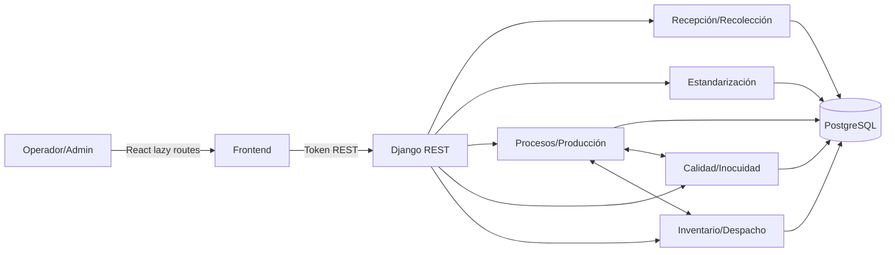

# Mapa AS-IS de CCAA

Fecha de verificación: 2026-09-10. Fuente principal: código de `DevelopMain` (`5ab05bc`).

## Resumen ejecutivo

CCAA es un monolito modular React + Django REST + PostgreSQL. Ya posee autenticación, tenancy, permisos por área, rutas productivas configurables, transacciones, bloqueos de equipos, cuatro puertas de Calidad, inventario físico y genealogía. No corresponde reescribirlo: la transformación debe ordenar y completar lo existente.

## Inventario y responsabilidad

| Componente | Responsabilidad | Evidencia |
|---|---|---|
| usuarios | Identidad, empresa/sucursal, área, rol, sesiones y permisos | `backend/usuarios/models.py:11-435`, `backend/usuarios/permisos.py:21-362` |
| maestros | Productos, equipos, silos, especificaciones, recetas y formatos | `backend/maestros/models.py:22-1238` |
| recepción/recolección | Camión, muestra, descarga, movimientos y origen predial | `backend/recepcion/models.py:59-1060`, `backend/recoleccion/models.py:10-160` |
| estandarización | Hoja RC, mezcla, agitación, muestra y corrección | `backend/estandarizacion/models.py:46-127` |
| procesos/producción | Rutas, ejecuciones, corridas, entradas, salidas, lotes y envasado | `backend/procesos/models.py:10-1225`, `backend/produccion/models.py:33-710` |
| calidad/inocuidad | Liberación intermedia/final, expedientes, PCC/PPRO | `backend/calidad/models.py:40-380`, `backend/inocuidad/models.py:27-190` |
| inventario | Existencias, movimientos, cuarentena, compras, despacho y rework | `backend/inventario/models.py:14-1225` |

## Entrada → ejecución → persistencia

| Origen | Acción | Destino | Mecanismo | Evidencia |
|---|---|---|---|---|
| React Recepción | Descargar leche | Silo | POST + servicio transaccional | `backend/recepcion/views.py:837-929` |
| React Procesos | Continuar material | Siguiente etapa | POST + locks | `backend/procesos/servicios.py:772-874` |
| Calidad | Liberar salida | Proceso/Envasado | POST + transición | `backend/calidad/views.py:930-1064` |
| Calidad | Liberar lote | Bodega | POST + expediente | `backend/calidad/views.py:1210-1298` |
| Inventario | Ejecutar despacho | Salida física | POST + locks/movimiento | `backend/inventario/servicios.py:199-285` |

## Estados y automatización

Las entidades tienen ciclos separados (recepción, vale, ejecución, corrida, liberación, pallet); no deben colapsarse en un estado universal. Celery se usa para MRP/alertas, no para confirmar operaciones críticas (`backend/inventario/tareas.py:18-79`).

## Inconsistencias confirmadas

- `procesos` e `inventario` tienen dependencia circular runtime mediante compuerta CIP y consumo/rework.
- Las escrituras masivas críticas omitían señales de auditoría; el primer bloque de esta transformación las instrumenta.
- La bandeja genérica de ejecuciones no se filtra por etapa del área y entrega transiciones de estado, no acciones realmente autorizadas (`backend/procesos/views.py:1070-1113`).
- El panel admin compone 7–8 GET y cuenta ejecuciones desde una página potencialmente parcial (`frontend/src/pages/Dashboard/Dashboard.tsx:77-110`).
