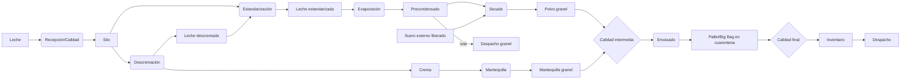

# Runtime productivo AS-IS

## Línea productiva confirmada

La ruta posterior depende de `RutaProducto`, no de condicionales React (`backend/procesos/models.py:66-115`, `backend/procesos/servicios.py:482-658`).

| Proceso | Entrada | Salida/handoff | Estado |
|---|---|---|---|
| Recepción | camión+módulos+controles | movimiento a silo | Confirmado |
| Estandarización | entera, opcional descremada/crema | mezcla RC liberada | Confirmado |
| Descremación | leche+plan+3 reservas | descremada y crema independientes | Confirmado |
| Evaporación | lote/vale+silo | precondensado a TK | Confirmado |
| Secado | intermedio o lote externo | polvo+finos+merma | Confirmado |
| Mantequilla | crema liberada | mantequilla+merma; coproducto backend oculto en UI | Parcial |
| Envasado | salida liberada | pallet/Big Bag en cuarentena | Confirmado |
| Calidad | salida/lote/expediente | libera, concede o rechaza | Confirmado |

## Puertas de Calidad

1. Camión antes de descarga. 2. Salida intermedia antes de continuidad/Envasado. 3. Materia prima externa antes de Secado. 4. Producto terminado antes de Bodega/Despacho.

## Trazabilidad

`EntradaProceso` conserva exactamente un origen y puede enlazar la salida consumida; `SalidaProceso` conserva producto, ruta, cantidad, unidad y destino (`backend/procesos/models.py:758-888,967-1034`). La genealogía acepta lote o pallet y agrega recepción FIFO, vale, ejecuciones, Calidad, ubicación y despacho (`backend/procesos/views.py:1703-1944`).

## Brechas

- HIGH: Mantequilla permite cantidad de salida menor a crema sin exigir clasificar toda diferencia (`backend/procesos/models.py:651-656`; `frontend/src/pages/Procesos/CierreMantequilla.tsx:21-34`).
- MEDIUM: salida de Estandarización no persiste producto/ruta en el grafo genérico (`backend/procesos/servicios.py:1081-1130`).
- MEDIUM: Protomalt es capacidad configurable, no circuito operativo verificado.
- Documentación de Suero está desactualizada: existe E2E hasta Big Bag e Inventario (`backend/procesos/tests_flujo_suero.py:204-305`).

