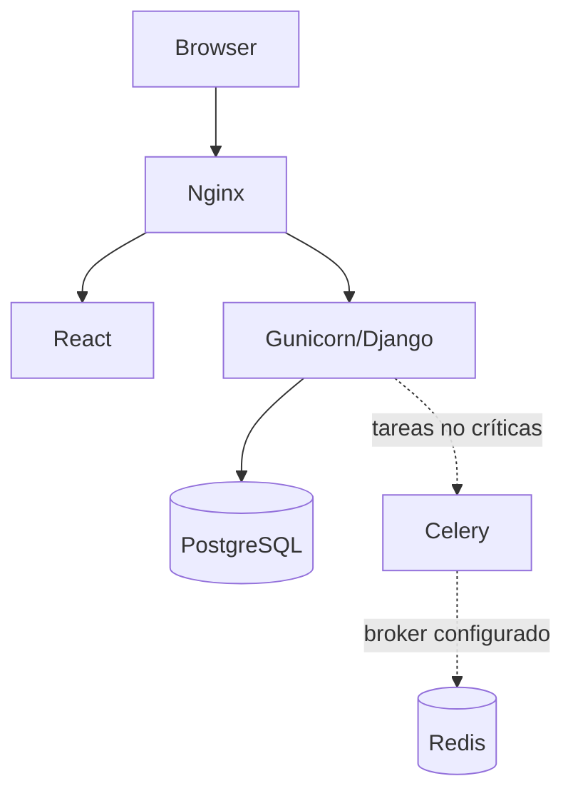
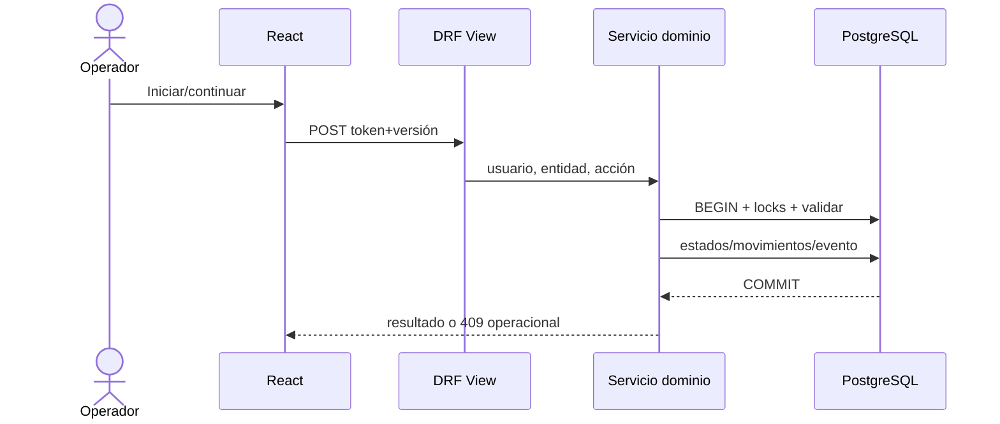

# Arquitectura actual

## Contexto y contenedores

React 19/Vite sirve rutas lazy; Django/DRF aplica autenticación fail-closed, permisos y tenancy; PostgreSQL es fuente de verdad y requisito por locks/constraints. Nginx/Gunicorn/Compose están configurados para despliegue. Celery es opcional y acotado a MRP/alertas.

## Seguridad y concurrencia

- `IsAuthenticated` por defecto y permisos explícitos (`backend/config/settings.py:344-365`).
- Scope empresa/sucursal aplicado a querysets y relaciones (`backend/usuarios/tenancy.py:128-298`).
- Escritura por área/rol y operación por etapa (`backend/usuarios/permisos.py:56-362`, `backend/procesos/permisos.py:21-131`).
- Transiciones críticas usan `atomic`, `select_for_update`, constraint de equipo y versión optimista (`backend/procesos/servicios.py:877-966`).

## Runtime representativo

## Riesgo estructural

El mayor riesgo no es ausencia de arquitectura, sino inconsistencias en sus bordes: auditoría de bulk, bandejas no contextualizadas, estados paralelos y cruces `procesos ↔ inventario`.

