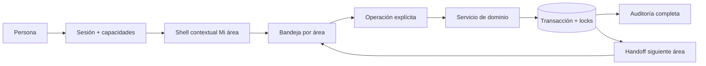

# Arquitectura objetivo incremental

## Principios

- Mantener monolito modular y URLs compatibles.
- Backend autoriza; frontend orienta y oculta lo imposible.
- Resumen primero, detalle bajo demanda.
- Trabajo organizado por área/estado; histórico separado y paginado.
- Transiciones explícitas, auditables e idempotentes.
- `EntradaProceso`/`SalidaProceso`/lote/ruta siguen siendo el eje de genealogía.
- Estados físicos, productivos y de Calidad permanecen separados.

## Transición

AS-IS estable → cerrar integridad/auditoría → contrato “Mi área” → shell jerárquico → handoffs/timeline → panel global agregado → optimización medida. No se introduce microservicios, Kafka ni una segunda fuente de verdad.

