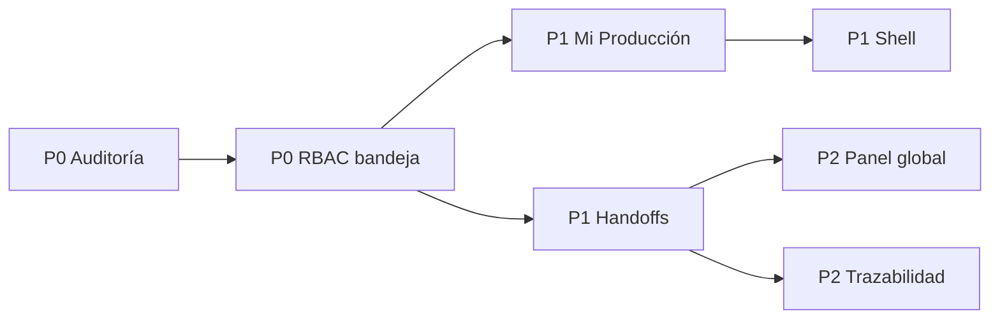

# Plan incremental ejecutable

## Top mejoras y dependencias

| Prioridad | Bloque | Resultado verificable |
|---|---|---|
| P0 | 1. Auditoría de bulk críticos | cada movimiento/reserva/liberación guarda before/after y actor |
| P0 | 2. Bandeja backend por área | admin ve todo; operador solo etapas propias y acciones autorizadas |
| P1 | 3. “Mi Producción” | pendientes/en curso/bloqueados/Calidad; histórico diferido |
| P1 | 4. Shell jerárquico contextual | navegación por área/proceso sin romper URLs |
| P1 | 5. Balance obligatorio de Mantequilla | 100% de masa clasificada, tras validación de planta |
| P1 | 6. Handoffs explícitos | cierre crea trabajo visible para siguiente área |
| P2 | 7. Panel Planta Ahora agregado | un contrato resumido; conteos globales exactos |
| P2 | 8. Trazabilidad visual | timeline y genealogía cuantificada bajo demanda |
| P2 | 9. Idempotencia MRP/destinos | redelivery y carreras sin duplicados |
| P3 | 10. Optimización medida | eliminar GET auxiliares/N+1 restantes y dividir componentes grandes |

## Bloque 1 — en implementación

Problema: Django no emite señales en `bulk_create`, `bulk_update` ni `QuerySet.update`. Solución: envolturas auditables dentro de la misma transacción y adopción en Calidad, reservas/silos y movimientos de Estandarización. Aceptación: una fila por objeto, `[antes, después]`, actor heredado del request y rollback conjunto. Sin migración ni cambio API.

## Bloque 2 — siguiente prompt Codex

Analiza `EjecucionProcesoViewSet.operativas`, `TIPOS_OPERABLES_POR_AREA` y sus consumidores. Filtra la bandeja por etapa autorizada para usuarios normales, conserva vista global para Administración, entrega acciones realmente autorizadas y agrega tests de Condensación, Secado, Calidad y admin. No cambies las transiciones ni URLs existentes.

## QA por bloque

Ruff, tests Django focales y de regresión, `makemigrations --check`, TypeScript, ESLint, unitarios frontend y E2E del flujo afectado. Los circuitos lácteos completos se ejecutan después de estabilizar cada handoff, no como sustituto de tests de dominio.

