# Mapa general de planta

## Objetivo

Mostrar las rutas productivas principales que CCAA controla actualmente y las puertas de Calidad que habilitan cada material.

## Diagrama

```mermaid
flowchart LR
    REC[Recepción] --> QREC{Calidad<br/>de leche}
    QREC -->|Liberada| SILO[(Materia prima: leche<br/>Calidad: liberada)]
    QREC -->|Rechazada| RET[Materia prima: leche<br/>Calidad: rechazada]

    SILO --> EST[Estandarización]
    EST --> LEST[Material intermedio<br/>Leche estandarizada]
    LEST --> QEST{Calidad}
    QEST -->|Liberada| EVA[Evaporación]
    EVA --> PRE[Material intermedio<br/>Precondensado]
    PRE --> QPRE{Calidad}
    QPRE -->|Despacho directo| DG1[Despacho a granel]
    QPRE -->|Continuar| SEC[Secado]
    SEC --> POL[Material intermedio<br/>Polvo a granel]
    POL --> QPOL{Calidad}
    QPOL -->|Liberado| ENV1[Envasado]
    ENV1 --> FMT{Formato configurado}
    FMT --> PAL1[Producto terminado<br/>Sacos + pallet]
    FMT --> BB[Producto terminado<br/>Big Bag]
    PAL1 --> QFIN1{Liberación final}
    BB --> QFIN1
    QFIN1 --> INV1[Inventario]

    SILO --> DES[Descremado]
    DES --> LD[Material intermedio<br/>Leche descremada]
    DES --> CRE[Material intermedio<br/>Crema]
    LD --> TKLD[(TK descremada)]
    TKLD --> QLD{Calidad}
    QLD -->|Ruta autorizada| EST
    CRE --> TKC[(TK crema)]
    TKC --> QCRE{Calidad}
    QCRE -->|Mantequilla| MAN[Mantequilla]
    QCRE -->|Despacho directo| DG2[Despacho a granel]
    QCRE -.->|Si la ruta lo permite| EST
    MAN --> MB[Material intermedio<br/>Mantequilla a granel]
    MB --> QMAN{Calidad}
    QMAN -->|Liberada| ENV2[Envasado]
    ENV2 --> CAJ[Producto terminado<br/>Cajas / pallet]
    CAJ --> QFIN2{Liberación final}
    QFIN2 --> INV2[Inventario]

    SUE[Materia prima externa<br/>Suero recibido] --> QSUE{Calidad}
    QSUE --> SECS[Secado de suero<br/>Ruta propia]
    SECS --> SUF[Producto terminado<br/>Suero en polvo]

    MAL[Materia prima / insumo<br/>Extracto de malta] --> QMAL{Calidad}
    QMAL --> PREM[Preparación previa<br/>pendiente de confirmar]
    PREM --> SECM[Secado Protomalt<br/>Ruta propia]
    SECM --> PMF[Producto terminado<br/>Protomalt]

    class REC,EST,EVA,SEC,DES,MAN,ENV1,ENV2,SECS,PREM,SECM process;
    class SILO,TKLD,TKC storage;
    class LEST,PRE,POL,LD,CRE,MB,PAL1,BB,CAJ,SUE,SUF,MAL,PMF material;
    class QREC,QEST,QPRE,QPOL,QCRE,QLD,QMAN,QFIN1,QFIN2,QSUE,QMAL quality;
    class RET,DG1,DG2,INV1,INV2 destination;
    classDef process fill:#dbeafe,stroke:#2563eb,color:#172554;
    classDef storage fill:#e0f2fe,stroke:#0284c7,color:#0c4a6e;
    classDef material fill:#fef3c7,stroke:#d97706,color:#78350f;
    classDef quality fill:#dcfce7,stroke:#16a34a,color:#14532d;
    classDef destination fill:#f3e8ff,stroke:#9333ea,color:#581c87;
```

## Explicación breve

La leche liberada entra a un silo y desde ahí sigue la ruta configurada para el producto. Descremado abre dos ramas independientes. Precondensado y crema pueden despacharse sin convertirse en producto envasado. Calidad aparece como varias puertas sobre materiales concretos, no como una etapa única al final.

## Estados o decisiones importantes

- Una ruta decide la etapa y el destino siguientes.
- El tipo de material y su estado de Calidad se muestran por separado.
- Un material rechazado o pendiente de Calidad no continúa.
- La crema y la leche descremada conservan decisiones independientes.
- Inventario recibe producto terminado liberado; el granel sale mediante despacho físico.
- Suero y Protomalt tienen rutas propias aunque compartan equipos de Secado.
- La ruta Protomalt permanece sin habilitar hasta confirmar su preparación previa.
- Big Bag no es un pallet de sacos y debe conservar identidad logística propia.

## Validación del experto-procesos-lacteos

**REQUIERE AJUSTE.** Los flujos actuales coinciden con CCAA, pero Suero recibido, Protomalt y Big Bag aún no están implementados de extremo a extremo. Las etapas no confirmadas se muestran explícitamente y no se inventan.
