# Mapa general de planta

## Objetivo

Mostrar las rutas productivas principales que CCAA controla actualmente y las puertas de Calidad que habilitan cada material.

## Diagrama

```mermaid
flowchart LR
    REC[Recepción] --> QREC{Calidad<br/>de leche}
    QREC -->|Liberada| SILO[(Silo de leche)]
    QREC -->|Rechazada| RET[Retención]

    SILO --> EST[Estandarización]
    EST --> LEST[Leche estandarizada]
    LEST --> QEST{Calidad}
    QEST -->|Liberada| EVA[Evaporación]
    EVA --> PRE[Precondensado]
    PRE --> QPRE{Calidad}
    QPRE -->|Despacho directo| DG1[Despacho a granel]
    QPRE -->|Continuar| SEC[Secado]
    SEC --> POL[Polvo a granel]
    POL --> QPOL{Calidad}
    QPOL -->|Liberado| ENV1[Envasado]
    ENV1 --> PAL1[Pallet]
    PAL1 --> QFIN1{Liberación final}
    QFIN1 --> INV1[Inventario]

    SILO --> DES[Descremado]
    DES --> LD[Leche descremada]
    DES --> CRE[Crema]
    LD --> TKLD[(TK descremada)]
    TKLD --> QLD{Calidad}
    QLD -->|Ruta autorizada| EST
    CRE --> TKC[(TK crema)]
    TKC --> QCRE{Calidad}
    QCRE -->|Mantequilla| MAN[Mantequilla]
    QCRE -->|Despacho directo| DG2[Despacho a granel]
    QCRE -.->|Si la ruta lo permite| EST
    MAN --> MB[Mantequilla a granel]
    MB --> QMAN{Calidad}
    QMAN -->|Liberada| ENV2[Envasado]
    ENV2 --> CAJ[Cajas / pallet]
    CAJ --> QFIN2{Liberación final}
    QFIN2 --> INV2[Inventario]

    class REC,EST,EVA,SEC,DES,MAN,ENV1,ENV2 process;
    class SILO,TKLD,TKC storage;
    class LEST,PRE,POL,LD,CRE,MB,PAL1,CAJ material;
    class QREC,QEST,QPRE,QPOL,QCRE,QLD,QMAN,QFIN1,QFIN2 quality;
    class RET,DG1,DG2,INV1,INV2 destination;
    classDef process fill:#dbeafe,stroke:#2563eb,color:#172554;
    classDef storage fill:#e0f2fe,stroke:#0284c7,color:#0c4a6e;
    classDef material fill:#fef3c7,stroke:#d97706,color:#78350f;
    classDef quality fill:#dcfce7,stroke:#16a34a,color:#14532d;
    classDef destination fill:#f3e8ff,stroke:#9333ea,color:#581c87;
```

## Explicación breve

La leche liberada entra a un silo y desde ahí sigue la ruta configurada para el producto. Descremado abre dos ramas independientes. Precondensado y crema pueden despacharse sin convertirse en producto envasado. Calidad aparece como varias puertas sobre materiales concretos, no como una etapa única al final.

## Estados o decisiones importantes

- Una ruta decide la etapa y el destino siguientes.
- Un material rechazado o pendiente de Calidad no continúa.
- La crema y la leche descremada conservan decisiones independientes.
- Inventario recibe producto terminado liberado; el granel sale mediante despacho físico.

## Validación del experto-procesos-lacteos

**CORRECTO CON OBSERVACIONES.** El mapa coincide con la implementación actual. Las capacidades, identificadores físicos y parámetros provisionales deben ser confirmados por planta.
