# Flujo de leche en polvo

## Objetivo

Explicar cómo una leche recibida se transforma en un pallet de leche en polvo disponible en Inventario.

## Diagrama

```mermaid
flowchart LR
    REC[Recepción] --> Q1{Calidad<br/>leche}
    Q1 -->|Liberada| SILO[(Silo)]
    SILO --> EST[Estandarización]
    EST --> ME1[Leche estandarizada]
    ME1 --> Q2{Calidad / RC}
    Q2 -->|Liberada| EVA[Evaporación]
    EVA --> ME2[Precondensado]
    ME2 --> Q3{Calidad}
    Q3 -->|Liberado para Secado| SEC[Secado]
    SEC --> ME3[Polvo a granel]
    ME3 --> Q4{Calidad de lote}
    Q4 -->|Liberado para Envasado| ENV[Envasado]
    ENV --> PT[Producto terminado<br/>sacos + pallet]
    PT --> Q5{Liberación final}
    Q5 -->|Liberado| INV[Inventario disponible]

    class REC,EST,EVA,SEC,ENV process;
    class SILO storage;
    class ME1,ME2,ME3 intermediate;
    class PT final;
    class Q1,Q2,Q3,Q4,Q5 quality;
    class INV destination;
    classDef process fill:#dbeafe,stroke:#2563eb,color:#172554;
    classDef storage fill:#e0f2fe,stroke:#0284c7,color:#0c4a6e;
    classDef intermediate fill:#fef3c7,stroke:#d97706,color:#78350f;
    classDef final fill:#f3e8ff,stroke:#9333ea,color:#581c87;
    classDef quality fill:#dcfce7,stroke:#16a34a,color:#14532d;
    classDef destination fill:#ede9fe,stroke:#7c3aed,color:#4c1d95;
```

## Explicación breve

La leche pasa por transformaciones físicas separadas y cada material intermedio conserva su lote y origen. El cierre de una máquina no reemplaza una liberación de Calidad. Envasado consume los materiales de embalaje y crea el pallet; la liberación final permite que llegue a stock disponible.

## Estados o decisiones importantes

- El RC conforme habilita la salida de Estandarización.
- El precondensado necesita liberación antes de Secado.
- El polvo a granel necesita liberación antes de Envasado.
- El pallet queda en cuarentena hasta la liberación comercial final.

## Validación del experto-procesos-lacteos

**CORRECTO.** El circuito completo fue verificado por interfaz hasta un pallet de 500 kg disponible en Inventario.
