# Precondensado a despacho directo

## Objetivo

Mostrar la ruta comercial del precondensado que se despacha a granel sin pasar por Secado ni Envasado.

## Diagrama

```mermaid
flowchart LR
    REC[Recepción] --> Q1{Calidad}
    Q1 -->|Liberada| SILO[(Silo de leche)]
    SILO --> EST[Estandarización]
    EST --> Q2{Calidad / RC}
    Q2 -->|Liberada| EVA[Evaporación]
    EVA --> PRE[Precondensado<br/>en TK]
    PRE --> Q3{Calidad}
    Q3 -->|Liberado para despacho| DISP[Granel disponible]
    DISP --> BOR[Borrador de despacho]
    BOR --> AUT[Despacho autorizado]
    AUT --> SAL[Salida física del TK]
    SAL --> MOV[Saldo y movimiento actualizados]

    class REC,EST,EVA process;
    class SILO,PRE storage;
    class Q1,Q2,Q3 quality;
    class DISP,BOR,AUT material;
    class SAL,MOV destination;
    classDef process fill:#dbeafe,stroke:#2563eb,color:#172554;
    classDef storage fill:#e0f2fe,stroke:#0284c7,color:#0c4a6e;
    classDef quality fill:#dcfce7,stroke:#16a34a,color:#14532d;
    classDef material fill:#fef3c7,stroke:#d97706,color:#78350f;
    classDef destination fill:#f3e8ff,stroke:#9333ea,color:#581c87;
```

## Explicación breve

La ruta termina en despacho directo después de la aprobación del precondensado. No se crea un lote envasado ni un pallet. Al confirmar el despacho, CCAA registra la salida física y descuenta el volumen real del TK.

## Estados o decisiones importantes

- El destino `despacho directo` debe venir de la ruta del producto.
- Solo se ofrece saldo liberado y no comprometido.
- El despacho avanza de borrador a autorizado y luego a despachado.
- Repetir la confirmación no duplica la salida física.

## Validación del experto-procesos-lacteos

**CORRECTO.** El recorrido de 1.500 L fue comprobado por interfaz, incluyendo la salida física del TK.
