# Flujo de mantequilla

## Objetivo

Explicar el camino propio de la crema hasta las cajas de mantequilla liberadas en Inventario.

## Diagrama

```mermaid
flowchart LR
    REC[Recepción] --> Q1{Calidad leche}
    Q1 -->|Liberada| SILO[(Silo)]
    SILO --> DES[Descremado]
    DES --> CRE[Crema<br/>salida independiente]
    DES --> LD[Leche descremada<br/>otra rama]
    CRE --> TK[(TK crema)]
    TK --> Q2{Calidad crema}
    Q2 -->|Liberada para Mantequilla| MAN[Proceso de Mantequilla]
    MAN --> MB[Mantequilla a granel]
    MAN --> MER[Merma]
    MB --> Q3{Calidad de lote}
    Q3 -->|Liberada para Envasado| ENV[Envasado]
    ENV --> CAJ[Cajas configuradas<br/>+ pallet]
    CAJ --> Q4{Liberación final}
    Q4 -->|Liberado| INV[Inventario disponible]

    class REC,DES,MAN,ENV process;
    class SILO,TK storage;
    class CRE,LD,MB,MER intermediate;
    class CAJ final;
    class Q1,Q2,Q3,Q4 quality;
    class INV destination;
    classDef process fill:#dbeafe,stroke:#2563eb,color:#172554;
    classDef storage fill:#e0f2fe,stroke:#0284c7,color:#0c4a6e;
    classDef intermediate fill:#fef3c7,stroke:#d97706,color:#78350f;
    classDef final fill:#f3e8ff,stroke:#9333ea,color:#581c87;
    classDef quality fill:#dcfce7,stroke:#16a34a,color:#14532d;
    classDef destination fill:#ede9fe,stroke:#7c3aed,color:#4c1d95;
```

## Explicación breve

La crema nace como una de las dos salidas de Descremado y tiene su propio lote, TK y liberación. En el alcance operacional actual, CCAA continúa solamente con mantequilla y merma declarada; no ofrece una ruta de mazada. Solo la mantequilla a granel conforme puede envasarse y las cajas requieren liberación final.

## Estados o decisiones importantes

- Crema pendiente o rechazada no puede entrar a Mantequilla.
- La corrida termina físicamente antes de la decisión sobre el granel.
- Mazada queda fuera del flujo operativo hasta que planta confirme que existe y cómo se gestiona.
- El formato y la cantidad máxima del pallet vienen de configuración.
- Un remanente insuficiente para una caja debe explicarse como rework o destrucción.

## Validación del experto-procesos-lacteos

**CORRECTO CON OBSERVACIONES.** El circuito fue probado hasta Inventario. Mazada no se presenta como destino operativo y las especificaciones provisionales deben reemplazarse por las aprobadas por CCAA.
