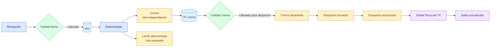

# Crema a despacho directo

## Objetivo

Mostrar cómo la crema comercial sale desde Descremado hacia un despacho a granel sin ingresar a Mantequilla.

## Diagrama

## Explicación breve

El operador elige para la crema una ruta de despacho directo. Calidad decide sobre esa salida sin afectar la leche descremada hermana. Una vez autorizado y ejecutado el despacho, el movimiento físico reduce el saldo del TK.

## Estados o decisiones importantes

- Elegir despacho evita que la misma crema aparezca como insumo de Mantequilla.
- La liberación es independiente de la salida de leche descremada.
- El saldo autorizado queda comprometido para impedir doble uso.
- No se crean cajas, pallets ni producto terminado.

## Validación del experto-procesos-lacteos

**CORRECTO CON OBSERVACIONES.** La rama fue verificada por interfaz; los rangos definitivos de crema comercial deben ser confirmados por Calidad.
