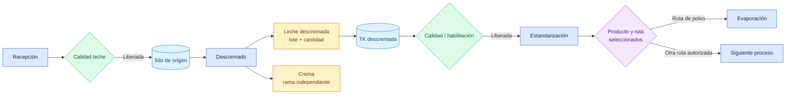

# Flujo de leche descremada

## Objetivo

Explicar cómo la leche descremada producida internamente queda habilitada para Estandarización y continúa por la ruta del producto elegido.

## Diagrama

## Explicación breve

La leche descremada no es leche en polvo ni un producto terminado: es un material intermedio en litros. Se almacena en su TK, espera su habilitación y luego puede alimentar un vale de Estandarización. Desde ahí continúa según la ruta del producto a fabricar.

## Estados o decisiones importantes

- Descremado reserva capacidad del TK antes de comenzar.
- La salida conserva su propio lote, cantidad, ubicación y ruta.
- Estandarización solo utiliza saldo disponible y liberado.
- React no decide la etapa posterior: la informa la ruta configurada.

## Validación del experto-procesos-lacteos

**CORRECTO CON OBSERVACIONES.** La salida y su acción hacia Estandarización fueron verificadas; falta confirmar en planta los maestros y completar una validación operacional prolongada de esta rama.
