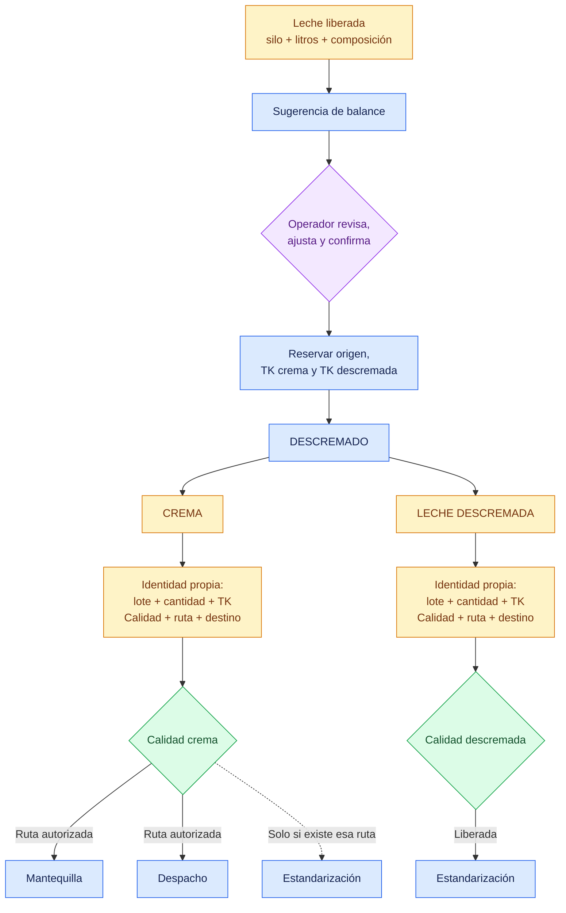

# Descremado como subproceso

## Objetivo

Destacar que una corrida de Descremado transforma una entrada en dos materiales trazables y operacionalmente independientes.

## Diagrama

## Explicación breve

CCAA calcula una sugerencia, pero el operador mantiene la decisión y debe confirmarla. Al cerrar, la corrida genera crema y leche descremada con registros separados. La decisión de Calidad o destino de una rama no cambia automáticamente la otra.

## Estados o decisiones importantes

- La sugerencia no inicia la corrida por sí sola.
- Las tres ubicaciones se reservan para evitar sobreasignación.
- Ambas salidas tienen lote, saldo, TK, Calidad, ruta y destino propios.
- Crema hacia Estandarización solo corresponde si existe una ruta autorizada.

## Validación del experto-procesos-lacteos

**CORRECTO CON OBSERVACIONES.** La bifurcación y sus liberaciones independientes son correctas; los parámetros definitivos de la descremadora siguen sujetos a validación de planta.
