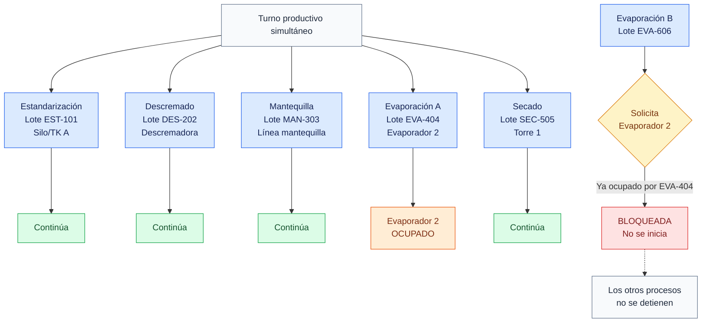

# Procesos simultáneos

## Objetivo

Mostrar que CCAA administra varias corridas al mismo tiempo y bloquea solo el recurso físico en conflicto.

## Diagrama

## Explicación breve

Cada corrida mantiene su lote, material, equipo, almacenamiento y estado. Los procesos con recursos distintos pueden avanzar en paralelo. Si otra corrida intenta usar el mismo equipo, CCAA rechaza solamente ese inicio y conserva las demás operaciones.

## Estados o decisiones importantes

- `En preparación` reserva el equipo.
- `En ejecución`, `Pausada` y `Bloqueada` mantienen la ocupación.
- `Pendiente de control` no ocupa físicamente el equipo.
- Silos y TK también reservan saldo o capacidad durante operaciones largas.

## Validación del experto-procesos-lacteos

**CORRECTO.** La simultaneidad con equipos distintos y el rechazo de una colisión fueron comprobados mediante pruebas transaccionales.
