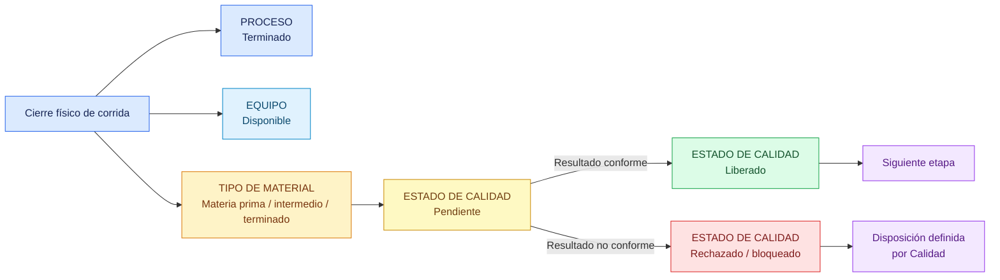

# Estados de proceso, equipo, material y Calidad

## Objetivo

Evitar que un mismo estado se utilice para describir cuatro situaciones operacionales diferentes.

## Diagrama

## Explicación breve

Cerrar una corrida indica que la transformación física terminó. El equipo puede quedar disponible inmediatamente, aunque el material siga retenido. El tipo del material no cambia porque Calidad lo rechace: solamente cambia su estado de Calidad y su disposición permitida.

## Estados o decisiones importantes

- Estado del proceso: qué ocurrió con la corrida.
- Estado del equipo: si puede recibir otro trabajo.
- Tipo de material: materia prima/insumo, intermedio, terminado, coproducto, rework o merma según corresponda.
- Estado de Calidad: pendiente, liberado, rechazado o bloqueado.
- Ejemplo: `Material intermedio` + `Calidad pendiente`.

## Validación del experto-procesos-lacteos

**CORRECTO.** Esta separación coincide con Secado, Descremado, Mantequilla y las liberaciones intermedias implementadas.
