# Trazabilidad de materiales y lotes

## Objetivo

Mostrar cómo CCAA reconstruye una cadena lineal y una transformación con dos salidas.

## Diagrama

```mermaid
flowchart TB
    subgraph POLVO[Cadena de leche en polvo]
        R1[Recepción<br/>ID + guía + origen] --> L1[Lote / atribución FIFO]
        L1 --> S1[(Silo + movimiento)]
        S1 --> E1[Estandarización<br/>vale]
        E1 --> O1[Salida estandarizada]
        O1 --> V1[Evaporación<br/>ejecución + corrida]
        V1 --> P1[Precondensado<br/>lote + TK]
        P1 --> D1[Secado<br/>ejecución + torre]
        D1 --> P2[Polvo a granel<br/>lote + Calidad]
        P2 --> ENV[Envasado<br/>operación]
        ENV --> PAL[Pallet<br/>código + formato]
        PAL --> INV[Inventario<br/>ubicación + movimientos]
    end

    subgraph BIF[Bifurcación de Descremado]
        R2[Recepción / silo] --> DES[Corrida de Descremado]
        DES --> CR[Crema<br/>lote + cantidad + TK]
        DES --> LD[Leche descremada<br/>lote + cantidad + TK]
        CR --> MAN[Mantequilla<br/>ruta propia]
        LD --> EST[Estandarización<br/>ruta propia]
    end

    class R1,E1,V1,D1,ENV,R2,DES,MAN,EST process;
    class S1 storage;
    class L1,O1,P1,P2,CR,LD material;
    class PAL,INV destination;
    classDef process fill:#dbeafe,stroke:#2563eb,color:#172554;
    classDef storage fill:#e0f2fe,stroke:#0284c7,color:#0c4a6e;
    classDef material fill:#fef3c7,stroke:#d97706,color:#78350f;
    classDef destination fill:#f3e8ff,stroke:#9333ea,color:#581c87;
```

## Explicación breve

La cadena se reconstruye enlazando recepción, movimientos, vale, ruta, lote, ejecución, corrida, entradas, salidas, análisis, liberaciones, envase y pallet. En Descremado, ambas salidas apuntan a la misma corrida de origen, pero conservan identidades y destinos separados. Los registros antiguos sin atribución exacta se muestran como inferidos.

## Estados o decisiones importantes

- La ruta elegida permanece asociada a la ejecución y a su salida.
- Cada consumo identifica el material o silo del que provino.
- Calidad queda vinculada al material analizado, no solo al proceso general.
- La genealogía FIFO cuantifica los litros aportados por cada recepción cuando existe evidencia.

## Validación del experto-procesos-lacteos

**CORRECTO CON OBSERVACIONES.** Las operaciones nuevas conservan la cadena completa; algunos datos históricos anteriores permanecen identificados como inferidos porque no es seguro reconstruirlos retroactivamente.
