# Secado de suero recibido

## Objetivo

Representar el suero que llega a la planta como materia prima externa y se seca en CCAA, sin confundirlo con la leche ni con un coproducto de Mantequilla.

## Diagrama

```mermaid
flowchart LR
    REC[Recepción de suero] --> MP[Materia prima: suero recibido]
    MP --> Q1{Calidad de recepción}
    Q1 -->|Liberado| ALM[(Almacenamiento / alimentación)]
    Q1 -->|Rechazado o bloqueado| RET[Disposición definida por Calidad]
    ALM --> PRE{Preparación previa requerida<br/>por producto o ficha}
    PRE -->|No| SEC[Secado]
    PRE -->|Sí, configurada| PPRO[Proceso previo autorizado]
    PPRO --> SEC
    SEC --> GR[Material intermedio<br/>Suero en polvo a granel]
    GR --> Q2{Calidad de lote}
    Q2 -->|Liberado| ENV[Envasado]
    Q2 -->|Rechazado o bloqueado| DISP[Disposición definida por Calidad]
    ENV --> PT[Producto terminado<br/>Formato configurado]
    PT --> Q3{Liberación final}
    Q3 -->|Liberado| INV[Inventario o Despacho]

    class REC,PPRO,SEC,ENV process;
    class ALM storage;
    class MP,GR intermediate;
    class PT final;
    class Q1,Q2,Q3 quality;
    class RET,DISP,INV destination;
    classDef process fill:#dbeafe,stroke:#2563eb,color:#172554;
    classDef storage fill:#e0f2fe,stroke:#0284c7,color:#0c4a6e;
    classDef intermediate fill:#fef3c7,stroke:#d97706,color:#78350f;
    classDef final fill:#f3e8ff,stroke:#9333ea,color:#581c87;
    classDef quality fill:#dcfce7,stroke:#16a34a,color:#14532d;
    classDef destination fill:#fee2e2,stroke:#dc2626,color:#7f1d1d;
```

## Explicación breve

El suero no se genera en Mantequilla dentro del alcance actual: llega desde fuera de la fábrica. Debe conservar recepción, origen, lote, cantidad y decisión de Calidad antes de alimentar Secado. El proceso previo solo se incorpora si la ficha real del producto lo exige.

## Estados o decisiones importantes

- Tipo de material inicial: materia prima / insumo recibido.
- La recepción de suero requiere un lote y origen trazables.
- Secado puede reutilizar la corrida existente, pero no una ruta de leche en polvo.
- Producto, especificación, preparación y formato deben venir de maestros aprobados.
- Calidad intermedia y liberación final siguen siendo decisiones distintas.

## Validación del experto-procesos-lacteos

**REQUIERE AJUSTE.** El flujo operacional fue confirmado de forma general, pero CCAA todavía no posee una recepción de suero conectada de extremo a extremo con Secado. Falta confirmar almacenamiento, controles de recepción, preparación previa y producto/formato reales.
