# Secado de extracto de malta / Protomalt

## Objetivo

Representar Protomalt como un producto y una ruta propios que pueden compartir equipos de Secado, sin forzarlo dentro del proceso estándar de leche en polvo.

## Diagrama

```mermaid
flowchart LR
    REC[Recepción / alimentación<br/>de extracto de malta] --> MP[Materia prima / insumo<br/>Extracto de malta]
    MP --> Q1{Calidad de entrada}
    Q1 -->|Liberado| ALM[(Almacenamiento definido<br/>por planta)]
    Q1 -->|Rechazado o bloqueado| RET[Disposición definida por Calidad]
    ALM --> DEF{Proceso previo<br/>confirmado en ficha}
    DEF -->|Pendiente de definir| STOP[No habilitar producción]
    DEF -->|Configurado y conforme| SEC[Secado]
    SEC --> GR[Material intermedio<br/>Protomalt a granel]
    GR --> Q2{Calidad de lote}
    Q2 -->|Liberado| ENV[Envasado]
    Q2 -->|Rechazado o bloqueado| DISP[Disposición definida por Calidad]
    ENV --> PT[Producto terminado<br/>Formato configurado]
    PT --> Q3{Liberación final}
    Q3 -->|Liberado| INV[Inventario o Despacho]

    class REC,SEC,ENV process;
    class ALM storage;
    class MP,GR intermediate;
    class PT final;
    class Q1,Q2,Q3 quality;
    class RET,STOP,DISP,INV destination;
    classDef process fill:#dbeafe,stroke:#2563eb,color:#172554;
    classDef storage fill:#e0f2fe,stroke:#0284c7,color:#0c4a6e;
    classDef intermediate fill:#fef3c7,stroke:#d97706,color:#78350f;
    classDef final fill:#f3e8ff,stroke:#9333ea,color:#581c87;
    classDef quality fill:#dcfce7,stroke:#16a34a,color:#14532d;
    classDef destination fill:#fee2e2,stroke:#dc2626,color:#7f1d1d;
```

## Explicación breve

El extracto de malta llega a la fábrica y se procesa en CCAA, pero todavía no está documentado qué preparación antecede al Secado. Por seguridad, esa etapa queda como configuración obligatoria: el sistema no debe inventarla ni permitir producir mientras falte.

## Estados o decisiones importantes

- Protomalt utiliza un producto, especificación y ruta independientes.
- Compartir una torre no convierte su ruta en leche en polvo.
- La preparación previa debe confirmarse con Producción y Calidad.
- El equipo solo puede seleccionarse cuando sea compatible y esté disponible.
- Envasado, Calidad final e Inventario reutilizan conceptos comunes con configuración propia.

## Validación del experto-procesos-lacteos

**REQUIERE AJUSTE.** La llegada a planta y el Secado están confirmados, pero falta documentar la preparación previa, almacenamiento, controles y formato. La ruta no debe activarse antes de esa confirmación.
